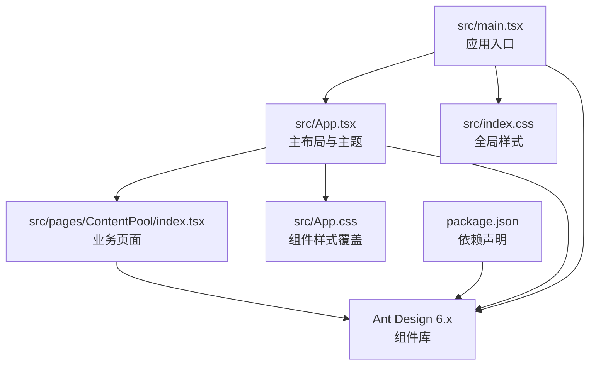
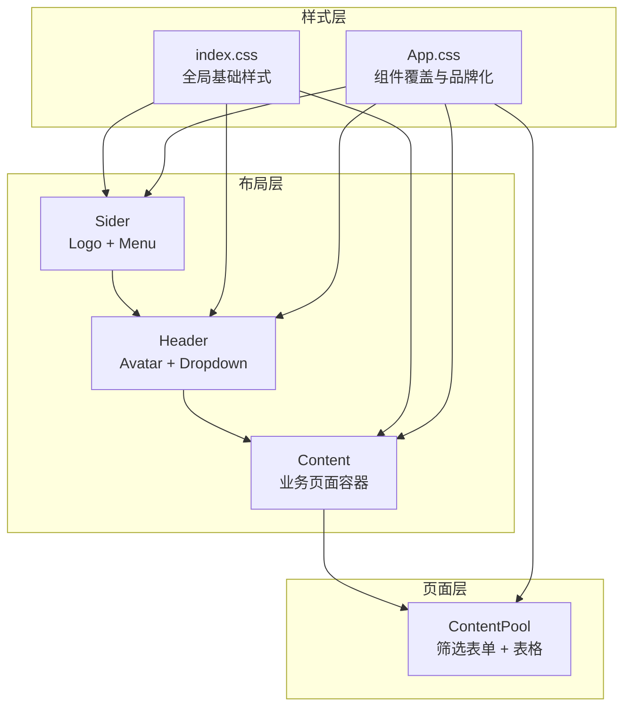
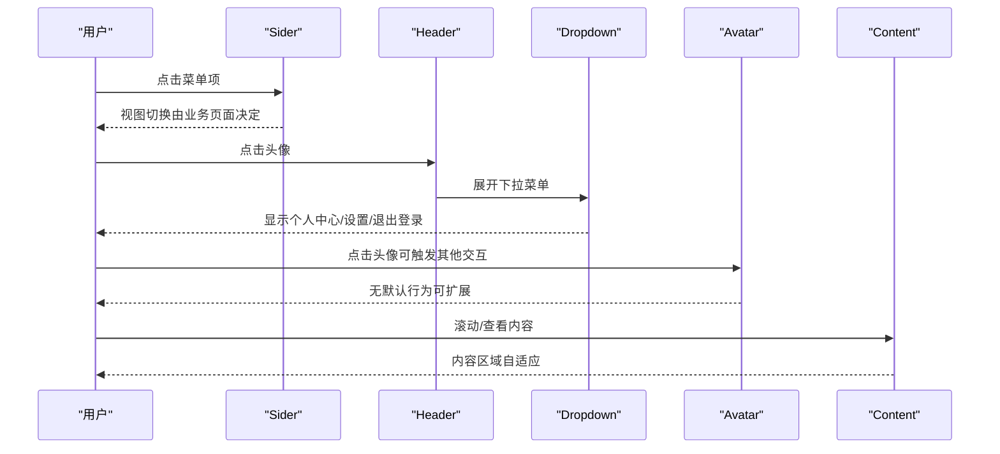
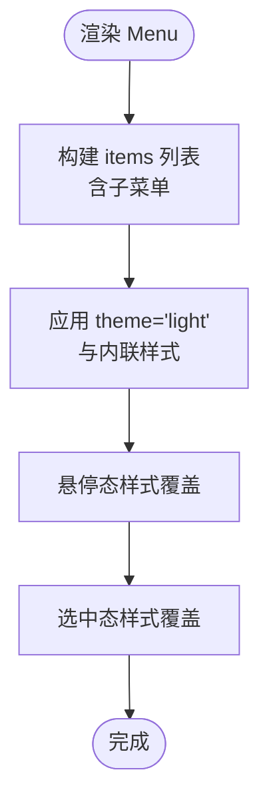
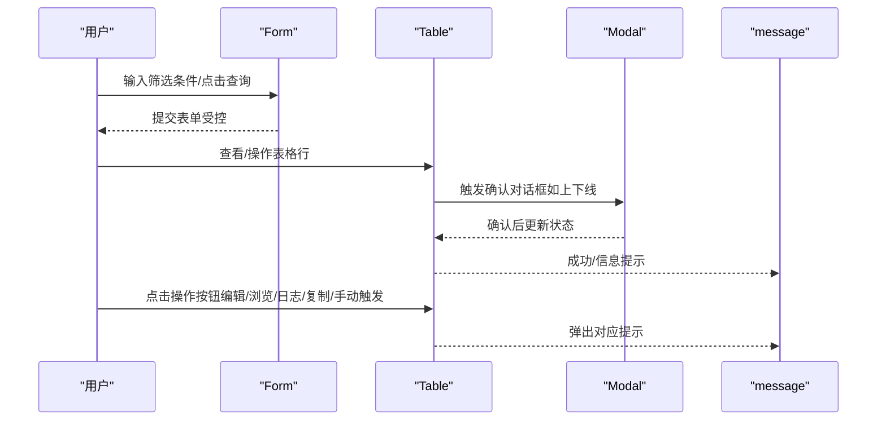
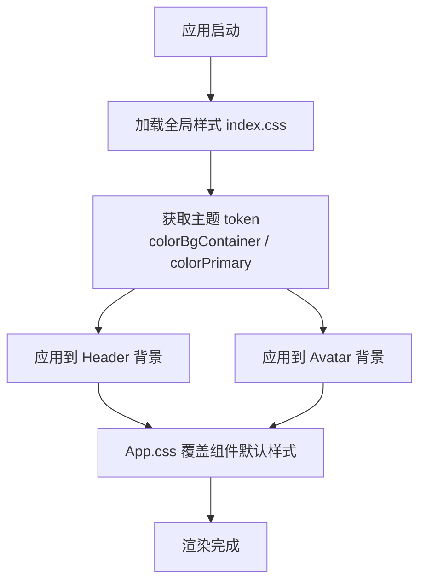
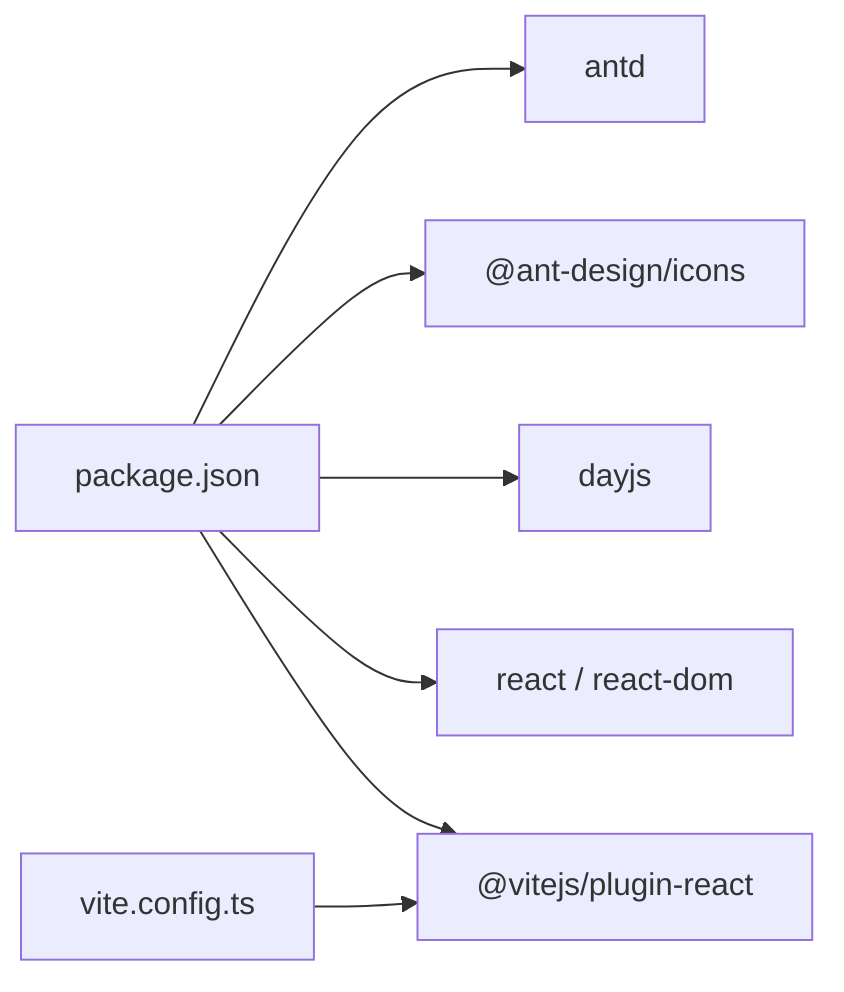

# UI 组件系统

<cite>
**本文引用的文件**
- [README.md](file://README.md)
- [package.json](file://package.json)
- [vite.config.ts](file://vite.config.ts)
- [src/main.tsx](file://src/main.tsx)
- [src/index.css](file://src/index.css)
- [src/App.tsx](file://src/App.tsx)
- [src/App.css](file://src/App.css)
- [src/pages/ContentPool/index.tsx](file://src/pages/ContentPool/index.tsx)
</cite>

## 目录
1. [简介](#简介)
2. [项目结构](#项目结构)
3. [核心组件](#核心组件)
4. [架构总览](#架构总览)
5. [详细组件分析](#详细组件分析)
6. [依赖分析](#依赖分析)
7. [性能考虑](#性能考虑)
8. [故障排查指南](#故障排查指南)
9. [结论](#结论)
10. [附录](#附录)

## 简介
本文件面向 Qoder 项目的 UI 组件系统，聚焦于 Ant Design 在本项目中的使用方式、自定义样式与主题集成、布局组件的设计原理与响应式实现、组件属性与事件、以及可访问性与性能优化建议。内容基于仓库现有源码进行梳理与总结，帮助开发者快速理解并扩展 UI 能力。

## 项目结构
Qoder 采用 React + TypeScript + Vite 的最小化模板，Ant Design 作为 UI 基础库，结合本地样式覆盖实现品牌化定制。关键文件职责如下：
- 应用入口与全局样式：src/main.tsx、src/index.css
- 主应用布局与主题使用：src/App.tsx、src/App.css
- 业务页面（内容池）：src/pages/ContentPool/index.tsx
- 构建与依赖：package.json、vite.config.ts、README.md

图表来源
- [src/main.tsx:1-11](file://src/main.tsx#L1-L11)
- [src/App.tsx:1-210](file://src/App.tsx#L1-L210)
- [src/pages/ContentPool/index.tsx:1-417](file://src/pages/ContentPool/index.tsx#L1-L417)
- [src/index.css:1-10](file://src/index.css#L1-L10)
- [src/App.css:1-84](file://src/App.css#L1-L84)
- [package.json:1-34](file://package.json#L1-L34)

章节来源
- [src/main.tsx:1-11](file://src/main.tsx#L1-L11)
- [src/index.css:1-10](file://src/index.css#L1-L10)
- [src/App.tsx:1-210](file://src/App.tsx#L1-L210)
- [src/App.css:1-84](file://src/App.css#L1-L84)
- [src/pages/ContentPool/index.tsx:1-417](file://src/pages/ContentPool/index.tsx#L1-L417)
- [package.json:1-34](file://package.json#L1-L34)
- [vite.config.ts:1-8](file://vite.config.ts#L1-L8)
- [README.md:1-74](file://README.md#L1-L74)

## 核心组件
本项目围绕以下 Ant Design 组件展开：
- 布局：Layout（Header、Sider、Content）
- 导航：Menu（含子菜单）
- 用户头像与下拉：Avatar、Dropdown
- 表单与控件：Form、Input、Select、DatePicker、Button、Space
- 数据展示：Table、Tag、Typography、Breadcrumb
- 反馈与提示：Modal、message、Tooltip
- 其他：Card、Typography.Text

这些组件在主应用布局与“内容池”页面中被广泛使用，并通过内联样式与全局样式进行品牌化定制。

章节来源
- [src/App.tsx:32-206](file://src/App.tsx#L32-L206)
- [src/pages/ContentPool/index.tsx:2-31](file://src/pages/ContentPool/index.tsx#L2-L31)
- [src/pages/ContentPool/index.tsx:138-414](file://src/pages/ContentPool/index.tsx#L138-L414)

## 架构总览
应用采用“布局 + 页面”的分层结构：
- 布局层：App.tsx 提供侧边栏、头部与内容区域，使用 Ant Design 的 Layout 组件实现固定侧边与自适应内容。
- 页面层：ContentPool 页面承载表单筛选、表格数据与操作按钮，使用 Ant Design 的 Form、Table、Button 等组件。
- 样式层：index.css 定义全局字体与背景；App.css 对 Ant Design 组件进行选择器级覆盖，实现品牌色与交互细节定制。

图表来源
- [src/App.tsx:135-206](file://src/App.tsx#L135-L206)
- [src/pages/ContentPool/index.tsx:326-413](file://src/pages/ContentPool/index.tsx#L326-L413)
- [src/index.css:1-10](file://src/index.css#L1-L10)
- [src/App.css:12-84](file://src/App.css#L12-L84)

## 详细组件分析

### 布局组件（Layout/Sider/Header/Content）
- 设计原理
  - 使用 Sider 实现左侧导航，支持折叠与阴影，通过主题 light 与自定义样式提升层级感。
  - Header 固定右侧用户信息，使用 Dropdown 展示用户菜单项，结合 Avatar 与 Typography.Text 实现简洁信息展示。
  - Content 包裹业务页面，统一圆角、内边距与溢出处理，确保滚动与卡片布局稳定。
- 响应式实现
  - 通过 Sider 的 collapsible 与 collapsed 状态控制宽度变化；Content 使用 margin/padding 与 overflow 控制内容区域自适应。
- 自定义配置
  - 主题 token：通过 theme.useToken 获取 colorBgContainer、colorPrimary 等派生值，用于 Header 与 Avatar 的背景色与文字色。
  - 样式覆盖：App.css 中对选中菜单项、悬停态与表格行等进行覆盖，保证品牌一致性。

图表来源
- [src/App.tsx:135-206](file://src/App.tsx#L135-L206)
- [src/App.css:28-44](file://src/App.css#L28-L44)

章节来源
- [src/App.tsx:123-206](file://src/App.tsx#L123-L206)
- [src/App.css:12-44](file://src/App.css#L12-L44)

### 导航组件（Menu）
- 使用方式
  - 通过 items 定义菜单项与子菜单，设置默认选中与默认展开键，实现多级导航。
  - 通过 theme="light" 与内联样式去除右侧边框，保持与布局一致的视觉风格。
- 自定义配置
  - 选中态与悬停态颜色覆盖，突出品牌色；选中态右侧边框与背景色增强层级感。
  - 通过 CSS 伪类隐藏默认右边界装饰，避免与布局冲突。

图表来源
- [src/App.tsx:37-121](file://src/App.tsx#L37-L121)
- [src/App.css:28-44](file://src/App.css#L28-L44)

章节来源
- [src/App.tsx:37-121](file://src/App.tsx#L37-L121)
- [src/App.css:28-44](file://src/App.css#L28-L44)

### 表单与数据展示（Form/Table/Breadcrumb/Button/Tag）
- 表单（Form）
  - 使用 Form.useForm 创建受控表单，布局为 inline，包含多个输入与选择器，支持重置与提交。
  - 通过 defaultValue 与 mode="multiple" 实现多选状态的初始值与交互。
- 表格（Table）
  - columns 通过 render 自定义列显示逻辑，如状态 Tag、富文本信息展示、固定列与横向滚动。
  - 支持分页、加载态与横向滚动，适配宽表场景。
- 面包屑（Breadcrumb）
  - 用于页面路径指示，结合图标与文字清晰表达层级关系。
- 按钮与标签（Button/Tag）
  - 按钮使用 link 类型与品牌色，配合图标与文案实现操作入口。
  - Tag 根据状态映射不同颜色，直观传达数据状态。

图表来源
- [src/pages/ContentPool/index.tsx:138-414](file://src/pages/ContentPool/index.tsx#L138-L414)

章节来源
- [src/pages/ContentPool/index.tsx:138-414](file://src/pages/ContentPool/index.tsx#L138-L414)

### 样式架构与主题定制
- 全局样式
  - index.css 设置字体族与背景色，确保基础排版与视觉基调。
- 组件覆盖
  - App.css 通过类名选择器覆盖 Ant Design 默认样式，包括：
    - 菜单项选中态与悬停态的品牌色强调
    - 表格表头与悬停行的背景色
    - 链接与标签的颜色映射
- 主题 token 使用
  - App.tsx 中通过 theme.useToken 获取 colorBgContainer 与 colorPrimary，用于 Header 背景色与 Avatar 背景色，实现与主题一致的品牌色彩。

图表来源
- [src/index.css:1-10](file://src/index.css#L1-L10)
- [src/App.tsx:125-186](file://src/App.tsx#L125-L186)
- [src/App.css:12-84](file://src/App.css#L12-L84)

章节来源
- [src/index.css:1-10](file://src/index.css#L1-L10)
- [src/App.tsx:125-186](file://src/App.tsx#L125-L186)
- [src/App.css:12-84](file://src/App.css#L12-L84)

## 依赖分析
- 运行时依赖
  - antd：提供 UI 组件库与主题系统
  - @ant-design/icons：提供图标集合
  - dayjs：日期时间处理
  - react/react-dom：前端框架
- 开发依赖
  - @vitejs/plugin-react：Vite React 插件
  - TypeScript 与 ESLint：类型检查与代码规范
- 构建配置
  - vite.config.ts 仅启用 React 插件，保持最小构建开销

图表来源
- [package.json:12-17](file://package.json#L12-L17)
- [package.json:19-31](file://package.json#L19-L31)
- [vite.config.ts:1-8](file://vite.config.ts#L1-L8)

章节来源
- [package.json:1-34](file://package.json#L1-L34)
- [vite.config.ts:1-8](file://vite.config.ts#L1-L8)

## 性能考虑
- 组件渲染
  - 表格列使用 render 函数时，尽量避免在 render 中创建新对象或函数，减少不必要的重渲染。
  - 使用 rowKey 指定唯一标识，提升 Table 渲染与更新性能。
- 样式覆盖
  - 优先使用主题 token 与轻量级 CSS 类覆盖，避免深层选择器导致的样式计算开销。
- 交互反馈
  - 使用 message 与 Modal 等轻量反馈组件，避免频繁全量刷新页面。
- 构建与打包
  - 保持 Vite 最小插件集，减少开发与生产构建时间。

## 故障排查指南
- 样式不生效
  - 检查 App.css 选择器优先级是否高于默认样式；确认组件是否正确引入样式文件。
- 主题色未体现
  - 确认 App.tsx 中是否正确调用 theme.useToken 并将其应用到对应元素。
- 表格列渲染异常
  - 检查 columns 的 render 返回值是否符合预期；确认数据源字段与 dataIndex 对齐。
- 下拉菜单显示位置
  - 如需调整 Dropdown 位置，参考 Ant Design 文档的 placement 选项与触发方式。

章节来源
- [src/App.css:12-84](file://src/App.css#L12-L84)
- [src/App.tsx:125-186](file://src/App.tsx#L125-L186)
- [src/pages/ContentPool/index.tsx:205-324](file://src/pages/ContentPool/index.tsx#L205-L324)

## 结论
Qoder 的 UI 组件系统以 Ant Design 为基础，结合主题 token 与局部样式覆盖，实现了统一的品牌化视觉与良好的交互体验。通过布局组件的合理组织与业务页面的数据驱动展示，系统具备清晰的层次与可扩展性。建议在后续迭代中持续关注渲染性能与可访问性，逐步完善主题体系与组件封装。

## 附录

### 组件属性、事件与插槽概览（基于现有实现）
- Layout
  - 属性：style（minHeight）、children
  - 事件：无（通过业务逻辑控制）
  - 插槽：无（通过 children 传入）
- Sider
  - 属性：trigger、collapsible、collapsed、theme、style
  - 事件：无（通过业务逻辑控制）
  - 插槽：无（通过 children 传入）
- Header
  - 属性：style
  - 事件：无（通过 Dropdown 控制）
  - 插槽：无（通过 children 传入）
- Menu
  - 属性：theme、mode、defaultSelectedKeys、defaultOpenKeys、items、style、selectedKeys
  - 事件：无（通过业务逻辑控制）
  - 插槽：无（通过 items 传入）
- Dropdown
  - 属性：menu、placement
  - 事件：无（通过业务逻辑控制）
  - 插槽：无（通过 children 传入）
- Avatar
  - 属性：size、icon、style
  - 事件：无（可扩展 onClick）
  - 插槽：无（通过 children 传入）
- Form
  - 属性：form、layout、onFinish
  - 事件：onFinish（提交）
  - 插槽：无（通过 children 传入）
- Input/Select/DatePicker
  - 属性：placeholder、allowClear、style、defaultValue、options、mode
  - 事件：onChange（可扩展）
  - 插槽：无
- Table
  - 属性：columns、dataSource、rowKey、loading、pagination、scroll
  - 事件：无（通过 render 与外部状态控制）
  - 插槽：无（通过 render 传入）
- Button/Space
  - 属性：type、size、icon、style、onClick
  - 事件：onClick
  - 插槽：无（通过 children 传入）
- Tag
  - 属性：color
  - 事件：无
  - 插槽：无（通过 children 传入）
- Breadcrumb
  - 属性：无（通过 children 传入）
  - 事件：无
  - 插槽：无（通过 children 传入）

章节来源
- [src/App.tsx:135-206](file://src/App.tsx#L135-L206)
- [src/pages/ContentPool/index.tsx:138-414](file://src/pages/ContentPool/index.tsx#L138-L414)

### 使用示例与代码片段路径
- 布局与主题使用
  - [App.tsx 布局与主题 token 使用:123-206](file://src/App.tsx#L123-L206)
- 菜单与下拉
  - [App.tsx 菜单与下拉定义:37-121](file://src/App.tsx#L37-L121)
- 表单与表格
  - [ContentPool 表单与表格实现:138-414](file://src/pages/ContentPool/index.tsx#L138-L414)
- 样式覆盖
  - [App.css 菜单项与表格覆盖:28-61](file://src/App.css#L28-L61)

### 响应式设计与无障碍访问指导
- 响应式
  - 使用 Sider 的 collapsible 与 collapsed 控制侧边宽度；Content 使用 margin/padding 与 overflow 实现内容区域自适应。
  - 表格启用 scroll.x 并设置固定列，保证移动端可读性。
- 无障碍
  - 为头像与按钮添加合适的 role 与 aria-label；为下拉菜单提供键盘可达性与焦点管理（可结合 Ant Design 的默认行为）。
  - 为图标与按钮提供可见的文本提示，避免仅依赖图标传达语义。

### 主题定制与样式覆盖
- 主题 token
  - 通过 theme.useToken 获取 colorBgContainer 与 colorPrimary，应用于 Header 与 Avatar。
- 样式覆盖
  - 使用 App.css 对菜单、表格、标签与面包屑进行品牌化覆盖，确保视觉一致性。

章节来源
- [src/App.tsx:125-186](file://src/App.tsx#L125-L186)
- [src/App.css:12-84](file://src/App.css#L12-L84)