# 开发指南

<cite>
**本文档引用的文件**
- [README.md](file://README.md)
- [package.json](file://package.json)
- [eslint.config.js](file://eslint.config.js)
- [vite.config.ts](file://vite.config.ts)
- [tsconfig.json](file://tsconfig.json)
- [tsconfig.app.json](file://tsconfig.app.json)
- [tsconfig.node.json](file://tsconfig.node.json)
- [src/App.tsx](file://src/App.tsx)
- [src/main.tsx](file://src/main.tsx)
- [src/pages/ContentPool/index.tsx](file://src/pages/ContentPool/index.tsx)
- [src/App.css](file://src/App.css)
- [src/index.css](file://src/index.css)
</cite>

## 目录
1. [简介](#简介)
2. [项目结构](#项目结构)
3. [核心组件](#核心组件)
4. [架构概览](#架构概览)
5. [详细组件分析](#详细组件分析)
6. [依赖分析](#依赖分析)
7. [性能考虑](#性能考虑)
8. [调试指南](#调试指南)
9. [测试策略](#测试策略)
10. [版本控制最佳实践](#版本控制最佳实践)
11. [故障排除指南](#故障排除指南)
12. [开发环境配置](#开发环境配置)
13. [结论](#结论)

## 简介

Qoder 是一个基于 React 19、TypeScript 和 Vite 的现代化前端应用，采用 Ant Design 设计系统构建社区运营管理系统。该项目提供了完整的开发工具链配置，包括 TypeScript 类型检查、ESLint 代码规范、Vite 构建工具和热模块替换（HMR）功能。

该应用的核心功能围绕内容池管理展开，提供活动管理、数据分析、评论审核、内容管理、质检管理等运营功能模块。系统采用响应式布局设计，支持侧边栏折叠和多级菜单导航。

## 项目结构

项目采用清晰的目录组织结构，遵循现代 React 应用的最佳实践：

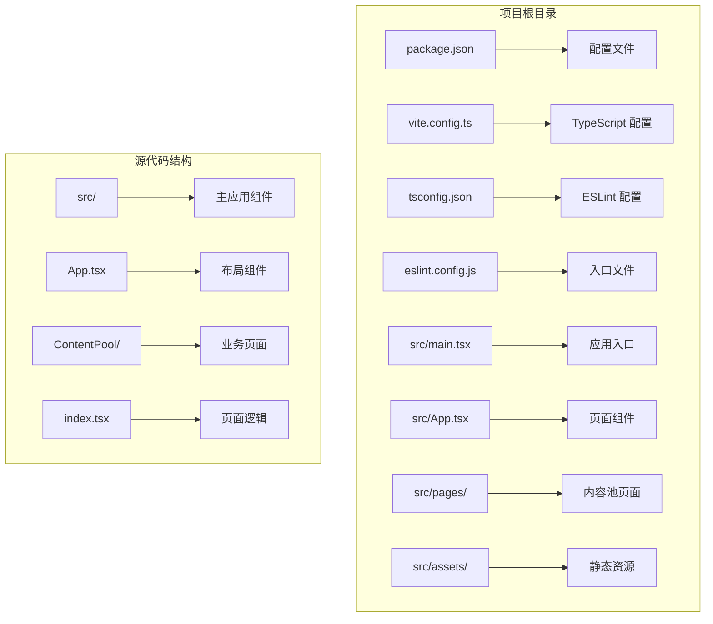

**图表来源**
- [src/main.tsx:1-11](file://src/main.tsx#L1-L11)
- [src/App.tsx:1-210](file://src/App.tsx#L1-L210)
- [src/pages/ContentPool/index.tsx:1-417](file://src/pages/ContentPool/index.tsx#L1-L417)

**章节来源**
- [package.json:1-34](file://package.json#L1-L34)
- [tsconfig.json:1-8](file://tsconfig.json#L1-L8)

## 核心组件

### 应用主组件架构

应用采用 Ant Design 的 Layout 组件体系，构建了完整的管理界面框架：

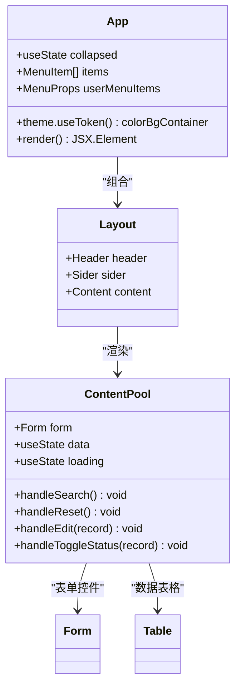

**图表来源**
- [src/App.tsx:123-210](file://src/App.tsx#L123-L210)
- [src/pages/ContentPool/index.tsx:138-417](file://src/pages/ContentPool/index.tsx#L138-L417)

### 菜单系统设计

应用实现了多层次的菜单导航系统，支持折叠和展开功能：

| 菜单项 | 功能描述 | 图标 | 子菜单 |
|--------|----------|------|--------|
| 活动管理 | 内容活动管理 | AppstoreOutlined | 无 |
| 数据分析 | 运营数据统计 | BarChartOutlined | 无 |
| 评论审核 | 用户评论内容审核 | CommentOutlined | 无 |
| 内容管理 | 主要业务功能 | FileTextOutlined | 动态内容池、AIGC、推送管理 |
| 质检管理 | 内容质量检查 | AuditOutlined | 无 |
| 任务中心后台 | 工作任务管理 | SolutionOutlined | 无 |
| 回复管理 | 用户回复处理 | CommentOutlined | 无 |
| 运营工具 | 辅助运营工具 | ToolOutlined | 无 |
| 配置管理 | 系统参数配置 | SettingOutlined | 无 |
| 达人认证管理 | 认证人员管理 | UserOutlined | 无 |
| 创作者管理 | 内容创作者管理 | TeamOutlined | 无 |
| 用户激励管理 | 用户激励机制 | TrophyOutlined | 无 |
| 内容分发 | 内容分发策略 | ShareAltOutlined | 无 |
| 系统运行监控 | 系统状态监控 | MonitorOutlined | 无 |

**章节来源**
- [src/App.tsx:37-121](file://src/App.tsx#L37-L121)

## 架构概览

### 技术栈架构

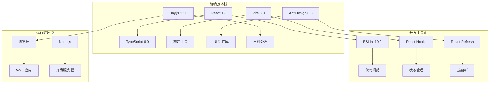

**图表来源**
- [package.json:12-32](file://package.json#L12-L32)
- [vite.config.ts:1-8](file://vite.config.ts#L1-L8)

### 数据流架构

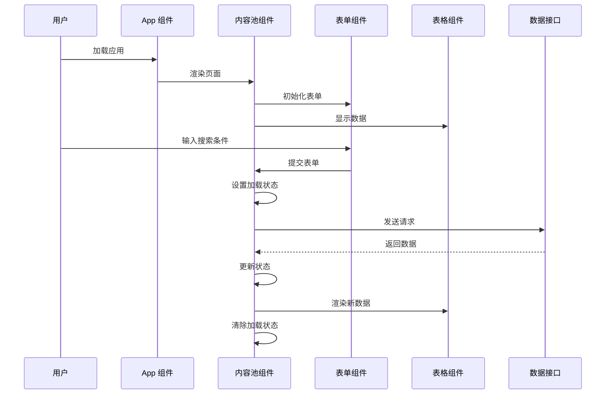

**图表来源**
- [src/App.tsx:123-210](file://src/App.tsx#L123-L210)
- [src/pages/ContentPool/index.tsx:138-417](file://src/pages/ContentPool/index.tsx#L138-L417)

## 详细组件分析

### 内容池管理组件

内容池管理是应用的核心业务组件，实现了完整的 CRUD 操作和数据展示功能：

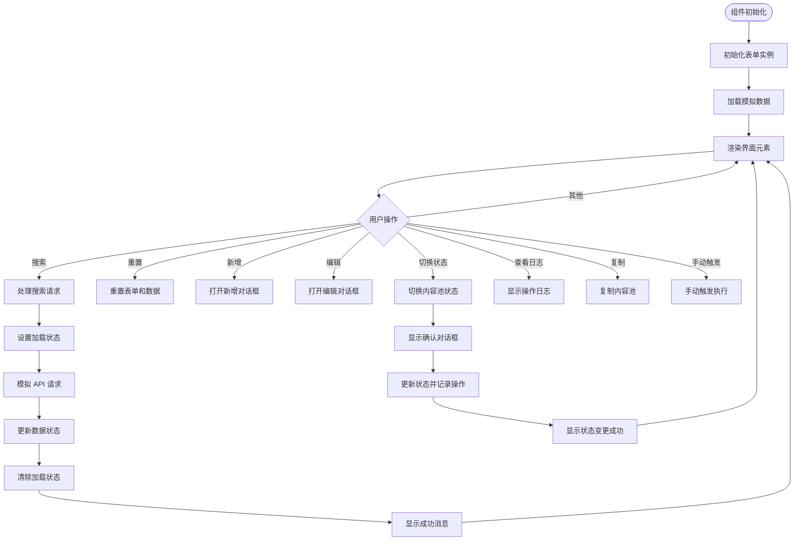

**图表来源**
- [src/pages/ContentPool/index.tsx:138-417](file://src/pages/ContentPool/index.tsx#L138-L417)

#### 状态管理模式

组件采用了 React Hooks 的函数式组件模式，实现了以下状态管理策略：

| 状态类型 | 状态钩子 | 数据用途 | 生命周期 |
|----------|----------|----------|----------|
| 表单状态 | Form.useForm | 搜索表单数据 | 组件挂载 |
| 列表数据 | useState | 内容池数据 | 数据变更 |
| 加载状态 | useState | 请求加载指示 | 异步操作 |
| 选中项 | useState | 当前选中记录 | 用户交互 |

#### 事件处理机制

组件实现了完整的事件处理体系：

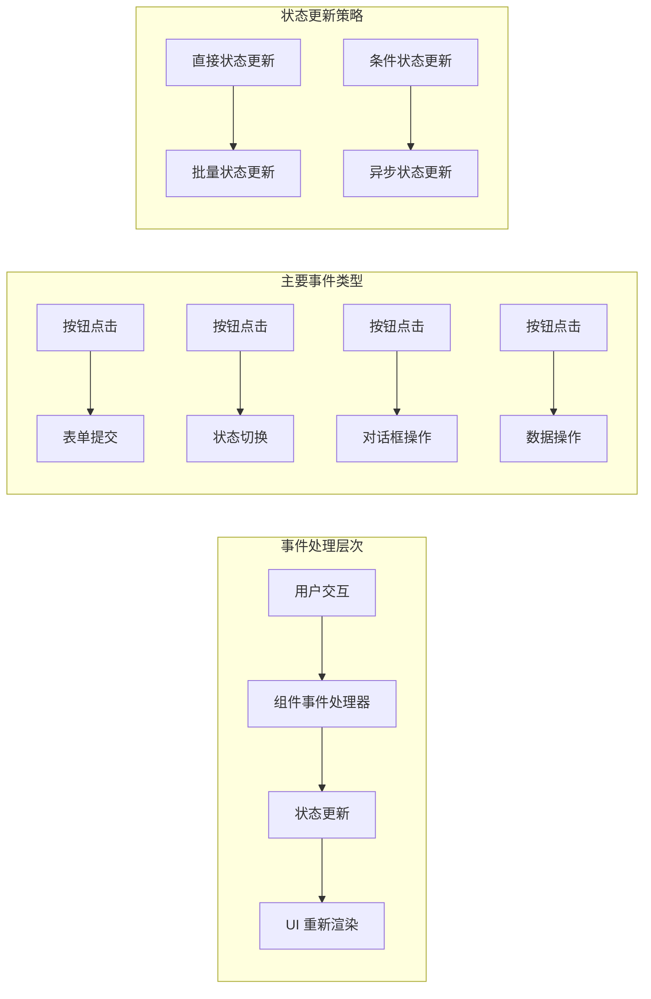

**图表来源**
- [src/pages/ContentPool/index.tsx:143-203](file://src/pages/ContentPool/index.tsx#L143-L203)

**章节来源**
- [src/pages/ContentPool/index.tsx:138-417](file://src/pages/ContentPool/index.tsx#L138-L417)

### 布局组件分析

应用的布局组件采用了 Ant Design 的响应式设计模式：

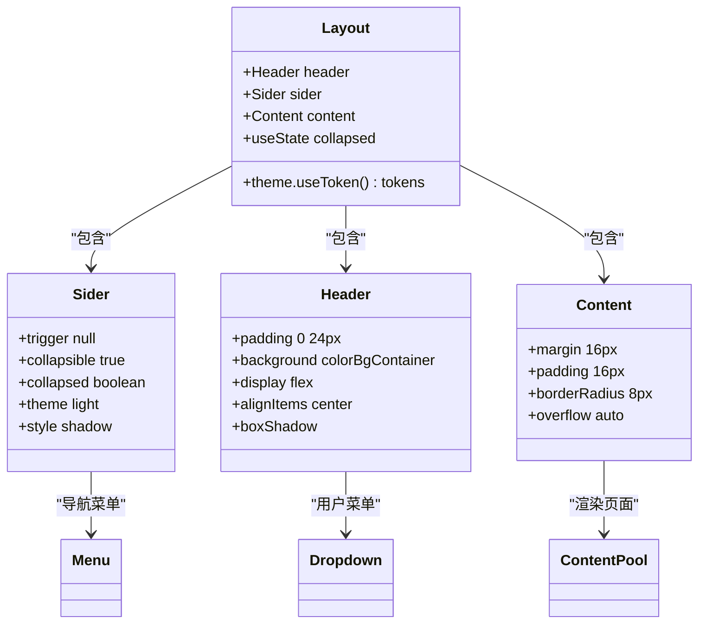

**图表来源**
- [src/App.tsx:135-207](file://src/App.tsx#L135-L207)

**章节来源**
- [src/App.tsx:123-210](file://src/App.tsx#L123-L210)

## 依赖分析

### 核心依赖关系

```mermaid
graph TB
subgraph "运行时依赖"
A[react@^19.2.5] --> B[react-dom@^19.2.5]
C[antd@^6.3.7] --> D[@ant-design/icons@^6.2.2]
E[dayjs@^1.11.20] --> F[日期处理]
end
subgraph "开发时依赖"
G[@vitejs/plugin-react@^6.0.1] --> H[Vite 插件]
I[typescript@~6.0.2] --> J[类型检查]
K[eslint@^10.2.1] --> L[代码规范]
M[typescript-eslint@^8.58.2] --> N[TS ESLint 规则]
end
subgraph "类型定义"
O[@types/react@^19.2.14] --> P[React 类型]
Q[@types/react-dom@^19.2.3] --> R[DOM 类型]
S[@types/node@^24.12.2] --> T[Node.js 类型]
end
A --> C
C --> E
G --> A
I --> A
K --> I
```

**图表来源**
- [package.json:12-32](file://package.json#L12-L32)

### 版本兼容性

| 包名 | 版本 | 兼容性 | 用途 |
|------|------|--------|------|
| react | ^19.2.5 | 最新稳定版 | 核心框架 |
| react-dom | ^19.2.5 | 与 React 同步 | DOM 渲染 |
| antd | ^6.3.7 | 最新稳定版 | UI 组件库 |
| @ant-design/icons | ^6.2.2 | 与 Ant Design 同步 | 图标库 |
| dayjs | ^1.11.20 | 最新稳定版 | 日期处理 |
| @vitejs/plugin-react | ^6.0.1 | Vite 生态 | 构建插件 |
| typescript | ~6.0.2 | 最新稳定版 | 类型系统 |
| eslint | ^10.2.1 | 最新稳定版 | 代码规范 |

**章节来源**
- [package.json:1-34](file://package.json#L1-L34)

## 性能考虑

### 构建优化策略

应用采用了多种性能优化策略：

1. **Tree Shaking**: 通过 ES 模块语法确保未使用的代码被移除
2. **代码分割**: 自动进行代码分割以减少初始包大小
3. **压缩优化**: 生产环境自动启用代码压缩和混淆
4. **缓存策略**: 利用浏览器缓存机制提升二次加载速度

### 运行时性能优化

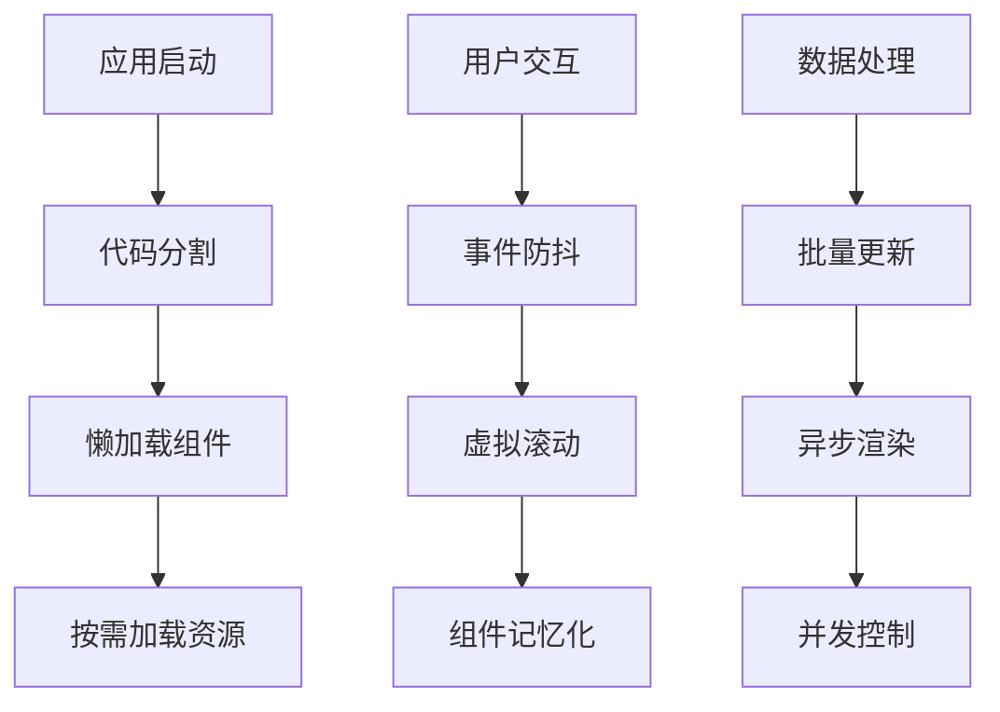

### 内存管理建议

1. **及时清理**: 在组件卸载时清理定时器和事件监听器
2. **状态优化**: 避免不必要的状态更新和重渲染
3. **资源释放**: 及时释放大对象和媒体资源
4. **循环引用**: 注意避免循环引用导致的内存泄漏

## 调试指南

### 开发工具使用

#### Vite 开发服务器

应用使用 Vite 作为开发服务器，提供以下功能：

- **热模块替换 (HMR)**: 实时更新修改的模块
- **快速启动**: 启动速度快，开发体验流畅
- **原生 ES 模块**: 支持现代 JavaScript 特性
- **内置代理**: 支持 API 代理和跨域请求

#### 浏览器开发者工具

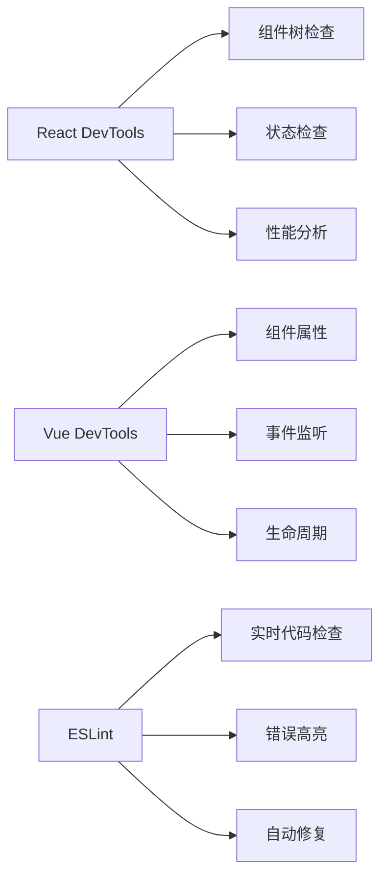

### 调试技巧

1. **组件状态调试**: 使用 React DevTools 检查组件状态和 props
2. **网络请求调试**: 使用浏览器网络面板监控 API 请求
3. **性能分析**: 使用 React Profiler 分析组件渲染性能
4. **内存泄漏检测**: 使用 Chrome 内存面板检测内存泄漏

**章节来源**
- [vite.config.ts:1-8](file://vite.config.ts#L1-L8)

## 测试策略

### 单元测试

虽然项目当前没有集成测试框架，但建议采用以下测试策略：

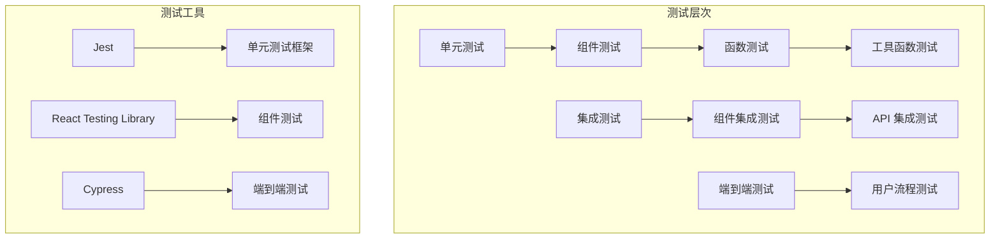

### 测试最佳实践

1. **测试覆盖率**: 保持关键业务逻辑 80%+ 的测试覆盖率
2. **测试隔离**: 每个测试独立运行，不依赖其他测试
3. **断言明确**: 使用明确的断言信息描述期望结果
4. **模拟外部依赖**: 使用 mock 对象模拟 API 和第三方服务

## 版本控制最佳实践

### Git 工作流程

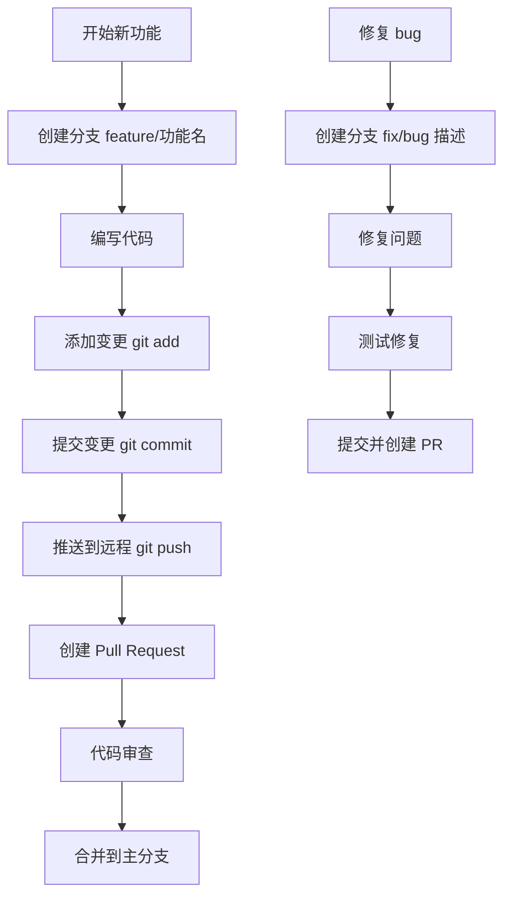

### 提交信息规范

| 类型 | 描述 | 示例 |
|------|------|------|
| feat | 新功能 | feat(content-pool): 添加内容池搜索功能 |
| fix | 修复缺陷 | fix(auth): 修复登录状态问题 |
| docs | 文档更新 | docs: 更新开发指南 |
| style | 样式调整 | style: 修复代码格式问题 |
| refactor | 代码重构 | refactor(utils): 优化工具函数 |
| test | 测试相关 | test: 添加单元测试 |
| chore | 构建过程 | chore(deps): 更新依赖版本 |

### 代码审查流程

1. **自动化检查**: CI 自动运行 ESLint、TypeScript 检查
2. **人工审查**: 团队成员进行代码审查
3. **测试验证**: 确保所有测试通过
4. **性能评估**: 评估代码性能影响
5. **安全检查**: 检查潜在的安全问题

## 故障排除指南

### 常见问题及解决方案

#### 构建问题

| 问题 | 可能原因 | 解决方案 |
|------|----------|----------|
| 构建失败 | TypeScript 类型错误 | 修复类型错误或添加类型声明 |
| 模块解析失败 | 路径配置错误 | 检查 tsconfig.json 中的路径映射 |
| 样式加载失败 | CSS 文件路径错误 | 确认样式文件路径正确 |
| 热更新失效 | Vite 配置问题 | 重启开发服务器或检查插件配置 |

#### 运行时问题

| 问题 | 可能原因 | 解决方案 |
|------|----------|----------|
| 组件渲染异常 | 状态更新问题 | 检查 useState 和 useEffect 的依赖数组 |
| 性能问题 | 渲染过度 | 使用 React.memo 或 useMemo 优化 |
| 内存泄漏 | 事件监听器未清理 | 确保在 cleanup 函数中移除监听器 |
| API 请求失败 | CORS 问题 | 检查后端 CORS 配置或使用代理 |

#### 开发工具问题

| 问题 | 可能原因 | 解决方案 |
|------|----------|----------|
| ESLint 不工作 | 配置文件错误 | 检查 eslint.config.js 配置 |
| TypeScript 类型错误 | 类型定义缺失 | 添加相应的类型声明文件 |
| Vite 启动缓慢 | 依赖过多 | 清理 node_modules 并重新安装 |
| 浏览器缓存问题 | 缓存过期 | 清除浏览器缓存或强制刷新 |

### 调试步骤

1. **重现问题**: 确定问题发生的最小复现步骤
2. **检查控制台**: 查看浏览器控制台中的错误信息
3. **网络检查**: 使用网络面板检查 API 请求状态
4. **状态检查**: 使用 React DevTools 检查组件状态
5. **日志输出**: 添加适当的 console.log 输出
6. **逐步排查**: 通过注释代码逐步定位问题范围

**章节来源**
- [eslint.config.js:1-23](file://eslint.config.js#L1-L23)

## 开发环境配置

### 环境要求

| 要求 | 最低版本 | 推荐版本 |
|------|----------|----------|
| Node.js | 16.x | 18.x 或更高 |
| npm | 8.x | 9.x 或更高 |
| Git | 2.20 | 最新稳定版 |

### 安装步骤

```bash
# 克隆项目
git clone <repository-url>
cd qoder

# 安装依赖
npm install

# 启动开发服务器
npm run dev

# 构建生产版本
npm run build

# 预览生产构建
npm run preview
```

### 开发工具配置

#### VS Code 推荐扩展

1. **ESLint**: 代码规范检查
2. **Prettier**: 代码格式化
3. **TypeScript Importer**: TypeScript 导入辅助
4. **Auto Rename Tag**: HTML 标签自动重命名
5. **Bracket Pair Colorizer**: 括号配对着色

#### IDE 设置建议

1. **代码格式化**: 配置 Prettier 为默认格式化工具
2. **保存时格式化**: 启用保存时自动格式化
3. **TypeScript 检查**: 启用 TypeScript 语言服务
4. **ESLint 集成**: 配置 ESLint 为问题检查工具

### 开发工作流

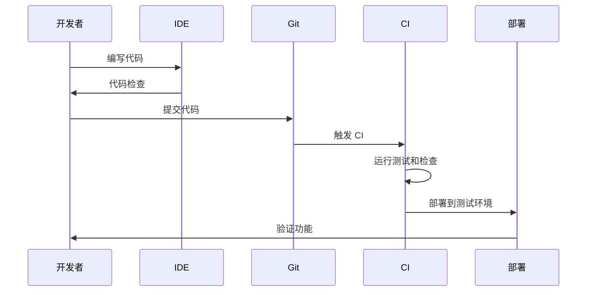

**章节来源**
- [package.json:6-11](file://package.json#L6-L11)
- [README.md:14-74](file://README.md#L14-L74)

## 结论

Qoder 项目展示了现代 React 应用开发的最佳实践，结合了 TypeScript 的强类型系统、Vite 的高性能构建工具和 Ant Design 的完整组件库。项目结构清晰，代码组织良好，为后续的功能扩展和维护奠定了坚实基础。

通过遵循本文档中介绍的开发规范、最佳实践和调试技巧，开发者可以高效地进行功能开发，同时保持代码质量和性能表现。建议团队在实际开发过程中持续关注这些规范，并根据项目发展需要适时调整和优化。