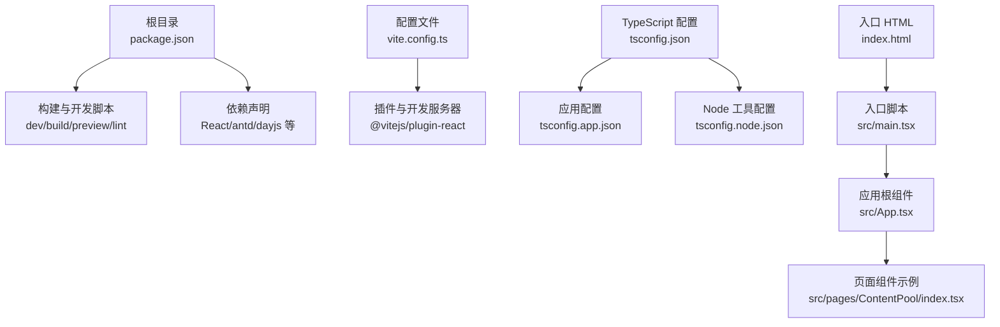
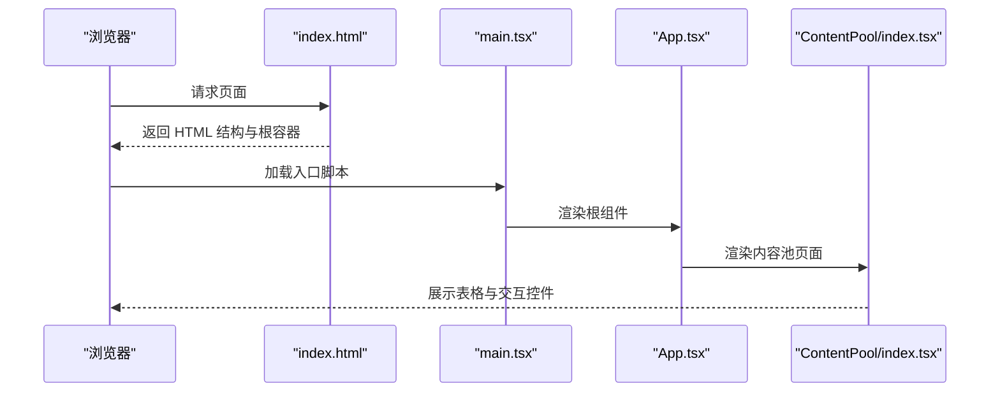
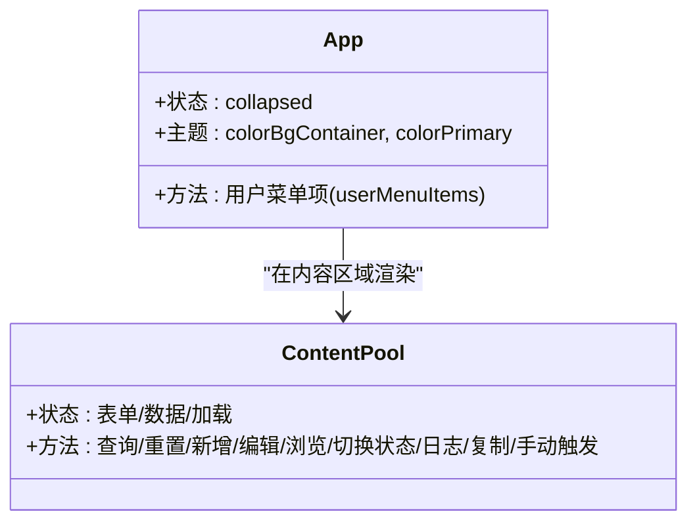
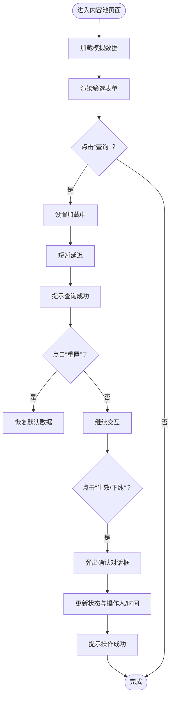

# 快速开始

<cite>
**本文引用的文件**
- [package.json](file://package.json)
- [README.md](file://README.md)
- [vite.config.ts](file://vite.config.ts)
- [src/main.tsx](file://src/main.tsx)
- [index.html](file://index.html)
- [src/App.tsx](file://src/App.tsx)
- [src/pages/ContentPool/index.tsx](file://src/pages/ContentPool/index.tsx)
- [tsconfig.json](file://tsconfig.json)
- [tsconfig.app.json](file://tsconfig.app.json)
- [tsconfig.node.json](file://tsconfig.node.json)
- [eslint.config.js](file://eslint.config.js)
- [src/index.css](file://src/index.css)
</cite>

## 目录
1. [简介](#简介)
2. [项目结构](#项目结构)
3. [核心组件](#核心组件)
4. [架构总览](#架构总览)
5. [详细组件分析](#详细组件分析)
6. [依赖分析](#依赖分析)
7. [性能考虑](#性能考虑)
8. [故障排除指南](#故障排除指南)
9. [结论](#结论)
10. [附录](#附录)

## 简介
本指南面向初学者与有经验的开发者，帮助你在最短时间内搭建并运行 Qoder 项目。你将获得：
- 环境要求与系统依赖说明
- 克隆仓库、安装依赖、启动开发服务器的完整步骤
- 常见安装问题的排查与修复建议
- 项目结构概览与首个功能演示
- 生产构建与部署基础指引

## 项目结构
Qoder 是一个基于 React + TypeScript + Vite 的前端应用，采用模块化目录组织，核心入口与页面组件清晰分离。以下为关键文件与职责概览：
- 根目录脚本与依赖：通过 npm/yarn/pnpm 的 scripts 管理开发、构建与预览流程
- 配置文件：Vite、TypeScript、ESLint 等配置分别定义编译目标、模块解析与代码规范
- 应用入口：HTML 容器与 React 根节点挂载点
- 页面与业务组件：以功能域划分的页面组件，如内容池管理

图表来源
- [package.json:1-34](file://package.json#L1-L34)
- [vite.config.ts:1-8](file://vite.config.ts#L1-L8)
- [tsconfig.json:1-8](file://tsconfig.json#L1-L8)
- [tsconfig.app.json:1-26](file://tsconfig.app.json#L1-L26)
- [tsconfig.node.json:1-25](file://tsconfig.node.json#L1-L25)
- [index.html:1-14](file://index.html#L1-L14)
- [src/main.tsx:1-11](file://src/main.tsx#L1-L11)
- [src/App.tsx:1-210](file://src/App.tsx#L1-L210)
- [src/pages/ContentPool/index.tsx:1-417](file://src/pages/ContentPool/index.tsx#L1-L417)

章节来源
- [package.json:1-34](file://package.json#L1-L34)
- [vite.config.ts:1-8](file://vite.config.ts#L1-L8)
- [tsconfig.json:1-8](file://tsconfig.json#L1-L8)
- [tsconfig.app.json:1-26](file://tsconfig.app.json#L1-L26)
- [tsconfig.node.json:1-25](file://tsconfig.node.json#L1-L25)
- [index.html:1-14](file://index.html#L1-L14)
- [src/main.tsx:1-11](file://src/main.tsx#L1-L11)
- [src/App.tsx:1-210](file://src/App.tsx#L1-L210)
- [src/pages/ContentPool/index.tsx:1-417](file://src/pages/ContentPool/index.tsx#L1-L417)

## 核心组件
- 开发服务器与构建工具：Vite 提供快速热更新与打包能力，配合 React 插件提升开发体验
- 应用入口与挂载：HTML 中的根容器与 main.tsx 负责渲染根组件
- 主界面布局：App.tsx 使用 Ant Design 的 Layout/Sider/Menu 组件实现侧边导航与头部用户菜单
- 内容池页面：ContentPool 页面展示内容池列表、筛选表单、表格与常用操作按钮，内置模拟数据与交互逻辑

章节来源
- [vite.config.ts:1-8](file://vite.config.ts#L1-L8)
- [src/main.tsx:1-11](file://src/main.tsx#L1-L11)
- [src/App.tsx:1-210](file://src/App.tsx#L1-L210)
- [src/pages/ContentPool/index.tsx:1-417](file://src/pages/ContentPool/index.tsx#L1-L417)

## 架构总览
从浏览器加载到页面渲染的关键路径如下：

图表来源
- [index.html:1-14](file://index.html#L1-L14)
- [src/main.tsx:1-11](file://src/main.tsx#L1-L11)
- [src/App.tsx:1-210](file://src/App.tsx#L1-L210)
- [src/pages/ContentPool/index.tsx:1-417](file://src/pages/ContentPool/index.tsx#L1-L417)

## 详细组件分析

### 组件关系图（代码级）

图表来源
- [src/App.tsx:123-207](file://src/App.tsx#L123-L207)
- [src/pages/ContentPool/index.tsx:138-414](file://src/pages/ContentPool/index.tsx#L138-L414)

章节来源
- [src/App.tsx:1-210](file://src/App.tsx#L1-L210)
- [src/pages/ContentPool/index.tsx:1-417](file://src/pages/ContentPool/index.tsx#L1-L417)

### 内容池页面交互流程（搜索与状态切换）

图表来源
- [src/pages/ContentPool/index.tsx:143-203](file://src/pages/ContentPool/index.tsx#L143-L203)

章节来源
- [src/pages/ContentPool/index.tsx:138-414](file://src/pages/ContentPool/index.tsx#L138-L414)

## 依赖分析
- 运行时依赖
  - React 与 React DOM：应用的核心 UI 框架
  - Ant Design 与图标：提供丰富的 UI 组件与图标资源
  - dayjs：日期处理工具
- 开发时依赖
  - Vite：构建与开发服务器
  - @vitejs/plugin-react：React 快速热更新支持
  - TypeScript 及相关类型与 ESLint 插件：类型检查与代码规范
  - ESLint：统一团队编码风格与规则

章节来源
- [package.json:12-32](file://package.json#L12-L32)
- [eslint.config.js:1-23](file://eslint.config.js#L1-L23)

## 性能考虑
- Vite 默认启用按需编译与模块联邦式打包，开发阶段具备极佳的热更新性能
- TypeScript 在开发时仅做类型检查，不输出构建产物，减少构建开销
- Ant Design 组件按需引入与样式按需加载可进一步优化首屏表现（建议结合实际业务按需裁剪）

## 故障排除指南
- Node.js 版本不兼容
  - 现象：安装或启动时报错，提示版本过低或语法不支持
  - 排查：确认 Node.js 版本满足现代 ESNext 语法与 Vite/TypeScript 要求
  - 解决：升级至推荐的 LTS 版本后重试
- 包管理器缓存问题
  - 现象：安装依赖失败或依赖版本异常
  - 排查：清理缓存并重新安装
  - 解决：使用包管理器的清理命令后重试安装
- TypeScript 类型错误
  - 现象：IDE 或终端出现类型检查报错
  - 排查：检查 tsconfig 配置与类型声明是否正确
  - 解决：根据报错定位文件并修正类型定义或配置
- ESLint 规则冲突
  - 现象：编辑器提示规则冲突或构建失败
  - 排查：检查 eslint.config.js 与 IDE 设置
  - 解决：统一团队规则或调整本地配置
- 开发服务器端口占用
  - 现象：启动 dev 报告端口被占用
  - 排查：确认 5173 端口是否被其他进程占用
  - 解决：更换端口或释放占用进程后重试
- 构建产物空白或样式缺失
  - 现象：预览或部署后页面无内容或样式异常
  - 排查：检查入口 HTML 是否正确挂载根容器，CSS 是否正确引入
  - 解决：确认 index.html 中的根容器与入口脚本路径，以及样式文件引入顺序

章节来源
- [package.json:6-11](file://package.json#L6-L11)
- [index.html:1-14](file://index.html#L1-14)
- [src/index.css:1-10](file://src/index.css#L1-L10)

## 结论
通过本指南，你已经完成了 Qoder 项目的环境准备、依赖安装与开发服务器启动，并对项目结构与首个功能（内容池）有了直观认识。建议在本地开发完成后，参考“附录”的生产构建与部署要点进行打包与上线。

## 附录

### 环境要求与系统依赖
- Node.js：建议使用长期支持版本（LTS），确保支持现代 ESNext 语法与模块系统
- 包管理器：npm/yarn/pnpm 任选其一，建议使用与团队一致的版本
- 系统依赖：无需额外系统级依赖，但需要网络访问以下载依赖

章节来源
- [package.json:12-32](file://package.json#L12-L32)

### 快速开始步骤
- 克隆仓库
  - 使用 Git 将仓库克隆到本地
- 安装依赖
  - 在项目根目录执行依赖安装命令
- 启动开发服务器
  - 执行开发脚本启动本地服务
- 访问应用
  - 在浏览器中打开默认地址，即可看到首页布局与内容池页面

章节来源
- [package.json:6-11](file://package.json#L6-L11)
- [index.html:1-14](file://index.html#L1-14)
- [src/main.tsx:1-11](file://src/main.tsx#L1-L11)

### 第一个功能演示
- 打开内容池页面
  - 通过侧边栏导航进入“内容池”页面
- 使用筛选表单
  - 输入 ID/名称等条件，点击“查询”
  - 点击“重置”恢复默认数据
- 操作内容池
  - 点击“生效/下线”切换状态，确认后更新状态与操作人/时间
  - 点击“编辑/浏览/日志/复制/手动触发”等按钮，查看交互反馈

章节来源
- [src/App.tsx:37-121](file://src/App.tsx#L37-L121)
- [src/pages/ContentPool/index.tsx:143-203](file://src/pages/ContentPool/index.tsx#L143-L203)

### 生产构建与部署
- 构建
  - 执行构建脚本生成静态资源
- 预览
  - 在本地预览构建产物，验证页面与交互
- 部署
  - 将构建产物上传至静态托管平台或服务器，确保根容器与入口脚本路径正确

章节来源
- [package.json:6-11](file://package.json#L6-L11)
- [index.html:1-14](file://index.html#L1-14)