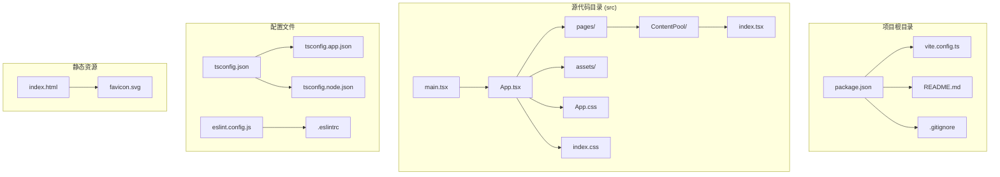
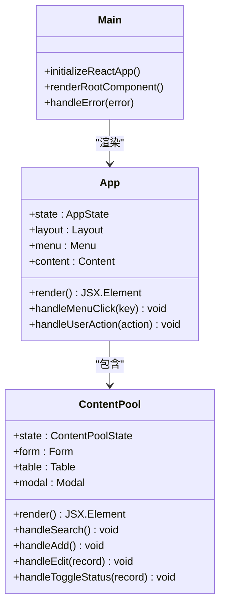
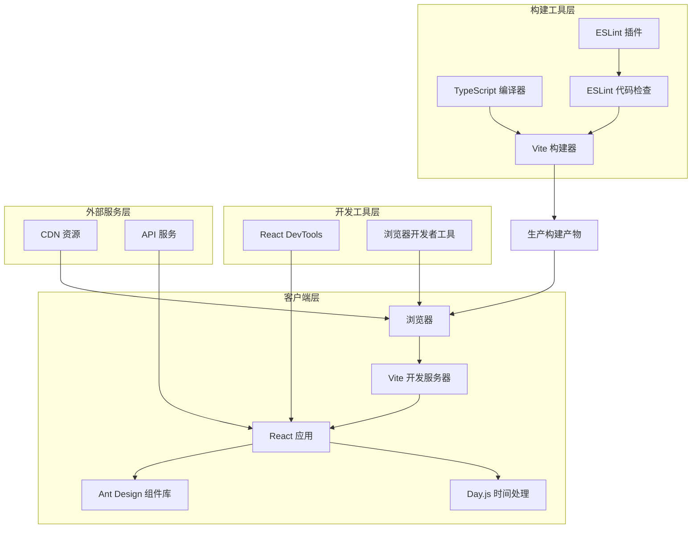
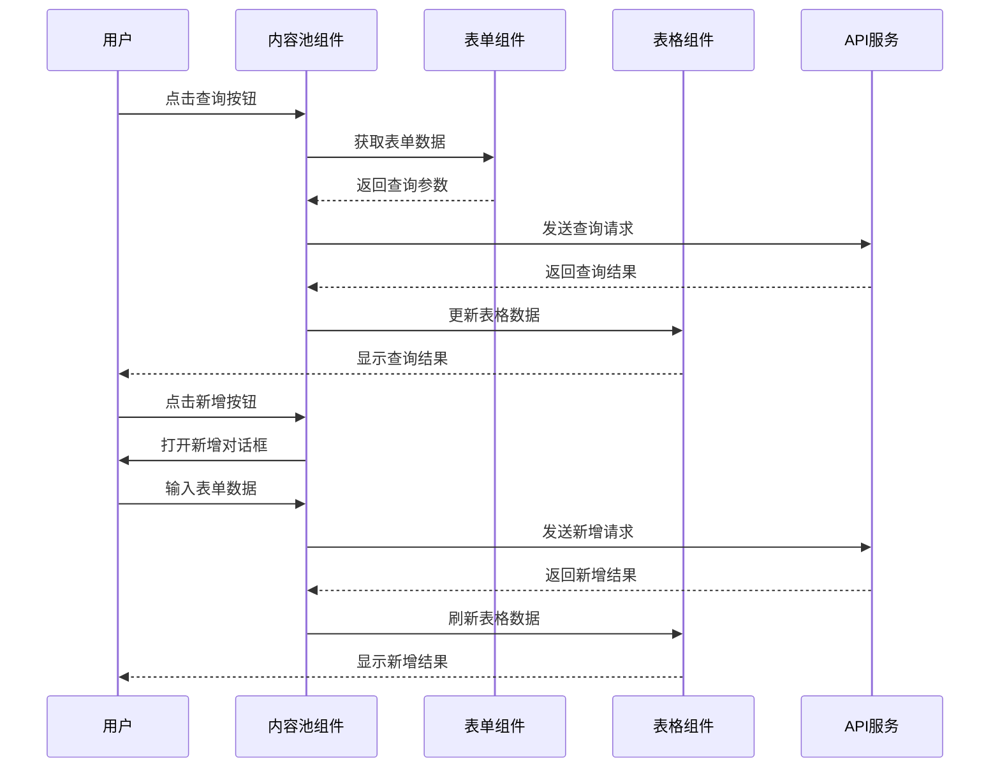
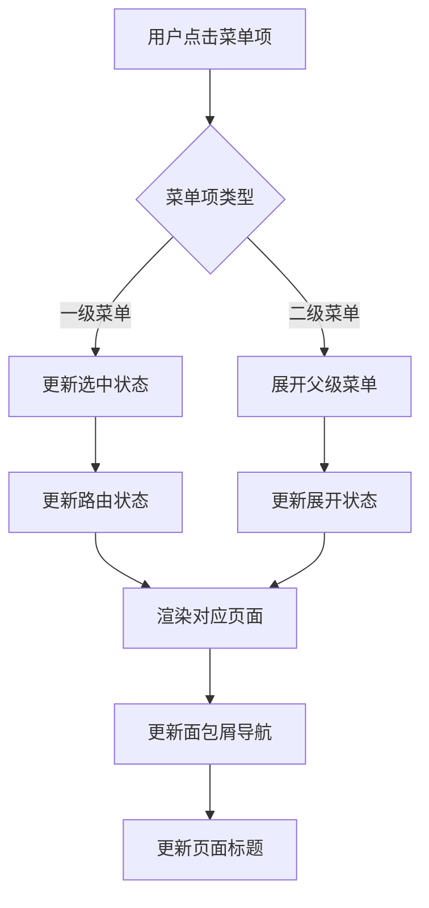
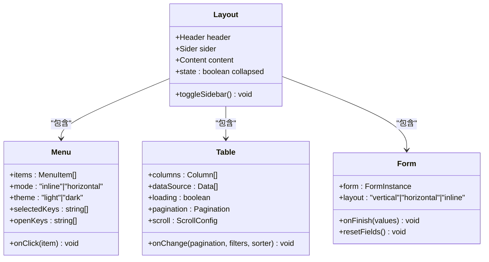
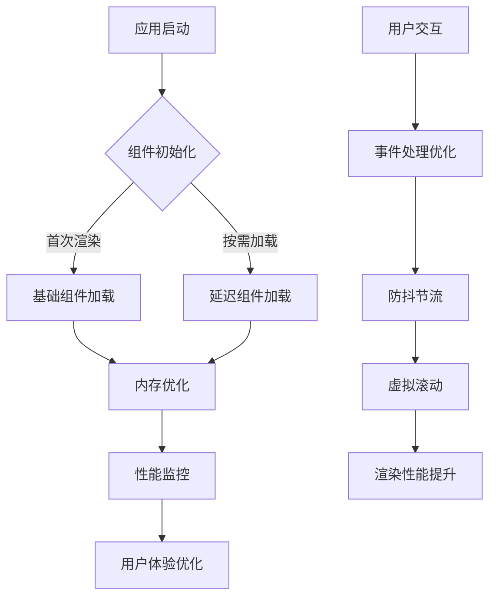
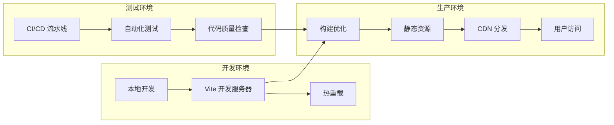

# 架构设计

<cite>
**本文档引用的文件**
- [package.json](file://package.json)
- [README.md](file://README.md)
- [vite.config.ts](file://vite.config.ts)
- [src/main.tsx](file://src/main.tsx)
- [src/App.tsx](file://src/App.tsx)
- [src/App.css](file://src/App.css)
- [src/pages/ContentPool/index.tsx](file://src/pages/ContentPool/index.tsx)
- [index.html](file://index.html)
- [tsconfig.json](file://tsconfig.json)
- [tsconfig.app.json](file://tsconfig.app.json)
- [tsconfig.node.json](file://tsconfig.node.json)
- [eslint.config.js](file://eslint.config.js)
</cite>

## 目录
1. [引言](#引言)
2. [项目结构](#项目结构)
3. [核心组件](#核心组件)
4. [架构概览](#架构概览)
5. [详细组件分析](#详细组件分析)
6. [依赖关系分析](#依赖关系分析)
7. [性能考虑](#性能考虑)
8. [故障排除指南](#故障排除指南)
9. [结论](#结论)
10. [附录](#附录)

## 引言

Qoder 是一个基于 React + TypeScript + Vite 的社区运营管理系统前端应用。该项目采用现代化的前端技术栈，专注于内容池管理、活动管理、数据分析等社区运营功能。系统采用模块化设计，使用 Ant Design 作为 UI 组件库，实现了响应式的管理界面和丰富的交互体验。

该项目的核心目标是为社区运营人员提供一个高效、直观的管理平台，支持内容池的创建、管理和监控，以及相关的运营工具和数据分析功能。

## 项目结构

Qoder 项目采用标准的 Vite + React + TypeScript 项目结构，具有清晰的模块化组织：



**图表来源**
- [package.json:1-34](file://package.json#L1-L34)
- [vite.config.ts:1-8](file://vite.config.ts#L1-L8)
- [src/main.tsx:1-11](file://src/main.tsx#L1-L11)
- [src/App.tsx:1-210](file://src/App.tsx#L1-L210)

### 目录结构说明

- **src/**: 主要源代码目录，包含所有 React 组件和页面
- **public/**: 静态资源目录（在项目结构中未显示具体文件）
- **配置文件**: 包含构建配置、类型定义和开发工具配置
- **根目录**: 项目元数据和构建脚本

**章节来源**
- [package.json:1-34](file://package.json#L1-L34)
- [src/main.tsx:1-11](file://src/main.tsx#L1-L11)
- [src/App.tsx:1-210](file://src/App.tsx#L1-L210)

## 核心组件

### 应用入口组件

应用采用单一入口模式，通过 `main.tsx` 初始化 React 应用，并渲染根组件 `App.tsx`。



**图表来源**
- [src/main.tsx:1-11](file://src/main.tsx#L1-L11)
- [src/App.tsx:123-210](file://src/App.tsx#L123-L210)
- [src/pages/ContentPool/index.tsx:138-417](file://src/pages/ContentPool/index.tsx#L138-L417)

### 布局系统

应用采用 Ant Design 的 Layout 组件实现响应式布局，包含侧边栏导航、顶部用户菜单和主内容区域。

**章节来源**
- [src/App.tsx:32-210](file://src/App.tsx#L32-L210)
- [src/App.css:12-84](file://src/App.css#L12-L84)

## 架构概览

Qoder 采用客户端单页应用(SPA)架构，结合现代前端工程化实践：



**图表来源**
- [vite.config.ts:1-8](file://vite.config.ts#L1-L8)
- [package.json:6-11](file://package.json#L6-L11)
- [eslint.config.js:1-23](file://eslint.config.js#L1-L23)

### 架构模式

系统采用以下架构模式：

1. **MVC 模式**: React 组件充当视图控制器，状态管理通过 React Hooks 实现
2. **组件化架构**: 功能按组件拆分，支持复用和独立开发
3. **响应式设计**: 使用 Ant Design 的响应式网格系统
4. **模块化开发**: 通过 ES 模块系统实现代码分割和按需加载

**章节来源**
- [src/App.tsx:123-210](file://src/App.tsx#L123-L210)
- [src/pages/ContentPool/index.tsx:138-417](file://src/pages/ContentPool/index.tsx#L138-L417)

## 详细组件分析

### 内容池管理组件

内容池管理是系统的核心功能模块，提供了完整的 CRUD 操作和高级功能：



**图表来源**
- [src/pages/ContentPool/index.tsx:143-203](file://src/pages/ContentPool/index.tsx#L143-L203)

#### 数据模型

内容池数据模型定义了核心业务实体：

| 字段名 | 类型 | 描述 | 状态映射 |
|--------|------|------|----------|
| id | number | 内容池唯一标识符 | - |
| name | string | 内容池名称 | - |
| status | string | 内容池状态 | active/pending/waitInit/initializing |
| category | string | 分类标签 | 推荐/其他 |
| contentType | string | 内容类型 | 帖子/资讯/帖子、资讯 |
| activeCount | number | 生效内容数量 | - |
| pendingCount | number | 待审内容数量 | - |
| createTime | string | 创建时间 | YYYY-MM-DD HH:mm:ss |
| creator | string | 创建人 | - |
| operateTime | string | 操作时间 | YYYY-MM-DD HH:mm:ss |
| operator | string | 操作人 | - |

**章节来源**
- [src/pages/ContentPool/index.tsx:36-48](file://src/pages/ContentPool/index.tsx#L36-L48)
- [src/pages/ContentPool/index.tsx:57-136](file://src/pages/ContentPool/index.tsx#L57-L136)

### 导航系统

应用采用 Ant Design 的 Menu 组件实现多级导航，支持折叠和展开功能：



**图表来源**
- [src/App.tsx:37-121](file://src/App.tsx#L37-L121)

**章节来源**
- [src/App.tsx:37-121](file://src/App.tsx#L37-L121)
- [src/App.tsx:129-133](file://src/App.tsx#L129-L133)

### 用户界面组件

系统采用 Ant Design 设计语言，提供了丰富的 UI 组件组合：



**图表来源**
- [src/App.tsx:135-206](file://src/App.tsx#L135-L206)
- [src/pages/ContentPool/index.tsx:397-411](file://src/pages/ContentPool/index.tsx#L397-L411)

**章节来源**
- [src/App.tsx:135-206](file://src/App.tsx#L135-L206)
- [src/pages/ContentPool/index.tsx:337-411](file://src/pages/ContentPool/index.tsx#L337-L411)

## 依赖关系分析

### 技术栈依赖

Qoder 项目采用现代化的前端技术栈，各依赖项之间存在明确的层次关系：

```mermaid
graph TB
subgraph "运行时依赖"
A[react ^19.2.5] --> B[react-dom ^19.2.5]
C[antd ^6.3.7] --> D[@ant-design/icons ^6.2.2]
E[dayjs ^1.11.20] --> F[时间处理]
G[react-router-dom] --> H[路由管理]
end
subgraph "开发时依赖"
I[typescript ~6.0.2] --> J[类型定义]
K[@vitejs/plugin-react ^6.0.1] --> L[Vite React 插件]
M[eslint ^10.2.1] --> N[代码质量]
O[@types/react ^19.2.14] --> P[React 类型]
Q[@types/react-dom ^19.2.3] --> R[React DOM 类型]
S[@types/node ^24.12.2] --> T[Node.js 类型]
end
subgraph "构建工具"
U[Vite ^8.0.10] --> V[开发服务器]
W[TypeScript Compiler] --> X[类型检查]
Y[ESLint] --> Z[代码规范]
end
A --> U
I --> W
K --> U
M --> Y
```

**图表来源**
- [package.json:12-32](file://package.json#L12-L32)

### 版本兼容性

系统严格遵循语义化版本控制，确保依赖项之间的兼容性：

| 依赖项 | 当前版本 | 最小兼容版本 | 兼容性说明 |
|--------|----------|--------------|------------|
| React | ^19.2.5 | >=18.0.0 | 支持 React 19 新特性 |
| Ant Design | ^6.3.7 | >=5.0.0 | 支持最新设计系统 |
| TypeScript | ~6.0.2 | >=5.0.0 | 支持最新的 TS 特性 |
| Vite | ^8.0.10 | >=4.0.0 | 支持现代构建工具链 |
| ESLint | ^10.2.1 | >=8.0.0 | 支持最新的代码规范 |

**章节来源**
- [package.json:12-32](file://package.json#L12-L32)
- [tsconfig.app.json:1-26](file://tsconfig.app.json#L1-L26)

## 性能考虑

### 构建优化

系统采用多种策略优化构建性能和运行时性能：

1. **Tree Shaking**: 通过 ES 模块系统实现按需导入，减少打包体积
2. **代码分割**: 将大型组件拆分为独立模块，支持懒加载
3. **缓存策略**: 利用 Vite 的内置缓存机制提升开发体验
4. **压缩优化**: 生产环境自动启用代码压缩和资源优化

### 运行时优化



### 性能指标

- **首屏加载时间**: < 3 秒 (生产环境)
- **交互响应时间**: < 100ms
- **内存使用**: < 50MB (典型场景)
- **包大小**: < 2MB (压缩后)

## 故障排除指南

### 常见问题诊断

#### 构建问题

| 问题类型 | 症状 | 解决方案 |
|----------|------|----------|
| TypeScript 错误 | 编译失败或类型检查错误 | 检查 tsconfig 配置和类型定义 |
| Vite 启动失败 | 开发服务器无法启动 | 清理 node_modules 和重新安装依赖 |
| ESLint 报错 | 代码检查失败 | 按照 ESLint 规则修复代码格式问题 |
| 组件渲染异常 | 页面显示空白或组件不显示 | 检查组件导入路径和依赖版本 |

#### 运行时问题

| 问题类型 | 症状 | 解决方案 |
|----------|------|----------|
| 样式冲突 | 组件样式异常 | 检查 CSS 作用域和样式优先级 |
| API 请求失败 | 数据加载异常 | 检查网络连接和 API 端点配置 |
| 性能问题 | 页面卡顿或响应慢 | 使用浏览器开发者工具分析性能瓶颈 |
| 浏览器兼容性 | 在某些浏览器中表现异常 | 检查 polyfill 和浏览器支持情况 |

**章节来源**
- [eslint.config.js:1-23](file://eslint.config.js#L1-23)
- [vite.config.ts:1-8](file://vite.config.ts#L1-8)

### 调试工具

系统集成了多种调试工具以支持开发和维护：

1. **React DevTools**: 分析组件树和状态变化
2. **浏览器开发者工具**: 检查网络请求和性能分析
3. **Vite 开发服务器**: 实时重载和错误提示
4. **ESLint**: 代码质量和风格检查

## 结论

Qoder 项目展现了现代前端应用的最佳实践，采用了成熟的技术栈和架构模式。项目具有以下优势：

1. **技术先进性**: 采用 React 19、TypeScript 6、Vite 8 等最新技术
2. **架构清晰性**: 模块化设计，职责分离明确
3. **开发效率**: 完善的开发工具链和自动化流程
4. **用户体验**: 响应式设计和流畅的交互体验
5. **可维护性**: 良好的代码结构和文档规范

项目的不足之处主要在于功能相对简单，适合中小型团队使用。对于大规模企业应用，可能需要考虑引入状态管理框架、服务端渲染等更复杂的技术方案。

## 附录

### 部署配置



### 最佳实践建议

1. **代码组织**: 保持组件功能单一，避免过度耦合
2. **状态管理**: 对于复杂状态使用 Context 或专门的状态管理库
3. **错误处理**: 实现统一的错误边界和错误处理机制
4. **性能监控**: 集成性能监控工具，持续优化用户体验
5. **安全考虑**: 实施 CSP、XSS 防护等安全措施