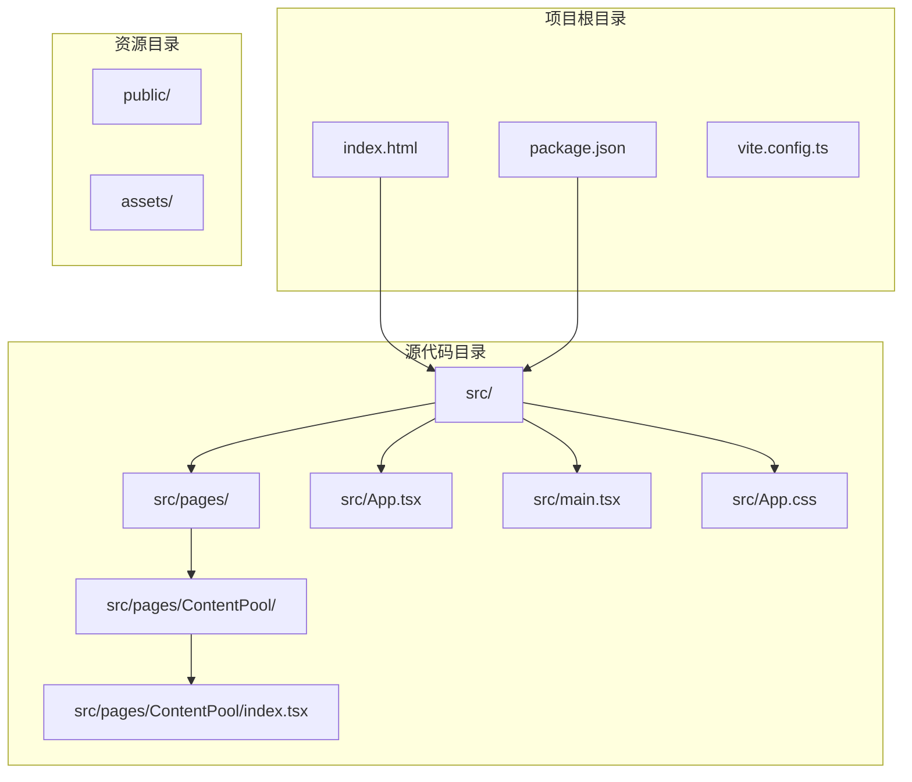
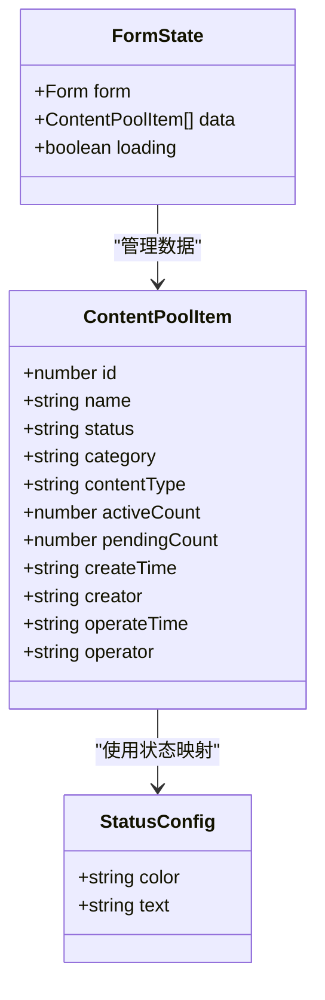
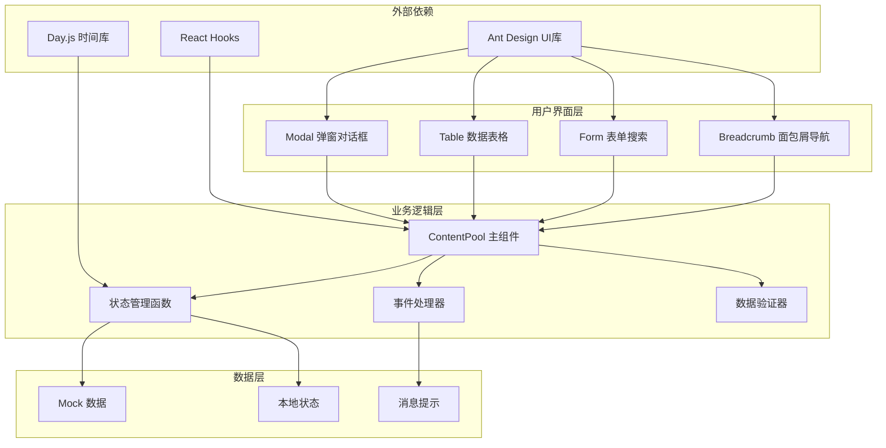
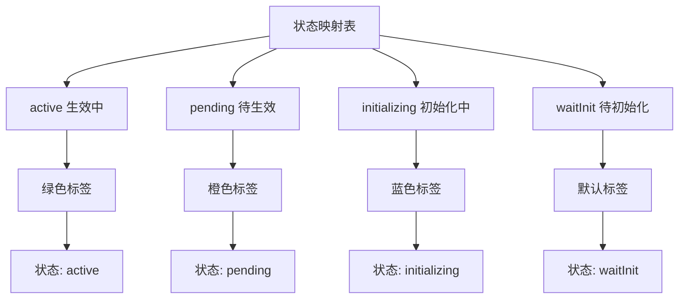
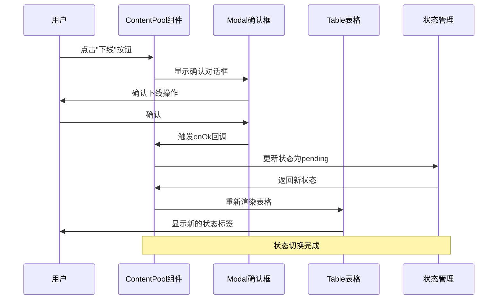
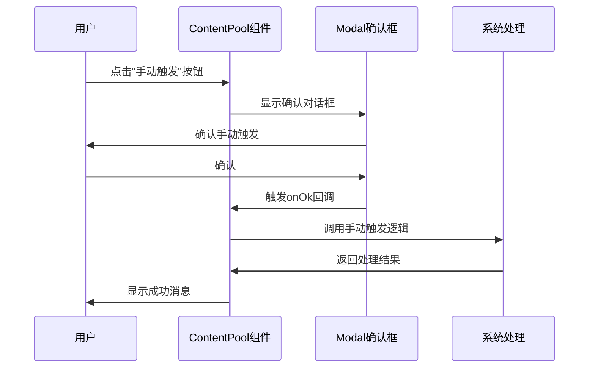
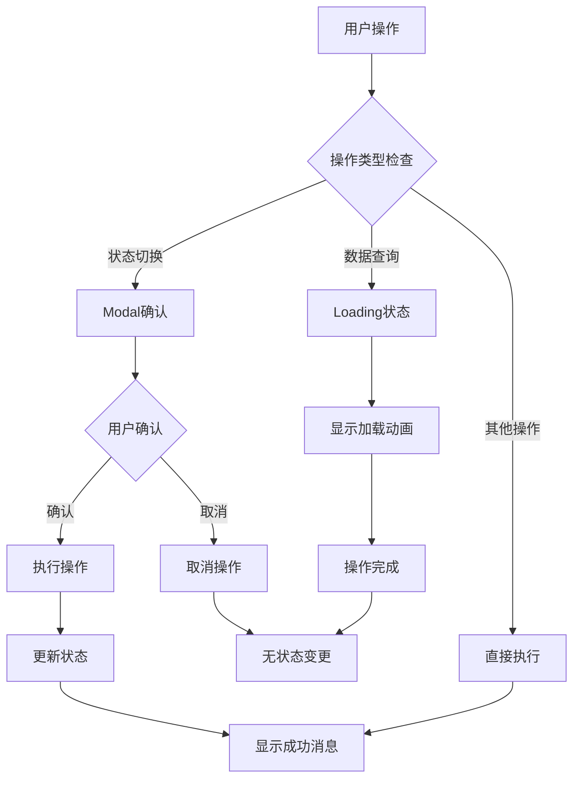
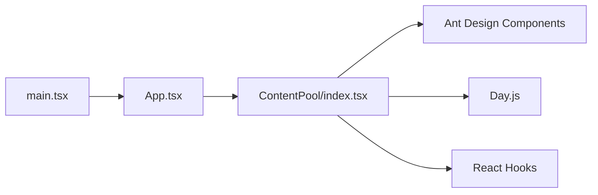

# 内容池管理功能

<cite>
**本文档引用的文件**
- [src/pages/ContentPool/index.tsx](file://src/pages/ContentPool/index.tsx)
- [src/App.tsx](file://src/App.tsx)
- [src/main.tsx](file://src/main.tsx)
- [src/App.css](file://src/App.css)
- [package.json](file://package.json)
- [index.html](file://index.html)
</cite>

## 目录
1. [简介](#简介)
2. [项目结构](#项目结构)
3. [核心组件](#核心组件)
4. [架构概览](#架构概览)
5. [详细组件分析](#详细组件分析)
6. [依赖关系分析](#依赖关系分析)
7. [性能考虑](#性能考虑)
8. [故障排除指南](#故障排除指南)
9. [结论](#结论)

## 简介

内容池管理功能是社区运营管理系统中的一个核心模块，负责管理和控制内容池的完整生命周期。该功能提供了内容池的创建、编辑、删除、复制和状态切换等完整操作能力，支持多状态管理机制和实时数据更新。

本系统采用现代化的前端技术栈，基于React 19、TypeScript和Ant Design组件库构建，提供了直观易用的用户界面和丰富的交互体验。

## 项目结构

该项目采用标准的Vite + React + TypeScript项目结构，重点关注内容池管理功能的实现。



**图表来源**
- [src/pages/ContentPool/index.tsx:1-417](file://src/pages/ContentPool/index.tsx#L1-L417)
- [src/App.tsx:1-210](file://src/App.tsx#L1-L210)
- [src/main.tsx:1-11](file://src/main.tsx#L1-L11)

**章节来源**
- [src/pages/ContentPool/index.tsx:1-417](file://src/pages/ContentPool/index.tsx#L1-L417)
- [src/App.tsx:1-210](file://src/App.tsx#L1-L210)
- [src/main.tsx:1-11](file://src/main.tsx#L1-L11)

## 核心组件

### ContentPool 主组件

ContentPool 是整个内容池管理功能的核心组件，负责渲染完整的UI界面和处理用户交互。

#### 主要功能特性

1. **数据展示**: 使用Ant Design Table组件展示内容池列表
2. **状态管理**: 维护内容池数据的本地状态
3. **用户交互**: 提供搜索、筛选、编辑、删除等操作
4. **状态切换**: 实现内容池状态的在线/离线切换
5. **批量操作**: 支持复制、手动触发等批量功能

#### 数据结构设计



**图表来源**
- [src/pages/ContentPool/index.tsx:36-48](file://src/pages/ContentPool/index.tsx#L36-L48)
- [src/pages/ContentPool/index.tsx:50-55](file://src/pages/ContentPool/index.tsx#L50-L55)

**章节来源**
- [src/pages/ContentPool/index.tsx:36-48](file://src/pages/ContentPool/index.tsx#L36-L48)
- [src/pages/ContentPool/index.tsx:50-55](file://src/pages/ContentPool/index.tsx#L50-L55)

## 架构概览

系统采用组件化架构设计，主要分为以下几个层次：



**图表来源**
- [src/pages/ContentPool/index.tsx:138-414](file://src/pages/ContentPool/index.tsx#L138-L414)
- [src/App.tsx:29](file://src/App.tsx#L29)

## 详细组件分析

### 状态管理机制

系统实现了完整的状态管理机制，包括状态映射表和状态切换逻辑。

#### 状态映射表设计



**图表来源**
- [src/pages/ContentPool/index.tsx:50-55](file://src/pages/ContentPool/index.tsx#L50-L55)

#### 状态切换逻辑



**图表来源**
- [src/pages/ContentPool/index.tsx:168-185](file://src/pages/ContentPool/index.tsx#L168-L185)

**章节来源**
- [src/pages/ContentPool/index.tsx:50-55](file://src/pages/ContentPool/index.tsx#L50-L55)
- [src/pages/ContentPool/index.tsx:168-185](file://src/pages/ContentPool/index.tsx#L168-L185)

### 数据结构设计

#### ContentPoolItem 接口详解

| 字段名 | 类型 | 描述 | 示例值 |
|--------|------|------|--------|
| id | number | 内容池唯一标识符 | 1255 |
| name | string | 内容池名称 | "gif-帖子、资讯" |
| status | string | 当前状态 | "active" |
| category | string | 分类信息 | "推荐" |
| contentType | string | 内容类型 | "帖子" |
| activeCount | number | 生效内容数量 | 5 |
| pendingCount | number | 待审内容数量 | 0 |
| createTime | string | 创建时间 | "2025-10-22 13:55:19" |
| creator | string | 创建者 | "龚凌锋" |
| operateTime | string | 操作时间 | "2026-04-28 09:40:40" |
| operator | string | 操作者 | "龚凌锋" |

#### 状态枚举值说明

| 状态值 | 中文描述 | 颜色标识 | 用途场景 |
|--------|----------|----------|----------|
| active | 生效中 | green | 内容池正常运行，可被系统使用 |
| pending | 待生效 | orange | 内容池等待激活，准备上线 |
| initializing | 初始化中 | blue | 内容池正在初始化过程 |
| waitInit | 待初始化 | default | 内容池等待初始化 |

**章节来源**
- [src/pages/ContentPool/index.tsx:36-48](file://src/pages/ContentPool/index.tsx#L36-L48)
- [src/pages/ContentPool/index.tsx:50-55](file://src/pages/ContentPool/index.tsx#L50-L55)

### 操作流程详解

#### 内容池状态切换流程

```mermaid
flowchart TD
A[用户点击状态切换按钮] --> B{当前状态检查}
B --> |active| C[显示"下线"确认对话框]
B --> |非active| D[显示"生效"确认对话框]
C --> E[用户确认下线]
D --> F[用户确认生效]
E --> G[更新状态为pending]
F --> H[更新状态为active]
G --> I[更新操作时间和操作者]
H --> I
I --> J[重新渲染表格]
J --> K[显示成功消息]
K --> L[操作完成]
```

**图表来源**
- [src/pages/ContentPool/index.tsx:168-185](file://src/pages/ContentPool/index.tsx#L168-L185)

#### 手动触发功能流程



**图表来源**
- [src/pages/ContentPool/index.tsx:195-203](file://src/pages/ContentPool/index.tsx#L195-L203)

**章节来源**
- [src/pages/ContentPool/index.tsx:168-185](file://src/pages/ContentPool/index.tsx#L168-L185)
- [src/pages/ContentPool/index.tsx:195-203](file://src/pages/ContentPool/index.tsx#L195-L203)

### 错误处理和用户反馈机制

#### 用户反馈系统

系统实现了多层次的用户反馈机制：

1. **消息提示**: 使用Ant Design的message组件提供即时反馈
2. **确认对话框**: 使用Modal.confirm确保重要操作的安全性
3. **加载状态**: 通过loading状态指示异步操作进行中
4. **状态标签**: 通过颜色编码直观显示状态信息

#### 错误处理策略



**图表来源**
- [src/pages/ContentPool/index.tsx:143-149](file://src/pages/ContentPool/index.tsx#L143-L149)
- [src/pages/ContentPool/index.tsx:171-184](file://src/pages/ContentPool/index.tsx#L171-L184)

**章节来源**
- [src/pages/ContentPool/index.tsx:143-149](file://src/pages/ContentPool/index.tsx#L143-L149)
- [src/pages/ContentPool/index.tsx:171-184](file://src/pages/ContentPool/index.tsx#L171-L184)

## 依赖关系分析

### 技术栈依赖

```mermaid
graph TB
subgraph "核心框架"
A[React 19]
B[TypeScript]
C[Vite]
end
subgraph "UI组件库"
D[Ant Design 6.3.7]
E[@ant-design/icons]
end
subgraph "工具库"
F[dayjs 1.11.20]
end
subgraph "开发工具"
G[ESLint]
H[React Hooks]
I[React Refresh]
end
A --> D
A --> F
D --> E
C --> G
A --> H
A --> I
```

**图表来源**
- [package.json:12-32](file://package.json#L12-L32)

### 组件依赖关系



**图表来源**
- [src/main.tsx:4](file://src/main.tsx#L4)
- [src/App.tsx:29](file://src/App.tsx#L29)
- [src/pages/ContentPool/index.tsx:1-31](file://src/pages/ContentPool/index.tsx#L1-L31)

**章节来源**
- [package.json:12-32](file://package.json#L12-L32)
- [src/main.tsx:4](file://src/main.tsx#L4)
- [src/App.tsx:29](file://src/App.tsx#L29)

## 性能考虑

### 渲染优化

1. **虚拟滚动**: 表格组件支持大数据量的虚拟滚动渲染
2. **状态最小化**: 只在必要时更新相关状态
3. **防抖处理**: 搜索功能支持防抖，避免频繁请求
4. **懒加载**: 图标和组件按需加载

### 内存管理

1. **组件卸载**: 正确处理组件卸载时的状态清理
2. **事件监听**: 及时移除不需要的事件监听器
3. **定时器清理**: 确保定时器在组件卸载时正确清理

## 故障排除指南

### 常见问题及解决方案

#### 状态显示异常

**问题**: 状态标签颜色或文本显示不正确
**原因**: 状态映射表配置错误
**解决方案**: 检查statusMap对象的配置，确保所有状态都有对应的配置项

#### 操作无响应

**问题**: 点击按钮后没有反应
**原因**: 事件处理器未正确绑定或状态更新失败
**解决方案**: 检查按钮的onClick属性绑定，确认状态更新逻辑正常执行

#### 数据不更新

**问题**: 修改状态后表格数据没有刷新
**原因**: 状态更新后未触发重新渲染
**解决方案**: 确保使用setState正确更新状态，检查key属性是否正确

**章节来源**
- [src/pages/ContentPool/index.tsx:168-185](file://src/pages/ContentPool/index.tsx#L168-L185)

## 结论

内容池管理功能是一个功能完整、架构清晰的前端应用模块。它成功实现了内容池的全生命周期管理，包括创建、编辑、删除、复制和状态切换等核心功能。

### 主要优势

1. **用户体验优秀**: 基于Ant Design的现代化UI设计，提供直观的操作界面
2. **功能完整**: 覆盖了内容池管理的所有核心需求
3. **扩展性强**: 清晰的架构设计便于后续功能扩展
4. **性能良好**: 采用现代前端技术栈，具有良好的性能表现

### 技术亮点

1. **状态管理**: 完整的状态映射表和切换逻辑
2. **用户反馈**: 多层次的用户反馈机制
3. **数据结构**: 清晰的数据模型设计
4. **错误处理**: 完善的错误处理和用户提示机制

该功能模块为社区运营管理系统提供了坚实的基础，能够有效支撑内容池的日常管理工作。