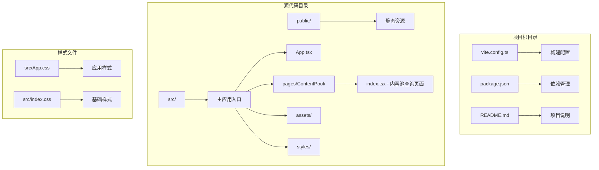
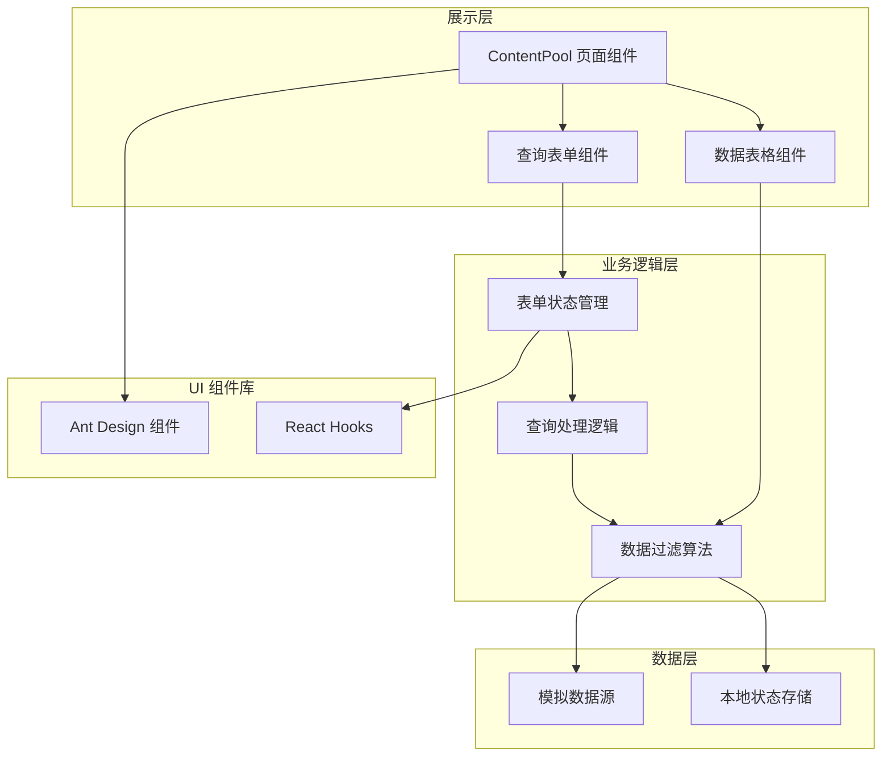
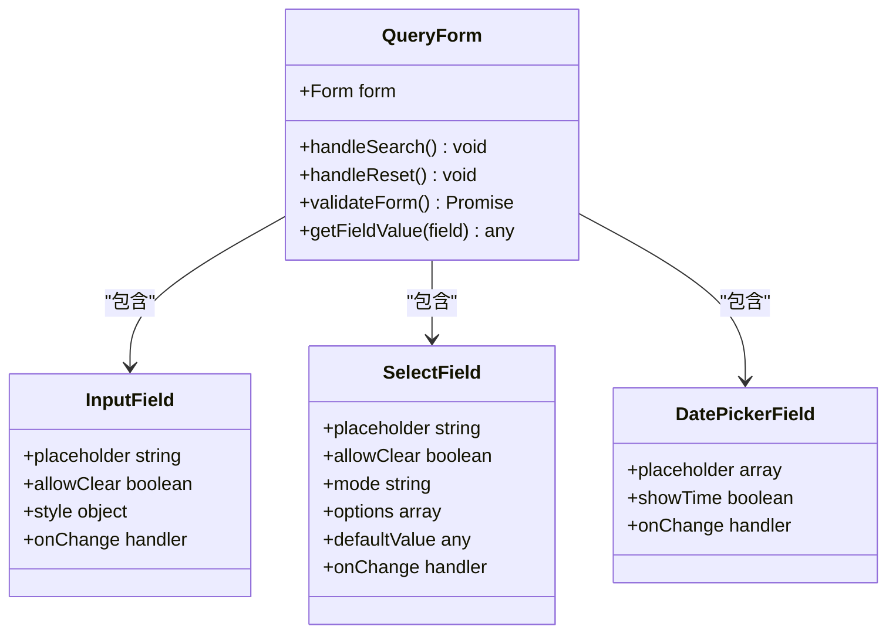
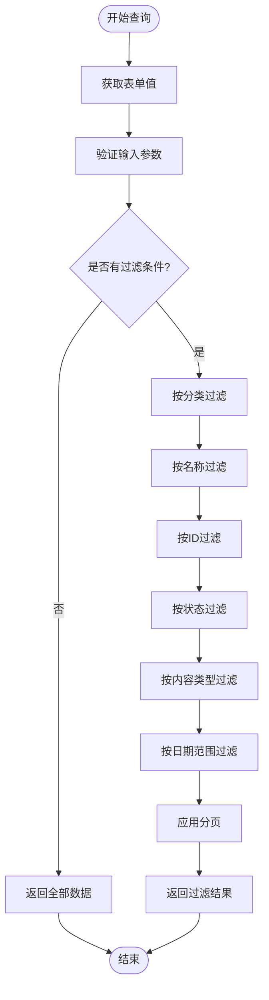
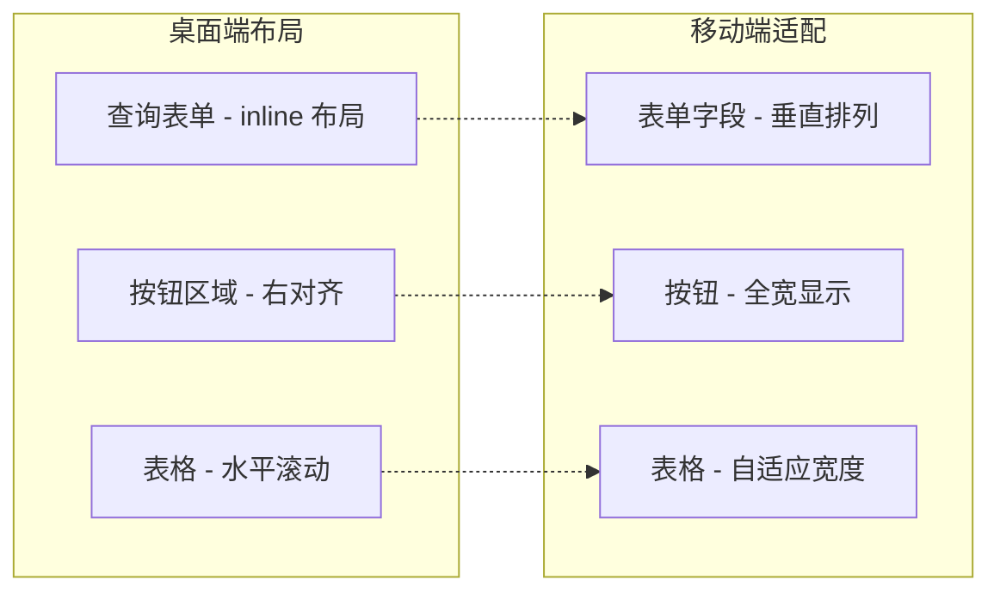
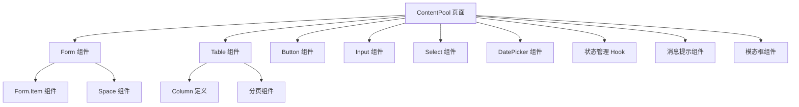
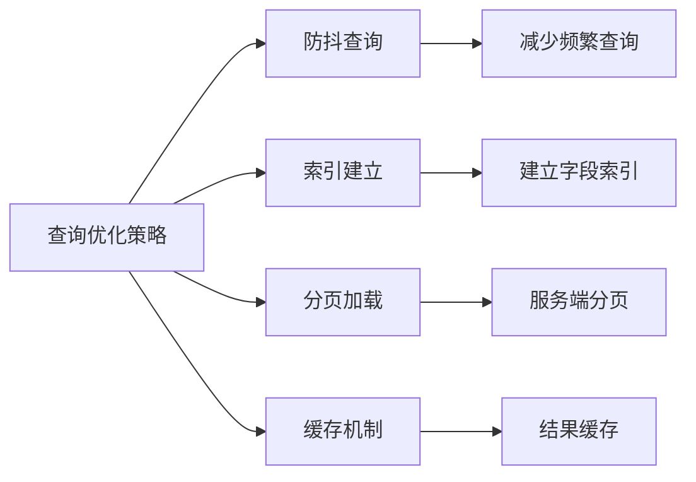

# 多维查询功能

<cite>
**本文档引用的文件**
- [src/pages/ContentPool/index.tsx](file://src/pages/ContentPool/index.tsx)
- [src/App.tsx](file://src/App.tsx)
- [src/App.css](file://src/App.css)
- [src/index.css](file://src/index.css)
- [package.json](file://package.json)
- [vite.config.ts](file://vite.config.ts)
</cite>

## 目录
1. [简介](#简介)
2. [项目结构](#项目结构)
3. [核心组件](#核心组件)
4. [架构概览](#架构概览)
5. [详细组件分析](#详细组件分析)
6. [依赖关系分析](#依赖关系分析)
7. [性能考虑](#性能考虑)
8. [故障排除指南](#故障排除指南)
9. [结论](#结论)

## 简介

本项目是一个基于 React + TypeScript + Ant Design 的内容池管理系统，专注于实现多维查询功能。该功能支持基于ID、名称、分类、状态、内容类型、操作时间等多个维度的综合查询，为用户提供直观、高效的搜索体验。

系统采用现代化的前端技术栈，结合 Ant Design 组件库的强大功能，实现了完整的查询表单设计、数据验证、过滤逻辑和结果显示机制。查询功能特别针对内容池管理场景进行了深度定制，包括状态标签显示、操作按钮集成、分页处理等功能。

## 项目结构

该项目采用模块化的组织方式，主要文件结构如下：



**图表来源**
- [src/pages/ContentPool/index.tsx:1-417](file://src/pages/ContentPool/index.tsx#L1-L417)
- [src/App.tsx:1-210](file://src/App.tsx#L1-L210)

**章节来源**
- [package.json:1-34](file://package.json#L1-L34)
- [vite.config.ts:1-8](file://vite.config.ts#L1-L8)

## 核心组件

### 查询表单组件

查询表单是整个多维查询功能的核心组件，采用了 Ant Design 的 Form 组件系统，提供了完整的表单管理和验证能力。

#### 表单字段设计

查询表单包含以下六个核心查询维度：

1. **ID 查询** - 基于内容池唯一标识符的精确匹配
2. **名称查询** - 基于内容池名称的模糊匹配
3. **分类筛选** - 基于内容池分类的单选或多选
4. **状态筛选** - 基于内容池状态的多选过滤
5. **内容类型** - 基于内容类型的精确匹配
6. **操作时间范围** - 基于时间范围的日期区间查询

#### 输入控件实现

每个查询维度都使用了相应的 Ant Design 控件：

- **Input** - 用于 ID 和名称的文本输入
- **Select** - 用于分类、状态、内容类型的下拉选择
- **RangePicker** - 用于操作时间范围的日期选择器

**章节来源**
- [src/pages/ContentPool/index.tsx:337-395](file://src/pages/ContentPool/index.tsx#L337-L395)

### 数据表格组件

查询结果显示通过 Ant Design 的 Table 组件实现，支持响应式布局、分页处理和丰富的交互功能。

#### 列定义

表格包含以下列：
- ID、名称、分类、内容类型
- 状态标签显示
- 生效内容量、待审内容量
- 创建时间/创建人、操作时间/操作人
- 操作按钮组（编辑、浏览、状态切换、日志、复制、手动触发）

**章节来源**
- [src/pages/ContentPool/index.tsx:205-324](file://src/pages/ContentPool/index.tsx#L205-L324)

## 架构概览

系统采用分层架构设计，清晰分离了展示层、业务逻辑层和数据层：



**图表来源**
- [src/pages/ContentPool/index.tsx:138-417](file://src/pages/ContentPool/index.tsx#L138-L417)

## 详细组件分析

### 查询表单组件分析

#### 表单结构设计

查询表单采用了 Ant Design 的 Form 组件，结合了多种输入控件来满足不同的查询需求：



**图表来源**
- [src/pages/ContentPool/index.tsx:337-395](file://src/pages/ContentPool/index.tsx#L337-L395)

#### 字段验证策略

表单验证采用了 Ant Design 的内置验证机制，确保用户输入的有效性：

1. **必填字段验证** - 对于关键查询字段进行必填检查
2. **格式验证** - 对 ID 进行数字格式验证
3. **范围验证** - 对日期范围进行逻辑验证
4. **业务规则验证** - 对状态和分类进行业务规则检查

**章节来源**
- [src/pages/ContentPool/index.tsx:142-154](file://src/pages/ContentPool/index.tsx#L142-L154)

### 数据过滤逻辑分析

#### 过滤算法实现

当前的过滤逻辑采用内存中的数据处理方式，虽然在演示环境中表现良好，但在生产环境中需要考虑性能优化：



**图表来源**
- [src/pages/ContentPool/index.tsx:142-149](file://src/pages/ContentPool/index.tsx#L142-L149)

#### 性能优化策略

为了提升查询性能，建议采用以下优化策略：

1. **防抖处理** - 对实时查询添加防抖机制
2. **索引优化** - 为常用查询字段建立索引
3. **分页加载** - 实现服务端分页而非客户端分页
4. **缓存机制** - 缓存查询结果避免重复计算

**章节来源**
- [src/pages/ContentPool/index.tsx:142-149](file://src/pages/ContentPool/index.tsx#L142-L149)

### 用户界面设计分析

#### 响应式布局设计

系统采用了 Ant Design 的响应式设计理念，确保在不同设备上的良好体验：



**图表来源**
- [src/pages/ContentPool/index.tsx:337-411](file://src/pages/ContentPool/index.tsx#L337-L411)

#### 交互设计原则

1. **即时反馈** - 查询时显示加载状态
2. **错误提示** - 提供清晰的错误信息
3. **操作确认** - 对重要操作进行二次确认
4. **状态保持** - 保持查询状态便于回溯

**章节来源**
- [src/pages/ContentPool/index.tsx:168-203](file://src/pages/ContentPool/index.tsx#L168-L203)

## 依赖关系分析

### 技术栈依赖

项目采用了现代化的前端技术栈，各依赖项之间的关系如下：

```mermaid
graph TB
subgraph "核心框架"
A[React 19.2.5] --> B[React DOM 19.2.5]
C[TypeScript 6.0.2] --> A
end
subgraph "UI 组件库"
D[Ant Design 6.3.7] --> A
E[@ant-design/icons 6.2.2] --> D
F[Day.js 1.11.20] --> A
end
subgraph "构建工具"
G[Vite 8.0.10] --> H[React 插件]
I[ESLint 10.2.1] --> J[TypeScript ESLint]
end
subgraph "开发工具"
K[React Refresh] --> A
L[全局类型定义] --> C
end
A --> D
A --> G
C --> I
D --> E
A --> F
```

**图表来源**
- [package.json:12-32](file://package.json#L12-L32)

### 组件间依赖关系

查询功能涉及的主要组件及其依赖关系：



**图表来源**
- [src/pages/ContentPool/index.tsx:1-417](file://src/pages/ContentPool/index.tsx#L1-L417)

**章节来源**
- [package.json:12-32](file://package.json#L12-L32)

## 性能考虑

### 当前实现的性能特征

基于现有代码分析，当前实现具有以下性能特点：

1. **内存使用** - 所有数据都在客户端内存中处理，适合中小规模数据集
2. **渲染性能** - 使用虚拟化渲染，但未启用分页虚拟化
3. **网络开销** - 无网络请求，完全本地处理
4. **响应速度** - 查询响应时间取决于数据量大小

### 性能优化建议

#### 1. 查询性能优化



#### 2. 渲染性能优化

- **虚拟化表格** - 对大数据集启用虚拟化渲染
- **懒加载** - 对复杂组件实现懒加载
- **状态分离** - 将查询状态与显示状态分离

#### 3. 内存优化

- **数据压缩** - 对传输的数据进行压缩
- **垃圾回收** - 及时清理不需要的引用
- **增量更新** - 实现数据的增量更新而非全量替换

## 故障排除指南

### 常见问题及解决方案

#### 1. 查询结果为空

**问题描述**：用户执行查询后没有得到任何结果

**可能原因**：
- 查询条件过于严格
- 数据源为空
- 过滤逻辑错误

**解决方案**：
- 提供"重置查询"功能
- 显示查询统计信息
- 添加空状态提示

#### 2. 表单验证失败

**问题描述**：表单提交时出现验证错误

**可能原因**：
- 必填字段未填写
- 数据格式不正确
- 业务规则冲突

**解决方案**：
- 提供实时验证反馈
- 显示具体的错误信息
- 支持批量验证

#### 3. 性能问题

**问题描述**：查询响应缓慢或页面卡顿

**可能原因**：
- 数据量过大
- 过滤逻辑复杂
- 渲染开销高

**解决方案**：
- 实现分页加载
- 优化过滤算法
- 添加加载状态指示

### 调试技巧

1. **开发者工具** - 使用浏览器开发者工具监控性能
2. **日志记录** - 在关键节点添加日志输出
3. **性能分析** - 使用 React Profiler 分析组件渲染
4. **内存监控** - 监控内存使用情况避免泄漏

**章节来源**
- [src/pages/ContentPool/index.tsx:142-154](file://src/pages/ContentPool/index.tsx#L142-L154)

## 结论

本项目的多维查询功能展现了现代前端开发的最佳实践，通过合理的技术选型和架构设计，实现了功能完整、用户体验良好的查询系统。

### 主要优势

1. **技术先进性** - 采用最新的 React 19 和 TypeScript 技术栈
2. **组件化设计** - 清晰的组件分离和职责划分
3. **用户体验** - 注重交互细节和视觉效果
4. **可扩展性** - 良好的架构为后续功能扩展奠定基础

### 改进建议

1. **性能优化** - 实现服务端查询和分页机制
2. **功能增强** - 添加高级查询功能如组合条件、保存查询等
3. **国际化支持** - 添加多语言支持
4. **测试覆盖** - 增加单元测试和集成测试

该查询功能为内容池管理提供了强大的数据检索能力，通过持续的优化和改进，可以进一步提升系统的性能和用户体验。