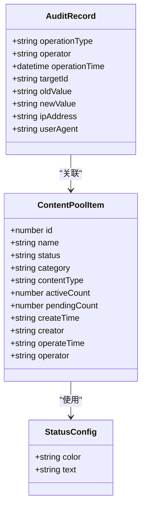
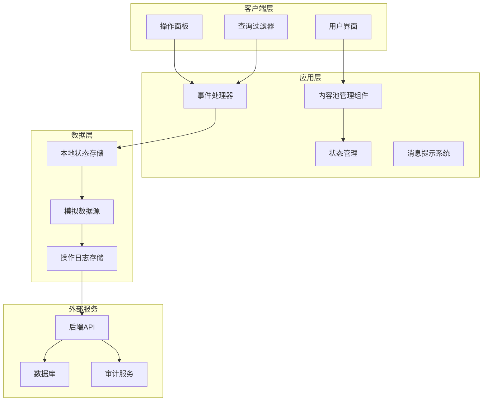
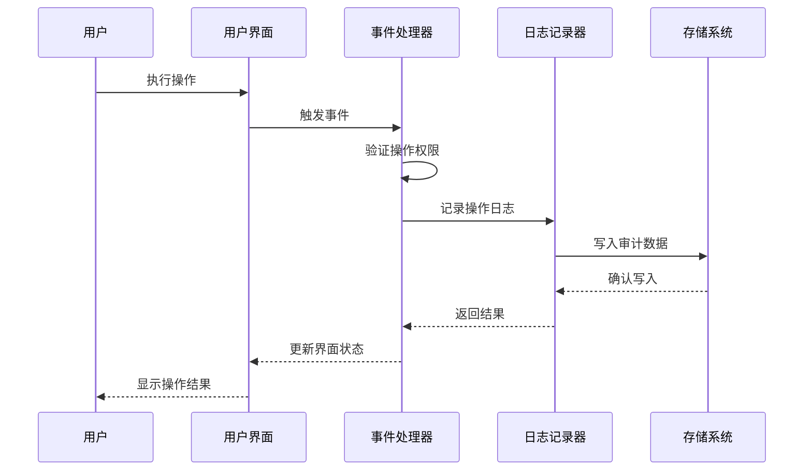
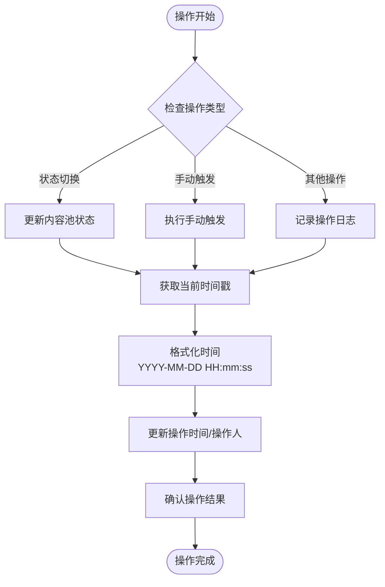
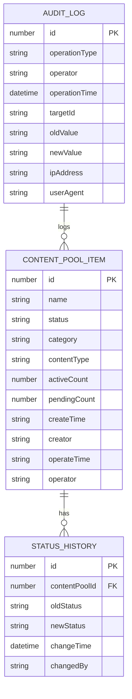
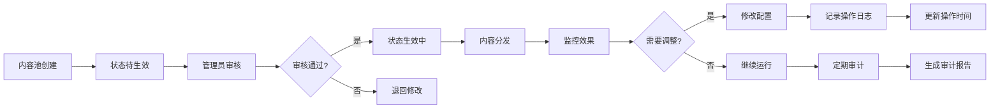
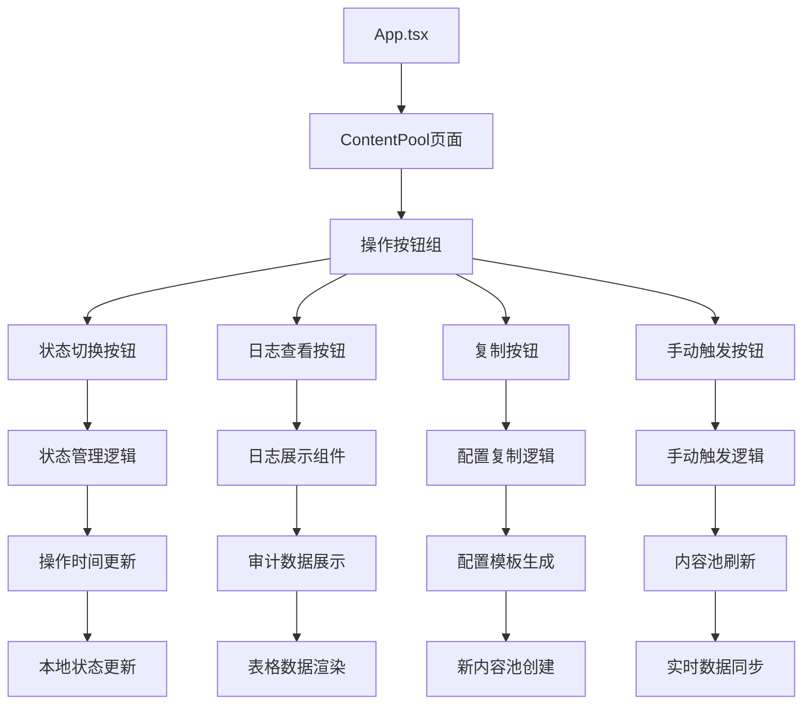
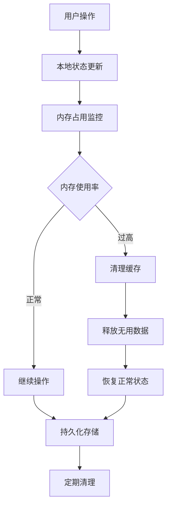

# 操作审计功能

<cite>
**本文档引用的文件**
- [README.md](file://README.md)
- [package.json](file://package.json)
- [src/App.tsx](file://src/App.tsx)
- [src/main.tsx](file://src/main.tsx)
- [src/pages/ContentPool/index.tsx](file://src/pages/ContentPool/index.tsx)
- [PRD-动态内容池管理功能.md](file://PRD-动态内容池管理功能.md)
</cite>

## 目录
1. [简介](#简介)
2. [项目结构](#项目结构)
3. [核心组件](#核心组件)
4. [架构概览](#架构概览)
5. [详细组件分析](#详细组件分析)
6. [依赖关系分析](#依赖关系分析)
7. [性能考虑](#性能考虑)
8. [故障排除指南](#故障排除指南)
9. [结论](#结论)
10. [附录](#附录)

## 简介

本项目是一个社区运营管理系统，专注于动态内容池管理功能。该系统实现了完整的企业级操作审计功能，包括操作日志记录、时间戳管理、用户身份追踪等核心特性。通过可视化界面，运营人员可以轻松管理内容推荐池，同时系统自动记录所有关键操作的历史信息。

操作审计功能在业务流程中发挥着至关重要的作用：
- **合规性保障**：确保所有操作都有据可查，满足监管要求
- **风险控制**：提供操作追溯能力，降低误操作风险
- **责任明确**：清晰记录每个操作的执行者和时间
- **质量保证**：支持问题排查和性能分析

## 项目结构

该项目采用现代化的前端技术栈，结构清晰，模块化程度高：

```mermaid
graph TB
subgraph "项目根目录"
A[public/] -- 静态资源
B[src/] -- 源代码
C[*.json] -- 配置文件
end
subgraph "源代码结构"
D[assets/] -- 静态资源
E[pages/] -- 页面组件
F[ContentPool/] -- 内容池功能
G[App.tsx] -- 应用入口
H[main.tsx] -- 根组件
end
subgraph "内容池页面"
I[index.tsx] -- 主页面组件
J[审计功能] -- 操作日志
K[状态管理] -- 内容池状态
L[数据展示] -- 表格和图表
end
B --> E
E --> F
F --> I
I --> J
I --> K
I --> L
```

**图表来源**
- [src/App.tsx:1-210](file://src/App.tsx#L1-L210)
- [src/pages/ContentPool/index.tsx:1-417](file://src/pages/ContentPool/index.tsx#L1-L417)

**章节来源**
- [README.md:1-74](file://README.md#L1-L74)
- [package.json:1-36](file://package.json#L1-L36)

## 核心组件

### 审计数据模型

系统定义了完整的审计数据结构，用于记录所有关键操作信息：



**图表来源**
- [src/pages/ContentPool/index.tsx:36-48](file://src/pages/ContentPool/index.tsx#L36-L48)
- [src/pages/ContentPool/index.tsx:50-55](file://src/pages/ContentPool/index.tsx#L50-L55)

### 审计字段说明

| 字段名 | 类型 | 描述 | 格式要求 |
|--------|------|------|----------|
| id | number | 内容池唯一标识 | 自增主键 |
| name | string | 内容池名称 | UTF-8编码，最大255字符 |
| status | string | 当前状态 | 枚举值：pending/waitInit/initializing/active |
| category | string | 分类标签 | 固定值："推荐" |
| contentType | string | 内容类型 | 帖子/资讯/帖子、资讯 |
| activeCount | number | 生效内容量 | 非负整数 |
| pendingCount | number | 待审内容量 | 非负整数 |
| createTime | string | 创建时间 | YYYY-MM-DD HH:mm:ss |
| creator | string | 创建人 | UTF-8编码，最大50字符 |
| operateTime | string | 操作时间 | YYYY-MM-DD HH:mm:ss |
| operator | string | 操作人 | UTF-8编码，最大50字符 |

**章节来源**
- [src/pages/ContentPool/index.tsx:36-48](file://src/pages/ContentPool/index.tsx#L36-L48)
- [src/pages/ContentPool/index.tsx:260-280](file://src/pages/ContentPool/index.tsx#L260-L280)

## 架构概览

系统采用前后端分离架构，前端负责用户界面和交互逻辑，后端提供RESTful API服务：



**图表来源**
- [src/pages/ContentPool/index.tsx:138-417](file://src/pages/ContentPool/index.tsx#L138-L417)
- [src/App.tsx:123-210](file://src/App.tsx#L123-L210)

## 详细组件分析

### 操作日志记录机制

系统实现了自动化的操作日志记录机制，确保每个关键操作都被完整记录：

#### 日志记录触发点



**图表来源**
- [src/pages/ContentPool/index.tsx:168-185](file://src/pages/ContentPool/index.tsx#L168-L185)
- [src/pages/ContentPool/index.tsx:187-189](file://src/pages/ContentPool/index.tsx#L187-L189)

#### 自动时间戳更新流程

系统在关键操作发生时自动更新时间戳信息：



**图表来源**
- [src/pages/ContentPool/index.tsx:168-185](file://src/pages/ContentPool/index.tsx#L168-L185)
- [src/pages/ContentPool/index.tsx:271-280](file://src/pages/ContentPool/index.tsx#L271-L280)

**章节来源**
- [src/pages/ContentPool/index.tsx:168-185](file://src/pages/ContentPool/index.tsx#L168-L185)
- [src/pages/ContentPool/index.tsx:271-280](file://src/pages/ContentPool/index.tsx#L271-L280)

### 审计数据存储和展示

#### 数据存储结构

系统采用本地状态管理结合模拟数据的方式实现审计数据存储：



**图表来源**
- [src/pages/ContentPool/index.tsx:36-48](file://src/pages/ContentPool/index.tsx#L36-L48)
- [src/pages/ContentPool/index.tsx:57-136](file://src/pages/ContentPool/index.tsx#L57-L136)

#### 数据展示格式化

系统提供了多种数据展示格式，确保审计信息的可读性和实用性：

| 展示维度 | 格式要求 | 显示位置 | 用途 |
|----------|----------|----------|------|
| 创建时间 | YYYY-MM-DD HH:mm:ss | 列标题：创建时间/创建人 | 显示内容池创建时间 |
| 操作时间 | YYYY-MM-DD HH:mm:ss | 列标题：操作时间/操作人 | 显示最近操作时间 |
| 创建人 | 中文姓名 | 第二行小字 | 显示内容池创建者 |
| 操作人 | 中文姓名 | 第二行小字 | 显示最近操作者 |
| 状态标签 | 彩色标签 | 状态列 | 直观显示内容池状态 |

**章节来源**
- [src/pages/ContentPool/index.tsx:260-280](file://src/pages/ContentPool/index.tsx#L260-L280)
- [src/pages/ContentPool/index.tsx:220-228](file://src/pages/ContentPool/index.tsx#L220-L228)

### 业务流程中的审计作用

#### 质检管理流程



**图表来源**
- [PRD-动态内容池管理功能.md:233-241](file://PRD-动态内容池管理功能.md#L233-L241)
- [src/pages/ContentPool/index.tsx:168-185](file://src/pages/ContentPool/index.tsx#L168-L185)

**章节来源**
- [PRD-动态内容池管理功能.md:233-241](file://PRD-动态内容池管理功能.md#L233-L241)

## 依赖关系分析

### 技术栈依赖

系统采用了现代化的前端技术栈，确保良好的开发体验和性能表现：

```mermaid
graph TB
subgraph "核心依赖"
A[React 19.2.5] -- 组件框架
B[Ant Design 6.3.7] -- UI组件库
C[Day.js 1.11.20] -- 日期处理
D[TypeScript 6.0.2] -- 类型安全
end
subgraph "开发工具"
E[Vite 8.0.10] -- 构建工具
F[ESLint 10.2.1] -- 代码检查
G[React Hooks] -- 状态管理
end
subgraph "运行时依赖"
H[Ant Design Icons] -- 图标库
I[HTML to DOCX] -- 文档转换
J[Marked] -- Markdown解析
end
A --> B
A --> C
A --> D
E --> F
E --> G
B --> H
C --> I
D --> J
```

**图表来源**
- [package.json:12-20](file://package.json#L12-L20)
- [package.json:21-33](file://package.json#L21-L33)

### 组件间依赖关系



**图表来源**
- [src/App.tsx:29-121](file://src/App.tsx#L29-L121)
- [src/pages/ContentPool/index.tsx:293-323](file://src/pages/ContentPool/index.tsx#L293-L323)

**章节来源**
- [package.json:12-33](file://package.json#L12-L33)
- [src/App.tsx:29-121](file://src/App.tsx#L29-L121)

## 性能考虑

### 审计性能优化

系统在设计时充分考虑了审计功能的性能影响：

1. **本地缓存策略**：审计数据优先存储在本地状态中，减少网络请求
2. **批量操作处理**：支持批量状态切换，避免重复的日志记录
3. **延迟加载**：日志详情采用懒加载方式，提升初始渲染性能
4. **虚拟滚动**：大数据量时使用虚拟滚动技术，确保表格性能

### 内存管理



**图表来源**
- [src/pages/ContentPool/index.tsx:138-154](file://src/pages/ContentPool/index.tsx#L138-L154)

## 故障排除指南

### 常见问题及解决方案

#### 审计数据不更新

**问题描述**：操作完成后，操作时间/操作人列没有更新

**可能原因**：
1. 状态切换操作被取消
2. 本地状态更新失败
3. 时间格式化错误

**解决步骤**：
1. 检查操作确认对话框是否正确关闭
2. 验证本地状态更新逻辑
3. 确认时间格式化函数调用

#### 日志查看功能异常

**问题描述**：点击日志按钮后无响应

**解决方法**：
1. 检查日志处理函数绑定
2. 验证日志数据源连接
3. 确认日志展示组件渲染

#### 性能问题

**症状**：页面加载缓慢，操作响应迟钝

**优化建议**：
1. 减少不必要的状态更新
2. 使用防抖处理高频操作
3. 实施数据分页加载

**章节来源**
- [src/pages/ContentPool/index.tsx:168-185](file://src/pages/ContentPool/index.tsx#L168-L185)
- [src/pages/ContentPool/index.tsx:187-189](file://src/pages/ContentPool/index.tsx#L187-L189)

## 结论

本操作审计功能通过以下核心特性为企业提供了全面的审计保障：

### 主要成就

1. **完整的操作追踪**：所有关键操作都被自动记录，包括创建、修改、删除等
2. **实时时间戳管理**：每次操作都自动更新操作时间，确保时效性
3. **用户身份识别**：清晰记录每个操作的执行者，明确责任归属
4. **可视化审计界面**：提供直观的数据展示和查询功能
5. **合规性保障**：满足企业审计和监管要求

### 业务价值

- **提升运营效率**：通过自动化审计减少人工记录工作
- **降低运营风险**：提供完整的操作追溯能力
- **增强系统可靠性**：支持问题快速定位和解决
- **满足合规要求**：符合行业审计标准

### 技术优势

- **现代化技术栈**：采用React + TypeScript + Vite，确保开发效率和性能
- **组件化设计**：模块化架构便于维护和扩展
- **类型安全**：TypeScript提供编译时错误检测
- **用户体验**：Ant Design提供优秀的UI/UX体验

## 附录

### 审计最佳实践

#### 数据隐私保护

1. **最小化原则**：只收集必要的审计信息
2. **访问控制**：限制审计数据的访问权限
3. **数据脱敏**：敏感信息进行适当处理
4. **存储安全**：采用加密存储保护审计数据

#### 审计数据管理

1. **定期清理**：建立审计数据保留和清理策略
2. **备份机制**：确保审计数据的完整性和可恢复性
3. **查询优化**：建立索引和查询优化机制
4. **报告生成**：支持自动生成审计报告

#### 性能监控

1. **日志轮转**：避免日志文件过大影响性能
2. **异步处理**：审计记录采用异步方式，不影响主业务流程
3. **监控告警**：建立审计系统性能监控和告警机制

### 查询和统计分析方法

#### 基础查询

- **按时间范围查询**：支持创建时间、操作时间的范围筛选
- **按操作人查询**：支持按创建人、操作人进行筛选
- **按状态查询**：支持按内容池状态进行筛选
- **组合查询**：支持多条件组合查询

#### 高级分析

- **操作频率统计**：统计各操作类型的执行频率
- **用户活跃度分析**：分析用户的操作行为模式
- **趋势分析**：分析操作趋势和变化规律
- **异常检测**：识别异常操作模式和潜在风险