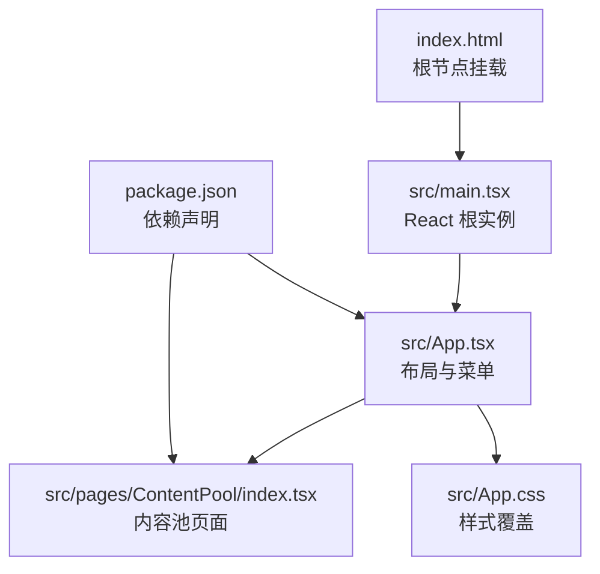
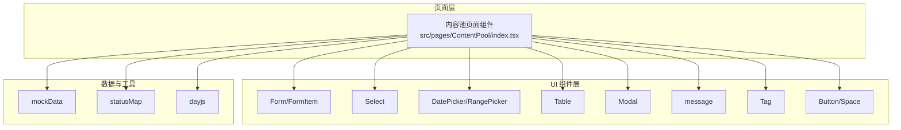
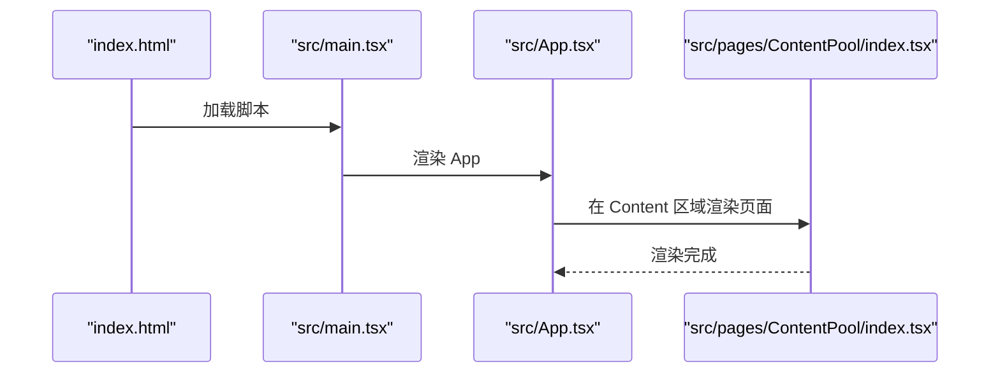
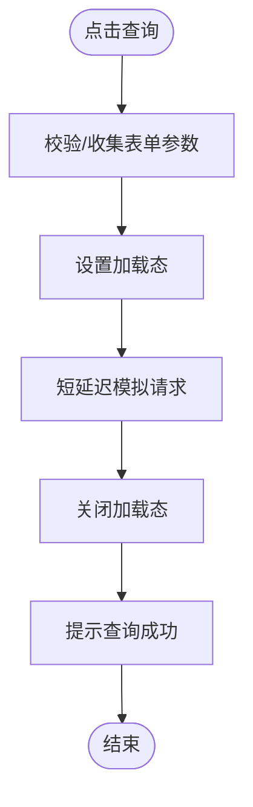
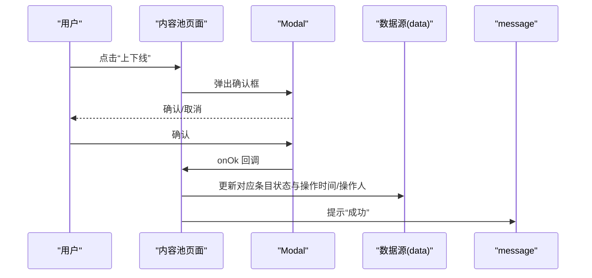
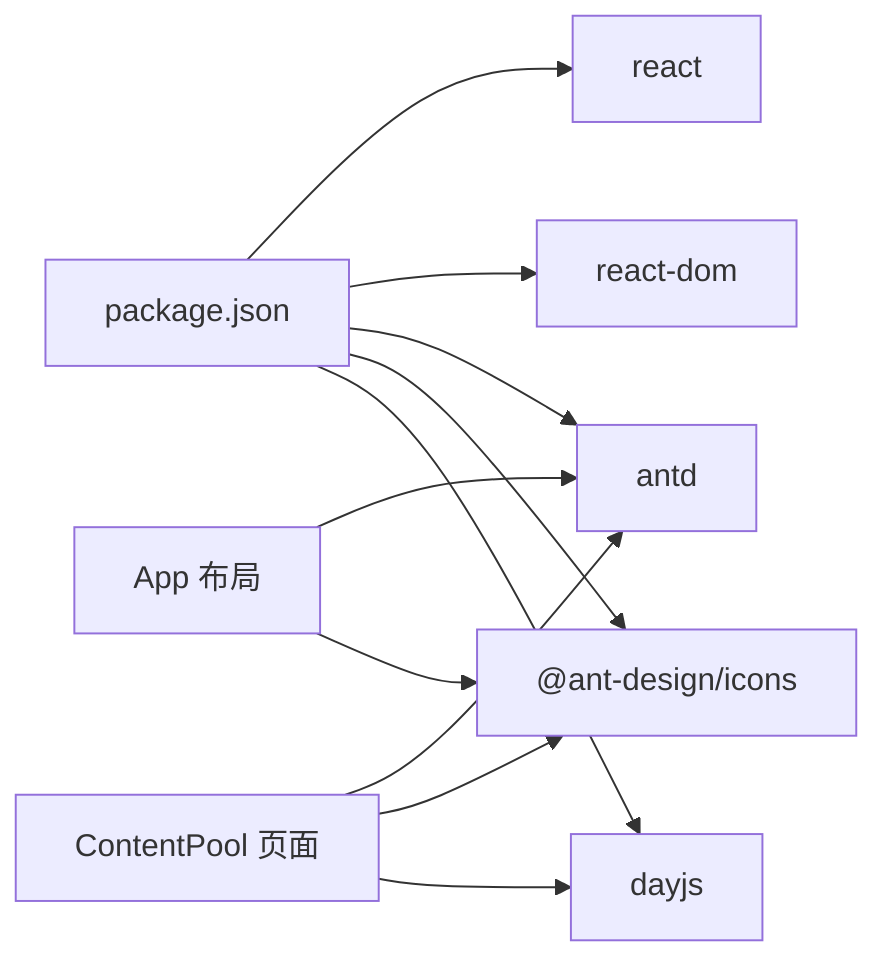

# 核心功能模块

<cite>
**本文引用的文件**
- [src/pages/ContentPool/index.tsx](file://src/pages/ContentPool/index.tsx)
- [src/App.tsx](file://src/App.tsx)
- [src/main.tsx](file://src/main.tsx)
- [src/App.css](file://src/App.css)
- [index.html](file://index.html)
- [package.json](file://package.json)
</cite>

## 目录
1. [简介](#简介)
2. [项目结构](#项目结构)
3. [核心组件](#核心组件)
4. [架构总览](#架构总览)
5. [详细组件分析](#详细组件分析)
6. [依赖关系分析](#依赖关系分析)
7. [性能考虑](#性能考虑)
8. [故障排查指南](#故障排查指南)
9. [结论](#结论)
10. [附录](#附录)

## 简介
本文件面向 Qoder 项目的“内容池管理”核心功能模块，围绕内容池的创建、编辑、删除、状态切换与实时状态管理，以及多维查询（ID、名称、分类、状态、内容类型、操作时间）进行系统化说明。同时解释表格展示与操作审计（创建时间/创建人、操作时间/操作人）的设计思路，并给出组件架构、API 接口定义与参数说明、与其他组件的集成关系、常见问题与性能优化建议。由于当前仓库为前端演示版本，实际后端接口调用与持久化逻辑以“模拟数据 + 前端交互”为主；本文在不虚构实现的前提下，提供可落地的扩展路径与最佳实践。

## 项目结构
- 入口与布局：应用入口通过 main.tsx 渲染 App 组件，App 组件负责侧边菜单与主内容区域，内容池页面作为主内容渲染。
- 内容池页面：位于 pages/ContentPool/index.tsx，包含表单查询、表格展示、状态切换、操作按钮与审计字段等完整 UI 与交互逻辑。
- 样式与主题：App.css 提供 Ant Design 覆盖样式，index.html 提供根节点挂载与基础 meta 配置。
- 依赖管理：package.json 定义了 React、Ant Design、Day.js 等核心依赖。



图表来源
- [index.html:1-14](file://index.html#L1-L14)
- [src/main.tsx:1-11](file://src/main.tsx#L1-L11)
- [src/App.tsx:1-210](file://src/App.tsx#L1-L210)
- [src/pages/ContentPool/index.tsx:1-417](file://src/pages/ContentPool/index.tsx#L1-L417)
- [src/App.css:1-84](file://src/App.css#L1-L84)
- [package.json:1-34](file://package.json#L1-L34)

章节来源
- [src/main.tsx:1-11](file://src/main.tsx#L1-L11)
- [src/App.tsx:1-210](file://src/App.tsx#L1-L210)
- [src/pages/ContentPool/index.tsx:1-417](file://src/pages/ContentPool/index.tsx#L1-L417)
- [src/App.css:1-84](file://src/App.css#L1-L84)
- [index.html:1-14](file://index.html#L1-L14)
- [package.json:1-34](file://package.json#L1-L34)

## 核心组件
- 页面容器：内容池页面组件负责承载查询表单、表格、分页与操作按钮。
- 数据模型：ContentPoolItem 接口定义内容池条目的字段集合，包含标识、名称、状态、分类、内容类型、生效/待审数量、创建与操作时间及人员信息。
- 状态映射：statusMap 将内部状态值映射为标签颜色与中文文本，用于表格状态列渲染。
- 模拟数据：mockData 提供初始数据集，便于演示与开发调试。
- 表格列定义：columns 定义各列标题、宽度、渲染规则与固定右侧操作列。
- 交互行为：包含查询、重置、新增、编辑、浏览、状态切换、日志查看、复制、手动触发等动作处理函数。

章节来源
- [src/pages/ContentPool/index.tsx:36-48](file://src/pages/ContentPool/index.tsx#L36-L48)
- [src/pages/ContentPool/index.tsx:50-55](file://src/pages/ContentPool/index.tsx#L50-L55)
- [src/pages/ContentPool/index.tsx:57-136](file://src/pages/ContentPool/index.tsx#L57-L136)
- [src/pages/ContentPool/index.tsx:205-324](file://src/pages/ContentPool/index.tsx#L205-L324)

## 架构总览
内容池模块采用“页面级组件 + Ant Design UI 组件”的组合架构：
- 页面组件负责状态管理（表单、数据、加载态）、事件处理与 UI 渲染。
- Ant Design 的 Form、Select、DatePicker、Table、Modal、Message 等组件承担交互与展示职责。
- Day.js 用于格式化时间戳，增强可读性。
- 样式通过 App.css 对 Ant Design 默认样式进行覆盖，统一视觉风格。



图表来源
- [src/pages/ContentPool/index.tsx:1-31](file://src/pages/ContentPool/index.tsx#L1-L31)
- [src/pages/ContentPool/index.tsx:57-136](file://src/pages/ContentPool/index.tsx#L57-L136)
- [src/pages/ContentPool/index.tsx:50-55](file://src/pages/ContentPool/index.tsx#L50-L55)
- [src/pages/ContentPool/index.tsx:31](file://src/pages/ContentPool/index.tsx#L31)

## 详细组件分析

### 页面容器与路由集成
- 入口：index.html 中的 #root 容器由 main.tsx 创建根实例并渲染 App。
- 布局：App.tsx 使用 Ant Design Layout、Menu、Dropdown 等构建侧边栏与头部，内容区域渲染 ContentPool 子组件。
- 导航：菜单项中“内容管理/动态内容池”对应当前页面，便于导航到该功能。



图表来源
- [index.html:1-14](file://index.html#L1-L14)
- [src/main.tsx:1-11](file://src/main.tsx#L1-L11)
- [src/App.tsx:193-203](file://src/App.tsx#L193-L203)
- [src/pages/ContentPool/index.tsx:1-417](file://src/pages/ContentPool/index.tsx#L1-L417)

章节来源
- [index.html:1-14](file://index.html#L1-L14)
- [src/main.tsx:1-11](file://src/main.tsx#L1-L11)
- [src/App.tsx:193-203](file://src/App.tsx#L193-L203)

### 查询与筛选（多维查询）
- 查询表单：使用 Ant Design Form，包含 ID、名称、分类、状态（多选）、内容类型、操作时间范围等字段。
- 查询流程：提交时触发 handleSearch，设置 loading 并延时关闭，提示“查询成功”。当前为模拟查询，后续可接入真实 API。
- 重置：handleReset 将表单清空并恢复初始 mockData。



图表来源
- [src/pages/ContentPool/index.tsx:143-149](file://src/pages/ContentPool/index.tsx#L143-L149)
- [src/pages/ContentPool/index.tsx:151-154](file://src/pages/ContentPool/index.tsx#L151-L154)

章节来源
- [src/pages/ContentPool/index.tsx:338-394](file://src/pages/ContentPool/index.tsx#L338-L394)
- [src/pages/ContentPool/index.tsx:143-149](file://src/pages/ContentPool/index.tsx#L143-L149)
- [src/pages/ContentPool/index.tsx:151-154](file://src/pages/ContentPool/index.tsx#L151-L154)

### 表格与列定义
- 列结构：包含 ID、名称、状态、分类、内容类型、生效/待审数量、创建时间/创建人、操作时间/操作人、操作按钮等。
- 渲染规则：状态列根据 statusMap 映射颜色与文案；数量列在大于 0 时高亮；创建/操作信息列居中展示时间与人员。
- 固定列：操作列固定在右侧，保证滚动时可见。
- 分页与滚动：分页每页 10 条，横向滚动以适配宽表。

```mermaid
classDiagram
class ContentPoolItem {
+number id
+string name
+string status
+string category
+string contentType
+number activeCount
+number pendingCount
+string createTime
+string creator
+string operateTime
+string operator
}
class StatusMap {
+map status -> {color,text}
}
class Columns {
+列 : ID/名称/状态/分类/内容类型
+列 : 生效内容量/待审内容量
+列 : 创建时间/创建人
+列 : 操作时间/操作人
+列 : 操作(编辑/浏览/上下线/日志/复制/手动触发)
}
ContentPoolItem <.. Columns : "被渲染"
StatusMap <.. Columns : "用于状态渲染"
```

图表来源
- [src/pages/ContentPool/index.tsx:36-48](file://src/pages/ContentPool/index.tsx#L36-L48)
- [src/pages/ContentPool/index.tsx:50-55](file://src/pages/ContentPool/index.tsx#L50-L55)
- [src/pages/ContentPool/index.tsx:205-324](file://src/pages/ContentPool/index.tsx#L205-L324)

章节来源
- [src/pages/ContentPool/index.tsx:205-324](file://src/pages/ContentPool/index.tsx#L205-L324)

### 实时状态管理与操作审计
- 状态切换：handleToggleStatus 根据当前状态切换为“生效/下线”，弹出确认框，确认后更新对应条目状态与操作时间/操作人字段。
- 审计字段：每个条目包含 createTime/creator 与 operateTime/operator，用于记录创建与最近一次操作的时间与人员。
- 时间格式：使用 dayjs 格式化当前时间，确保一致的显示格式。



图表来源
- [src/pages/ContentPool/index.tsx:168-185](file://src/pages/ContentPool/index.tsx#L168-L185)
- [src/pages/ContentPool/index.tsx:178](file://src/pages/ContentPool/index.tsx#L178)
- [src/pages/ContentPool/index.tsx:31](file://src/pages/ContentPool/index.tsx#L31)

章节来源
- [src/pages/ContentPool/index.tsx:168-185](file://src/pages/ContentPool/index.tsx#L168-L185)
- [src/pages/ContentPool/index.tsx:178](file://src/pages/ContentPool/index.tsx#L178)

### 操作按钮与功能
- 新增：打开新增内容池弹窗（当前为提示）。
- 编辑/浏览：分别弹出提示信息，后续可接入弹窗或详情页。
- 日志：查看日志（当前为提示）。
- 复制：复制内容池（当前为提示）。
- 手动触发：仅当状态为“生效中”时显示，确认后提示成功。

章节来源
- [src/pages/ContentPool/index.tsx:156-203](file://src/pages/ContentPool/index.tsx#L156-L203)

### API 接口定义与参数说明
以下为内容池相关接口的建议定义（基于当前页面的数据结构与交互），便于与后端对接或生成文档。接口均为概念性定义，具体实现需结合后端服务。

- 获取内容池列表
  - 方法：GET
  - 路径：/api/content-pools
  - 请求参数：
    - id: number（可选）
    - name: string（可选）
    - category: string（可选）
    - status: string[]（可选，多选）
    - contentType: string（可选）
    - operateTimeStart: string（可选，日期字符串）
    - operateTimeEnd: string（可选，日期字符串）
    - page: number（默认 1）
    - pageSize: number（默认 10）
  - 响应体：分页对象，包含 total、list（数组，元素为 ContentPoolItem）

- 创建内容池
  - 方法：POST
  - 路径：/api/content-pools
  - 请求体：除 id、createTime/creator、operateTime/operator 外的其余字段
  - 响应体：新创建的内容池对象

- 更新内容池
  - 方法：PUT
  - 路径：/api/content-pools/:id
  - 请求体：除 id、createTime/creator 外的其余字段
  - 响应体：更新后的对象

- 删除内容池
  - 方法：DELETE
  - 路径：/api/content-pools/:id
  - 响应体：布尔值（是否成功）

- 切换内容池状态
  - 方法：PATCH
  - 路径：/api/content-pools/:id/status
  - 请求体：{ status: string }
  - 响应体：更新后的对象

- 获取内容池日志
  - 方法：GET
  - 路径：/api/content-pools/:id/logs
  - 响应体：日志列表（按时间倒序）

章节来源
- [src/pages/ContentPool/index.tsx:36-48](file://src/pages/ContentPool/index.tsx#L36-L48)
- [src/pages/ContentPool/index.tsx:338-394](file://src/pages/ContentPool/index.tsx#L338-L394)

### 与其他组件的关系与集成
- 与 App 布局的集成：App.tsx 的菜单与头部提供全局导航与用户信息，内容池页面作为子组件嵌入。
- 与 Ant Design 组件的集成：Form、Select、DatePicker、Table、Modal、Message、Tag、Button 等广泛使用，形成统一的交互体验。
- 与 Day.js 的集成：用于格式化时间，提升可读性与一致性。
- 与样式系统的集成：通过 App.css 覆盖 Ant Design 默认样式，统一品牌色与交互反馈。

章节来源
- [src/App.tsx:193-203](file://src/App.tsx#L193-L203)
- [src/pages/ContentPool/index.tsx:1-31](file://src/pages/ContentPool/index.tsx#L1-L31)
- [src/App.css:28-84](file://src/App.css#L28-L84)

## 依赖关系分析
- 运行时依赖：React、React DOM、Ant Design、@ant-design/icons、dayjs。
- 开发依赖：TypeScript、Vite、ESLint 及相关插件。
- 组件间耦合：内容池页面与 Ant Design 组件存在直接依赖；与 App 布局通过路由/渲染关系耦合；与样式通过 CSS 类名耦合。



图表来源
- [package.json:12-18](file://package.json#L12-L18)
- [src/pages/ContentPool/index.tsx:1-31](file://src/pages/ContentPool/index.tsx#L1-L31)
- [src/App.tsx:1-29](file://src/App.tsx#L1-L29)

章节来源
- [package.json:12-18](file://package.json#L12-L18)
- [src/pages/ContentPool/index.tsx:1-31](file://src/pages/ContentPool/index.tsx#L1-L31)
- [src/App.tsx:1-29](file://src/App.tsx#L1-L29)

## 性能考虑
- 表格性能
  - 使用虚拟滚动（如 antd 的虚拟化能力）以减少大数据量下的渲染开销（建议在真实数据量较大时启用）。
  - 合理设置列宽与固定列数量，避免过度横向滚动导致的重排。
  - 分页策略：当前每页 10 条，建议根据实际数据规模调整，避免一次性渲染过多行。
- 查询性能
  - 当前为模拟查询，建议在真实场景中加入防抖与节流，避免频繁请求。
  - 支持服务端分页与排序，前端仅做轻量展示。
- 状态与渲染
  - 使用 React.memo 或 useMemo 优化列渲染与标签渲染。
  - 避免不必要的 setState 触发，批量更新数据。
- 样式与图标
  - @ant-design/icons 为按需引入，注意避免重复加载。
  - App.css 中的覆盖样式应尽量精简，避免影响其他组件。

## 故障排查指南
- 查询无结果
  - 检查表单字段是否正确提交，确认 handleSearch 是否被触发。
  - 若为服务端查询，请检查网络请求与响应格式。
- 状态切换无效
  - 确认 handleToggleStatus 的逻辑是否执行，检查 data 状态更新是否生效。
  - 检查 operateTime/operator 字段是否正确更新。
- 表格列错位或滚动异常
  - 检查 columns 宽度与 scroll.x 设置，确保总宽度合理。
  - 确认固定列与非固定列的宽度之和不超过容器宽度。
- 样式冲突
  - 检查 App.css 中的覆盖规则是否影响其他组件，必要时使用作用域或 CSS Modules。
- 图标与时间显示
  - 确认 @ant-design/icons 已正确安装与引入。
  - 确认 dayjs 版本与格式化方法可用。

章节来源
- [src/pages/ContentPool/index.tsx:143-149](file://src/pages/ContentPool/index.tsx#L143-L149)
- [src/pages/ContentPool/index.tsx:168-185](file://src/pages/ContentPool/index.tsx#L168-L185)
- [src/pages/ContentPool/index.tsx:398-410](file://src/pages/ContentPool/index.tsx#L398-L410)
- [src/App.css:28-84](file://src/App.css#L28-L84)

## 结论
内容池管理模块以页面组件为核心，结合 Ant Design 组件与 Day.js 工具，实现了多维查询、表格展示、状态切换与操作审计等关键能力。当前版本为前端演示形态，建议后续接入真实 API、完善 CRUD 与权限控制、增加服务端分页与排序、优化表格性能与交互体验。通过本文档提供的接口定义、组件关系与优化建议，可快速推进功能落地与迭代。

## 附录
- 快速使用模式
  - 查询：填写查询条件后点击“查询”，等待提示“查询成功”。
  - 新增/编辑/浏览：点击相应按钮，按提示进行操作。
  - 上下线：点击“生效/下线”，确认后状态与操作时间/操作人自动更新。
  - 日志/复制/手动触发：根据需要选择对应按钮。
- 扩展建议
  - 接入真实后端：替换 mockData 与 handleSearch 为真实 API 调用。
  - 权限控制：在 App 布局或页面层添加权限校验。
  - 数据校验：在 Form 中增加校验规则，提升输入质量。
  - 错误处理：封装统一错误提示与重试机制。