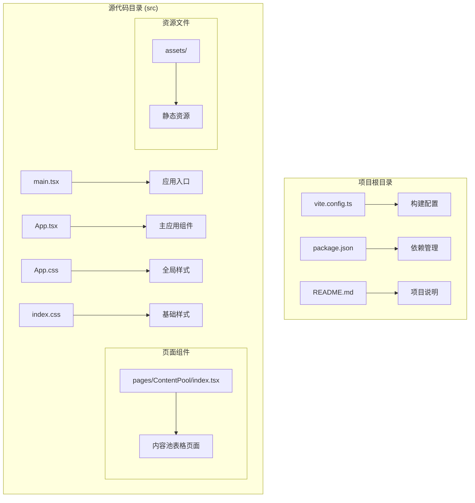
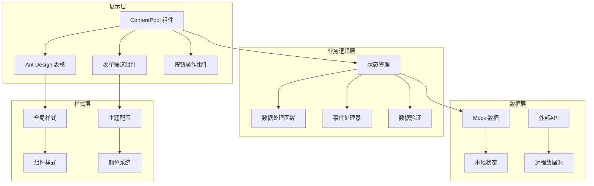
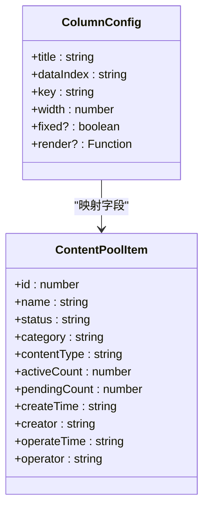
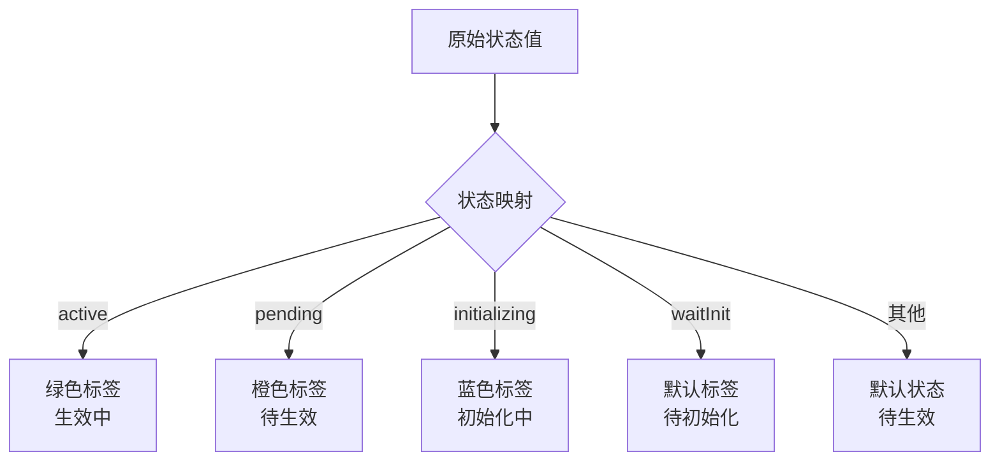
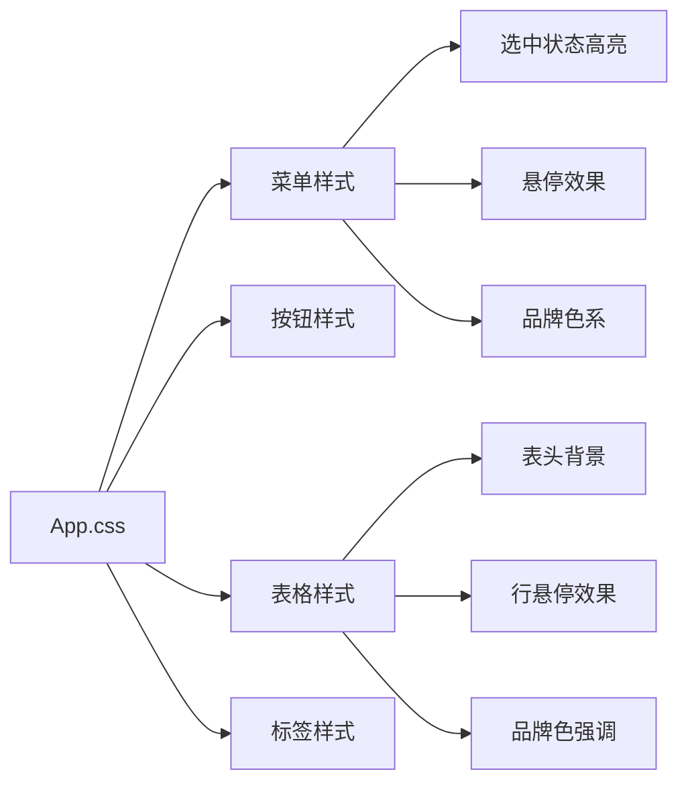
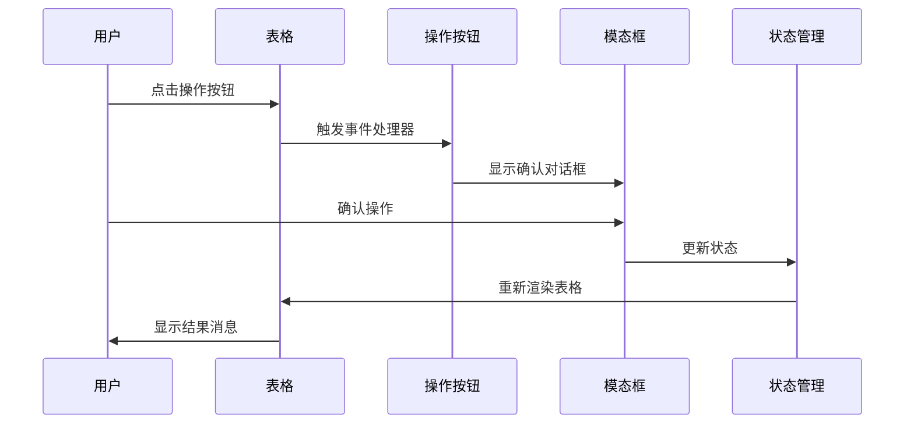
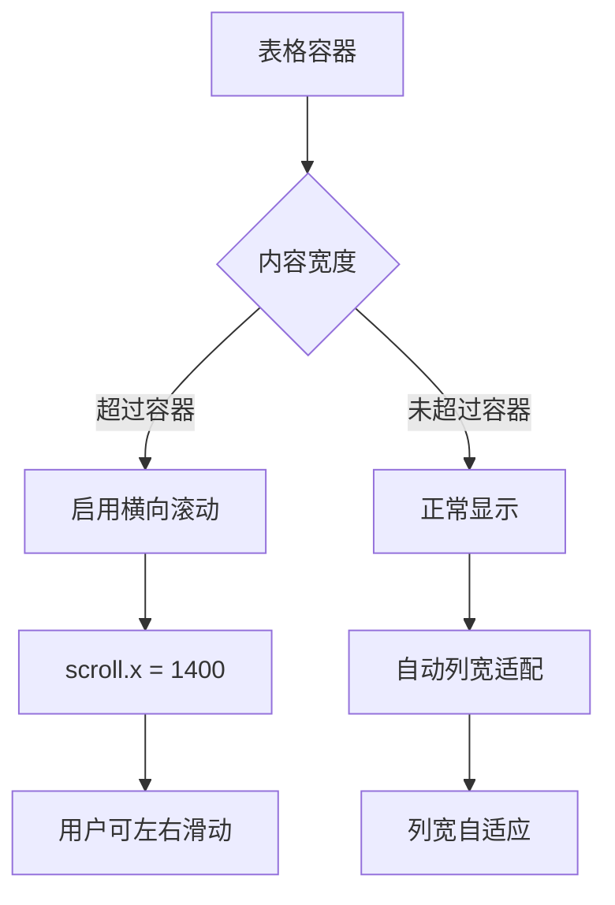
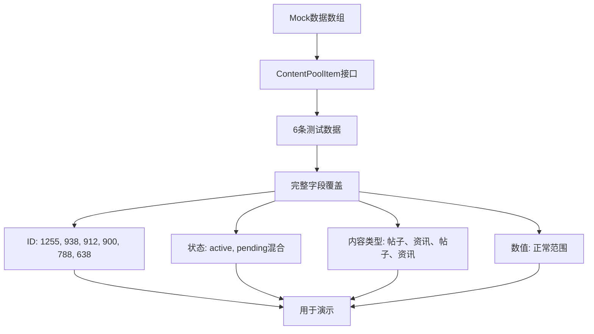
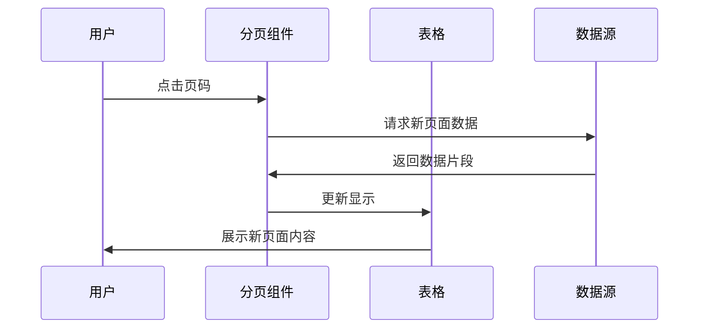
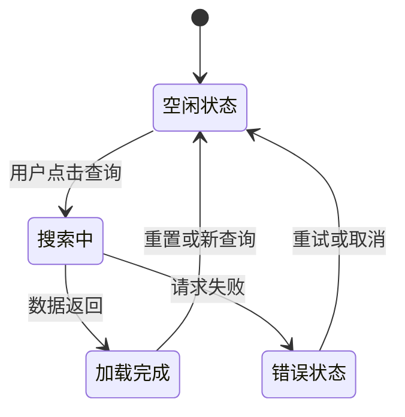

# 表格显示系统

<cite>
**本文档引用的文件**
- [src/pages/ContentPool/index.tsx](file://src/pages/ContentPool/index.tsx)
- [src/App.tsx](file://src/App.tsx)
- [src/App.css](file://src/App.css)
- [src/index.css](file://src/index.css)
- [src/main.tsx](file://src/main.tsx)
- [package.json](file://package.json)
- [vite.config.ts](file://vite.config.ts)
- [README.md](file://README.md)
</cite>

## 目录
1. [简介](#简介)
2. [项目结构](#项目结构)
3. [核心组件](#核心组件)
4. [架构概览](#架构概览)
5. [详细组件分析](#详细组件分析)
6. [依赖关系分析](#依赖关系分析)
7. [性能考虑](#性能考虑)
8. [故障排除指南](#故障排除指南)
9. [结论](#结论)

## 简介

本项目是一个基于React + TypeScript + Ant Design的表格显示系统，专门用于展示和管理内容池数据。该系统实现了完整的表格功能，包括数据展示、筛选、排序、分页、响应式设计等特性。系统采用现代化的前端技术栈，提供了良好的用户体验和可维护性。

## 项目结构

该项目采用模块化的文件组织方式，主要包含以下结构：



**图表来源**
- [src/main.tsx:1-11](file://src/main.tsx#L1-L11)
- [src/App.tsx:1-210](file://src/App.tsx#L1-L210)
- [src/pages/ContentPool/index.tsx:1-417](file://src/pages/ContentPool/index.tsx#L1-L417)

**章节来源**
- [src/main.tsx:1-11](file://src/main.tsx#L1-L11)
- [src/App.tsx:1-210](file://src/App.tsx#L1-L210)
- [package.json:1-34](file://package.json#L1-L34)

## 核心组件

### 主应用组件 (App)

主应用组件负责整个应用的布局和导航，采用了Ant Design的Layout组件系统：

- **侧边栏导航**: 实现了折叠式菜单，支持多级嵌套
- **顶部用户面板**: 包含用户头像和下拉菜单
- **内容区域**: 动态加载各个页面组件

### 内容池表格页面 (ContentPool)

这是系统的核心功能组件，实现了完整的表格显示功能：

- **数据模型**: 定义了ContentPoolItem接口，包含所有字段属性
- **Mock数据**: 提供了完整的内容池数据示例
- **表格配置**: 实现了10个列的详细配置
- **交互功能**: 支持增删改查、状态切换、日志查看等操作

**章节来源**
- [src/App.tsx:123-210](file://src/App.tsx#L123-L210)
- [src/pages/ContentPool/index.tsx:138-417](file://src/pages/ContentPool/index.tsx#L138-L417)

## 架构概览

系统采用分层架构设计，清晰分离了展示层、业务逻辑层和数据层：



**图表来源**
- [src/pages/ContentPool/index.tsx:36-48](file://src/pages/ContentPool/index.tsx#L36-L48)
- [src/pages/ContentPool/index.tsx:57-136](file://src/pages/ContentPool/index.tsx#L57-L136)
- [src/App.css:12-84](file://src/App.css#L12-L84)

## 详细组件分析

### 表格列定义系统

系统实现了完整的表格列配置机制，每个列都经过精心设计以满足不同的业务需求：

#### 基础列配置



**图表来源**
- [src/pages/ContentPool/index.tsx:205-324](file://src/pages/ContentPool/index.tsx#L205-L324)
- [src/pages/ContentPool/index.tsx:36-48](file://src/pages/ContentPool/index.tsx#L36-L48)

#### 列配置详解

系统实现了10个不同类型的列配置：

1. **ID列**: 基础数值列，固定宽度80px
2. **内容池名称列**: 文本列，使用品牌色突出显示
3. **状态列**: 使用标签组件展示不同状态
4. **分类列**: 基础文本列
5. **内容类型列**: 基础文本列
6. **生效内容量列**: 数值列，根据数量大小改变颜色
7. **待审内容量列**: 数值列，根据数量大小改变颜色
8. **创建时间/创建人列**: 复合信息列，居中显示
9. **操作时间/操作人列**: 复合信息列，居中显示
10. **操作列**: 固定右侧，包含多种操作按钮

**章节来源**
- [src/pages/ContentPool/index.tsx:205-324](file://src/pages/ContentPool/index.tsx#L205-L324)

### 数据格式化机制

系统实现了多层次的数据格式化功能：

#### 状态格式化



**图表来源**
- [src/pages/ContentPool/index.tsx:50-55](file://src/pages/ContentPool/index.tsx#L50-L55)
- [src/pages/ContentPool/index.tsx:224-227](file://src/pages/ContentPool/index.tsx#L224-L227)

#### 数值格式化

系统对数值列实现了智能的颜色提示：
- 当数值大于0时显示品牌色
- 当数值为0时保持默认颜色

**章节来源**
- [src/pages/ContentPool/index.tsx:246-248](file://src/pages/ContentPool/index.tsx#L246-L248)
- [src/pages/ContentPool/index.tsx:255-257](file://src/pages/ContentPool/index.tsx#L255-L257)

### 样式设置系统

系统采用了统一的样式管理策略：

#### 全局样式配置



**图表来源**
- [src/App.css:28-84](file://src/App.css#L28-L84)

#### 品牌色彩系统

系统使用了统一的品牌色彩方案：
- 主色调: #eb2f96 (粉红色)
- 辅助色: #1890ff (蓝色)
- 状态色: 绿色、橙色、蓝色等

**章节来源**
- [src/App.css:28-84](file://src/App.css#L28-L84)

### 交互行为实现

系统实现了丰富的用户交互功能：

#### 操作按钮组



**图表来源**
- [src/pages/ContentPool/index.tsx:168-185](file://src/pages/ContentPool/index.tsx#L168-L185)
- [src/pages/ContentPool/index.tsx:195-203](file://src/pages/ContentPool/index.tsx#L195-L203)

#### 动态状态切换

系统实现了智能的状态切换机制：
- 生效状态: 可以切换到待生效
- 待生效状态: 可以切换到生效
- 自动更新操作时间和操作人

**章节来源**
- [src/pages/ContentPool/index.tsx:168-185](file://src/pages/ContentPool/index.tsx#L168-L185)

### 响应式设计实现

系统采用了多层次的响应式设计策略：

#### 横向滚动支持



**图表来源**
- [src/pages/ContentPool/index.tsx:409](file://src/pages/ContentPool/index.tsx#L409)

#### 列宽自适应机制

系统通过以下方式实现列宽自适应：
- 固定宽度列: ID、状态、分类等
- 自适应列: 名称、内容类型等
- 最小宽度保证: 确保重要信息可见

**章节来源**
- [src/pages/ContentPool/index.tsx:205-324](file://src/pages/ContentPool/index.tsx#L205-L324)

### 数据加载和渲染机制

系统实现了Mock数据驱动的开发模式：

#### Mock数据系统



**图表来源**
- [src/pages/ContentPool/index.tsx:57-136](file://src/pages/ContentPool/index.tsx#L57-L136)
- [src/pages/ContentPool/index.tsx:36-48](file://src/pages/ContentPool/index.tsx#L36-L48)

#### 动态更新机制

系统实现了完整的数据更新流程：
- 状态变更: 通过useState管理
- 数据同步: 自动重新渲染
- 时间戳更新: 操作时间自动刷新

**章节来源**
- [src/pages/ContentPool/index.tsx:140-185](file://src/pages/ContentPool/index.tsx#L140-L185)

### 分页功能实现

系统集成了Ant Design的分页组件：

#### 分页配置参数

| 参数 | 值 | 说明 |
|------|-----|------|
| total | data.length | 总记录数 |
| pageSize | 10 | 每页显示数量 |
| showSizeChanger | true | 显示页码切换器 |
| showTotal | `(total) => "共 ${total} 条"` | 显示总数 |

#### 分页交互流程



**图表来源**
- [src/pages/ContentPool/index.tsx:403-408](file://src/pages/ContentPool/index.tsx#L403-L408)

**章节来源**
- [src/pages/ContentPool/index.tsx:403-408](file://src/pages/ContentPool/index.tsx#L403-L408)

### 加载状态管理

系统实现了完整的加载状态指示：

#### 加载状态流程



**图表来源**
- [src/pages/ContentPool/index.tsx:143-149](file://src/pages/ContentPool/index.tsx#L143-L149)

#### 加载状态实现

系统通过以下方式管理加载状态：
- 使用useState控制loading状态
- 在异步操作中设置loading为true
- 模拟延迟后恢复为false
- 显示相应的加载提示

**章节来源**
- [src/pages/ContentPool/index.tsx:141-149](file://src/pages/ContentPool/index.tsx#L141-L149)

## 依赖关系分析

系统采用了现代化的依赖管理策略：

```mermaid
graph TB
subgraph "运行时依赖"
A[react ^19.2.5] --> B[核心框架]
C[react-dom ^19.2.5] --> D[DOM渲染]
E[antd ^6.3.7] --> F[UI组件库]
G[@ant-design/icons ^6.2.2] --> H[图标库]
I[dayjs ^1.11.20] --> J[日期处理]
end
subgraph "开发时依赖"
K[@vitejs/plugin-react ^6.0.1] --> L[Vite插件]
M[typescript ~6.0.2] --> N[类型系统]
O[eslint-plugin-react-hooks ^7.1.1] --> P[Lint规则]
Q[eslint-plugin-react-refresh ^0.5.2] --> R[热重载]
end
subgraph "构建工具"
S[vite ^8.0.10] --> T[开发服务器]
U[typescript compiler] --> V[类型检查]
end
```

**图表来源**
- [package.json:12-32](file://package.json#L12-L32)

**章节来源**
- [package.json:12-32](file://package.json#L12-L32)

## 性能考虑

### 优化策略

1. **虚拟滚动**: 对于大量数据，建议实现虚拟滚动以提升性能
2. **懒加载**: 图片和复杂组件建议使用懒加载
3. **缓存机制**: 对于频繁访问的数据建立缓存
4. **防抖处理**: 对于高频操作（如搜索）添加防抖
5. **代码分割**: 将大组件拆分为更小的模块

### 内存管理

- 合理使用React.memo避免不必要的重渲染
- 及时清理定时器和事件监听器
- 使用useCallback优化回调函数

### 渲染优化

- 避免在render中创建新的对象和函数
- 使用key属性确保列表项正确更新
- 合理使用CSS类名减少样式计算

## 故障排除指南

### 常见问题及解决方案

#### 表格显示异常

**问题**: 表格列宽不正确或内容溢出
**解决方案**: 
- 检查scroll.x配置是否合理
- 确认列宽设置是否符合内容长度
- 调整responsive断点设置

#### 数据更新不生效

**问题**: 修改数据后表格未更新
**解决方案**:
- 确认rowKey设置是否正确
- 检查数据引用是否发生变化
- 验证setState调用时机

#### 性能问题

**问题**: 大数据量时表格卡顿
**解决方案**:
- 实现虚拟滚动
- 添加数据分页
- 优化render函数

**章节来源**
- [src/pages/ContentPool/index.tsx:140-185](file://src/pages/ContentPool/index.tsx#L140-L185)

## 结论

本表格显示系统是一个功能完整、架构清晰的React应用。系统成功实现了以下核心功能：

### 已实现的功能

- **完整的表格列配置**: 10个精心设计的列，涵盖各种数据类型
- **丰富的交互功能**: 支持状态切换、数据操作、批量处理
- **响应式设计**: 支持横向滚动和列宽自适应
- **数据管理**: Mock数据驱动，支持动态更新
- **样式统一**: 品牌色彩系统，视觉一致性良好

### 技术亮点

- **现代化技术栈**: React + TypeScript + Ant Design
- **模块化架构**: 清晰的组件分离和职责划分
- **类型安全**: 完整的TypeScript类型定义
- **可维护性**: 良好的代码组织和注释

### 改进建议

1. **增加排序功能**: 实现列排序和多列排序
2. **增强筛选能力**: 添加高级筛选和保存筛选条件
3. **性能优化**: 实现虚拟滚动和数据缓存
4. **国际化支持**: 添加多语言支持
5. **导出功能**: 实现数据导出为Excel等功能

该系统为内容管理提供了强大的数据展示和操作能力，具有良好的扩展性和维护性，是企业级应用的理想选择。