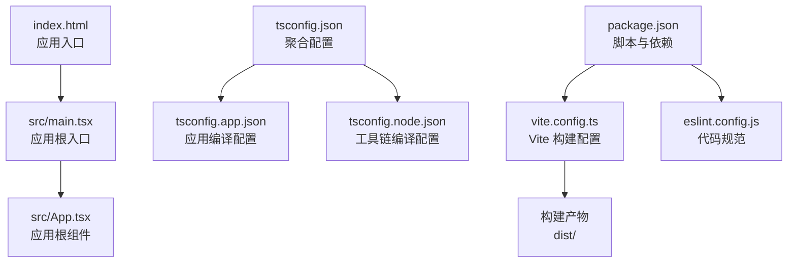
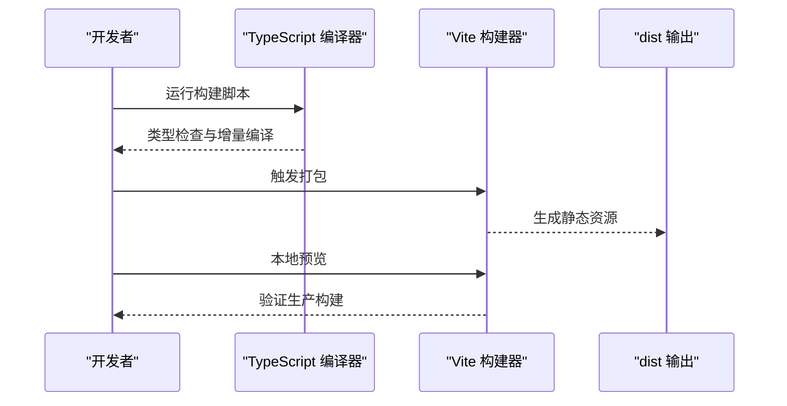
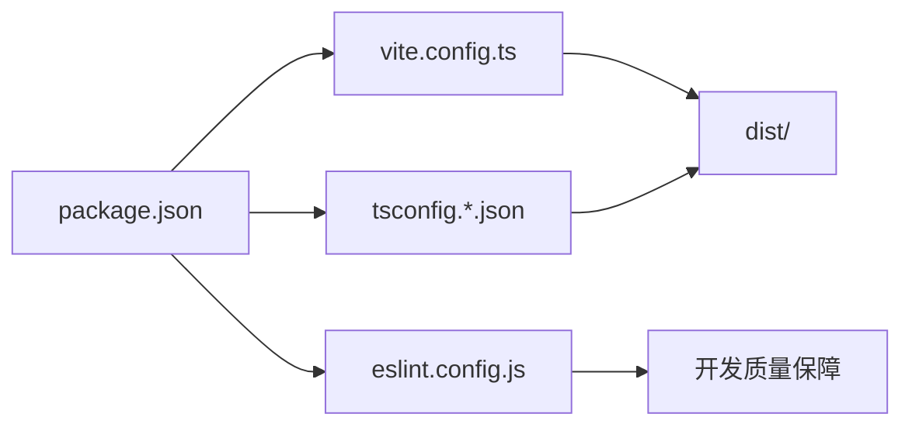

# 配置与部署

<cite>
**本文引用的文件**
- [vite.config.ts](file://vite.config.ts)
- [package.json](file://package.json)
- [tsconfig.json](file://tsconfig.json)
- [tsconfig.app.json](file://tsconfig.app.json)
- [tsconfig.node.json](file://tsconfig.node.json)
- [eslint.config.js](file://eslint.config.js)
- [index.html](file://index.html)
- [README.md](file://README.md)
- [src/main.tsx](file://src/main.tsx)
- [src/App.tsx](file://src/App.tsx)
</cite>

## 目录
1. [简介](#简介)
2. [项目结构](#项目结构)
3. [核心组件](#核心组件)
4. [架构总览](#架构总览)
5. [详细组件分析](#详细组件分析)
6. [依赖关系分析](#依赖关系分析)
7. [性能考虑](#性能考虑)
8. [故障排查指南](#故障排查指南)
9. [结论](#结论)
10. [附录](#附录)

## 简介
本文件面向 Qoder 项目的配置与部署，围绕以下主题展开：Vite 构建配置、TypeScript 多项目配置、package.json 脚本与依赖、生产构建流程与优化、部署指南（含多平台思路）、环境变量与敏感信息管理、性能监控与错误上报建议、CI/CD 流水线示例、版本发布与更新策略、以及常见问题排查与维护建议。内容基于仓库中现有配置文件进行梳理与扩展说明，帮助开发者快速理解并安全地交付应用。

## 项目结构
Qoder 采用 React + TypeScript + Vite 的现代前端工程化组合，使用独立的 TypeScript 配置文件拆分应用侧与工具侧配置，并通过 Vite 提供开发服务器与打包能力。入口 HTML 指向应用根节点，应用通过模块入口挂载到 DOM。

图表来源
- [index.html:1-14](file://index.html#L1-L14)
- [src/main.tsx:1-11](file://src/main.tsx#L1-L11)
- [src/App.tsx:1-210](file://src/App.tsx#L1-L210)
- [vite.config.ts:1-8](file://vite.config.ts#L1-L8)
- [tsconfig.json:1-8](file://tsconfig.json#L1-L8)
- [tsconfig.app.json:1-26](file://tsconfig.app.json#L1-L26)
- [tsconfig.node.json:1-25](file://tsconfig.node.json#L1-L25)
- [package.json:1-34](file://package.json#L1-L34)
- [eslint.config.js:1-23](file://eslint.config.js#L1-L23)

章节来源
- [index.html:1-14](file://index.html#L1-L14)
- [src/main.tsx:1-11](file://src/main.tsx#L1-L11)
- [src/App.tsx:1-210](file://src/App.tsx#L1-L210)
- [vite.config.ts:1-8](file://vite.config.ts#L1-L8)
- [tsconfig.json:1-8](file://tsconfig.json#L1-L8)
- [tsconfig.app.json:1-26](file://tsconfig.app.json#L1-L26)
- [tsconfig.node.json:1-25](file://tsconfig.node.json#L1-L25)
- [package.json:1-34](file://package.json#L1-L34)
- [eslint.config.js:1-23](file://eslint.config.js#L1-L23)

## 核心组件
- Vite 构建配置：当前仅启用 React 插件，未配置额外的构建选项（如目标浏览器、输出目录、资源路径等）。可按需扩展以满足生产优化与部署要求。
- TypeScript 配置：通过 tsconfig.json 聚合 app 与 node 两套配置；app 配置面向浏览器端 React 应用，node 配置面向 Vite 工具链与类型检查。
- 代码规范：ESLint 使用扁平配置，集成推荐规则与 React Hooks、React Refresh 规则，支持类型感知的 lint（可通过 README 扩展）。
- 包管理与脚本：package.json 定义了 dev、build、lint、preview 四类常用脚本，分别用于开发、构建、代码检查与本地预览。

章节来源
- [vite.config.ts:1-8](file://vite.config.ts#L1-L8)
- [tsconfig.json:1-8](file://tsconfig.json#L1-L8)
- [tsconfig.app.json:1-26](file://tsconfig.app.json#L1-L26)
- [tsconfig.node.json:1-25](file://tsconfig.node.json#L1-L25)
- [eslint.config.js:1-23](file://eslint.config.js#L1-L23)
- [package.json:1-34](file://package.json#L1-L34)

## 架构总览
下图展示从开发到生产的典型流程：开发时由 Vite 启动 HMR 服务；构建时先执行 TypeScript 编译，再由 Vite 打包生成静态资源；预览用于验证生产构建效果。

图表来源
- [package.json:6-11](file://package.json#L6-L11)
- [vite.config.ts:5-7](file://vite.config.ts#L5-L7)
- [tsconfig.app.json:10-16](file://tsconfig.app.json#L10-L16)

章节来源
- [package.json:6-11](file://package.json#L6-L11)
- [vite.config.ts:5-7](file://vite.config.ts#L5-L7)
- [tsconfig.app.json:10-16](file://tsconfig.app.json#L10-L16)

## 详细组件分析

### Vite 构建配置
- 当前配置要点
  - 启用 React 插件，适配 JSX 与 HMR。
  - 未显式设置构建目标、输出目录、资源路径等，遵循 Vite 默认行为。
- 可选增强方向（建议）
  - 目标浏览器：根据业务兼容需求设置 target 与 polyfill。
  - 输出目录：明确 outDir，便于部署与缓存控制。
  - 资源路径：配置 base 以适配子路径部署。
  - 产物优化：开启压缩、分包、资源内联策略。
  - 环境变量：统一通过 envDir/envPrefix 管理。
- 影响范围
  - 开发体验：影响 HMR 速度与热更新粒度。
  - 生产体积：影响 Tree Shaking、代码分割与缓存命中率。
  - 部署稳定性：影响静态资源路径与缓存策略。

章节来源
- [vite.config.ts:1-8](file://vite.config.ts#L1-L8)

### TypeScript 配置
- 配置组织
  - tsconfig.json 作为聚合入口，引用 app 与 node 两套配置。
  - app 配置面向浏览器端 React 应用，启用 bundler 模式、ESNext 模块解析、React JSX 转换等。
  - node 配置面向 Vite 工具链与类型检查，启用 bundler 模式与 Node 类型。
- 关键编译选项说明（摘自配置）
  - 目标与库：ES2023 与 DOM/Node。
  - 模块解析：bundler，配合 verbatimModuleSyntax、moduleDetection 等提升类型安全与打包效率。
  - JSX：react-jsx，确保 React 18+ 语义与类型推断。
  - 严格性：启用未使用局部变量/参数、switch 无穿透等规则，降低潜在问题。
- 影响范围
  - 开发期类型检查与编辑器智能提示。
  - 构建期的类型检查与增量编译。
  - 与 ESLint 的类型感知联动（可通过 README 扩展）。

章节来源
- [tsconfig.json:1-8](file://tsconfig.json#L1-L8)
- [tsconfig.app.json:1-26](file://tsconfig.app.json#L1-L26)
- [tsconfig.node.json:1-25](file://tsconfig.node.json#L1-L25)

### 代码规范与类型感知
- ESLint 配置
  - 使用扁平配置，引入推荐规则集与 React Hooks、React Refresh 规则。
  - 支持类型感知的 lint（参考 README 扩展方案），可切换至 checked 或 strict 配置。
- 与 TypeScript 的协作
  - 通过 parserOptions.project 指定 tsconfig 路径，使 ESLint 能正确解析类型信息。
- 影响范围
  - 统一团队编码风格与质量基线。
  - 在大型项目中显著减少类型相关错误与运行时风险。

章节来源
- [eslint.config.js:1-23](file://eslint.config.js#L1-L23)
- [README.md:14-74](file://README.md#L14-L74)

### 包管理与脚本命令
- 常用脚本
  - dev：启动 Vite 开发服务器。
  - build：先执行 TypeScript 增量编译，再触发 Vite 打包。
  - lint：运行 ESLint 检查。
  - preview：本地预览生产构建结果。
- 依赖与开发依赖
  - 运行时依赖：React、React DOM、Ant Design 与图标库、日期处理库等。
  - 开发依赖：Vite、React 插件、TypeScript、ESLint 及其插件生态。
- 影响范围
  - 开发效率与构建稳定性。
  - 版本升级与依赖冲突治理。

章节来源
- [package.json:1-34](file://package.json#L1-L34)

### 应用入口与页面结构
- 入口 HTML
  - 提供基础 meta、标题与根容器，加载模块入口脚本。
- 模块入口
  - 创建根节点并渲染应用根组件，启用严格模式。
- 根组件
  - 使用 Ant Design 布局与菜单体系，承载业务页面（如内容池）。

章节来源
- [index.html:1-14](file://index.html#L1-L14)
- [src/main.tsx:1-11](file://src/main.tsx#L1-L11)
- [src/App.tsx:1-210](file://src/App.tsx#L1-L210)

## 依赖关系分析
- 组件耦合
  - 应用层（React）与 UI 组件库（Ant Design）存在直接依赖。
  - 构建层（Vite）与类型层（TypeScript）通过脚本串联。
  - 规范层（ESLint）贯穿开发与构建阶段。
- 外部依赖
  - React 19 与 Ant Design 6 为主要运行时依赖。
  - Vite 8 与 TypeScript 6 为核心工具链。
- 潜在风险
  - 版本不匹配可能导致类型检查失败或运行时异常。
  - 构建配置缺失可能造成资源路径与缓存策略不一致。

图表来源
- [package.json:1-34](file://package.json#L1-L34)
- [vite.config.ts:1-8](file://vite.config.ts#L1-L8)
- [tsconfig.json:1-8](file://tsconfig.json#L1-L8)
- [eslint.config.js:1-23](file://eslint.config.js#L1-L23)

章节来源
- [package.json:1-34](file://package.json#L1-L34)
- [vite.config.ts:1-8](file://vite.config.ts#L1-L8)
- [tsconfig.json:1-8](file://tsconfig.json#L1-L8)
- [eslint.config.js:1-23](file://eslint.config.js#L1-L23)

## 性能考虑
- 构建优化建议
  - 代码分割：按路由或功能拆分包，结合懒加载减少首屏体积。
  - Tree Shaking：保持 ESModule 导出风格，避免副作用与命名导出误用。
  - 资源压缩：启用最小化与压缩策略，合理配置资源内联阈值。
  - 缓存策略：静态资源采用长缓存，HTML 与入口脚本短缓存或禁缓存。
- 运行时优化建议
  - 图片与字体：优先使用现代格式（WebP/AVIF），按需加载与占位图。
  - 组件与状态：避免不必要的重渲染，合理使用 memo 与选择器。
  - 第三方库：按需引入与摇树优化，避免引入未使用的模块。
- 监控与诊断
  - 构建体积分析：使用可视化工具识别大体积依赖与重复模块。
  - 运行时性能：结合浏览器性能面板与网络面板定位瓶颈。

[本节为通用指导，无需特定文件引用]

## 故障排查指南
- 构建失败
  - 类型错误：优先修复类型检查问题，必要时临时放宽规则以定位根因。
  - 插件冲突：逐一注释插件或回退版本，确认问题来源。
  - 资源路径：核对 base 与 public 目录映射，避免 404。
- 开发异常
  - HMR 不生效：检查插件与配置是否被覆盖，清理缓存后重试。
  - 热更新粒度过粗：调整模块边界与导入方式，减少不必要的刷新。
- 预览与部署
  - 预览空白：确认 dist 目录存在且入口 HTML 正确。
  - 子路径部署：设置 base 并校验静态资源相对路径。
- 代码规范
  - ESLint 报错：根据规则逐条修正，或暂时关闭规则定位问题。
  - 类型感知失效：检查 parserOptions.project 指向的 tsconfig 是否正确。

章节来源
- [package.json:6-11](file://package.json#L6-L11)
- [vite.config.ts:5-7](file://vite.config.ts#L5-L7)
- [tsconfig.app.json:10-16](file://tsconfig.app.json#L10-L16)
- [eslint.config.js:18-22](file://eslint.config.js#L18-L22)

## 结论
Qoder 的配置体系以 Vite 与 TypeScript 为核心，结合 ESLint 实现开发期质量保障。当前配置简洁清晰，适合中小型项目快速迭代。建议在生产构建阶段补充构建优化与缓存策略，在部署阶段统一资源路径与环境变量管理，并建立 CI/CD 流水线与版本发布机制，以提升交付稳定性与可维护性。

[本节为总结性内容，无需特定文件引用]

## 附录

### 生产构建流程与优化策略
- 构建流程
  - 类型检查与增量编译 → Vite 打包 → 产物分析 → 部署。
- 优化策略
  - 分包与懒加载、Tree Shaking、压缩与缓存。
  - 资源指纹与长缓存策略。
- 部署前验证
  - 本地预览与端到端测试，确保静态资源与路由可用。

章节来源
- [package.json:8](file://package.json#L8)
- [vite.config.ts:5-7](file://vite.config.ts#L5-L7)

### 部署配置指南（多平台思路）
- 静态托管（如 GitHub Pages、Vercel、Netlify）
  - 设置 base 与构建输出目录，上传 dist。
  - 配置重定向规则以支持 SPA 路由。
- 传统服务器（Nginx/Apache）
  - 将 dist 作为站点根目录，配置 404 回退到 index.html。
  - 启用 Gzip/Br 压缩与缓存头。
- 容器化部署（Docker）
  - 使用 Nginx 镜像作为反向代理，挂载 dist 目录。
  - 配置健康检查与日志采集。

[本节为通用指导，无需特定文件引用]

### 环境变量配置与敏感信息管理
- 环境变量
  - 以 VITE_ 前缀注入客户端可见变量；服务端或机密信息不应暴露在前端。
  - 使用 .env 文件与 envDir/envPrefix 管理多环境变量。
- 敏感信息
  - API 密钥、数据库连接串等应置于服务端或受控环境变量中。
  - 构建时避免硬编码敏感数据。

章节来源
- [vite.config.ts:5-7](file://vite.config.ts#L5-L7)
- [tsconfig.app.json:7](file://tsconfig.app.json#L7)

### 性能监控与错误报告
- 性能监控
  - 前端：记录首屏时间、交互延迟与资源体积，结合埋点系统。
  - 后端：接口响应时间、错误率与资源占用。
- 错误报告
  - 前端：集成错误上报 SDK，过滤隐私信息与敏感数据。
  - 后端：结构化日志与告警，结合链路追踪定位问题。

[本节为通用指导，无需特定文件引用]

### CI/CD 流水线配置示例（思路）
- 触发条件
  - 主分支保护与 PR 规则，确保合并前通过检查。
- 步骤建议
  - 安装依赖 → 类型检查 → 单元测试 → 代码扫描 → 构建 → 产物归档 → 部署预发布 → 自动化验收 → 发布。
- 缓存与并发
  - 缓存依赖与构建产物，缩短流水线时间。
  - 并行执行测试与构建，串行执行部署。

[本节为通用指导，无需特定文件引用]

### 版本发布与更新策略
- 版本号
  - 遵循语义化版本，区分主版本、次版本与补丁版本。
- 发布流程
  - 切换分支、更新版本号、生成变更日志、打标签并推送。
  - 自动化发布到制品库或托管平台。
- 回滚策略
  - 快速回滚至上一个稳定版本，保留灰度发布窗口。

[本节为通用指导，无需特定文件引用]