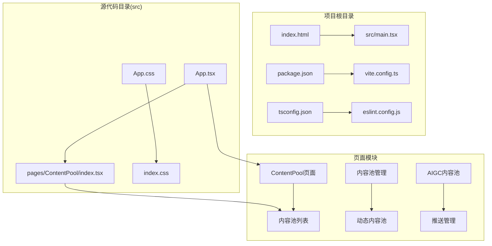
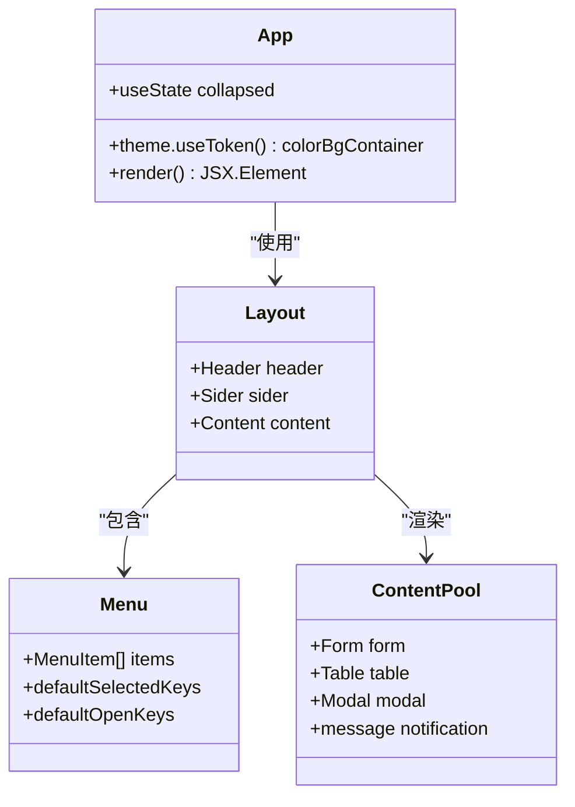
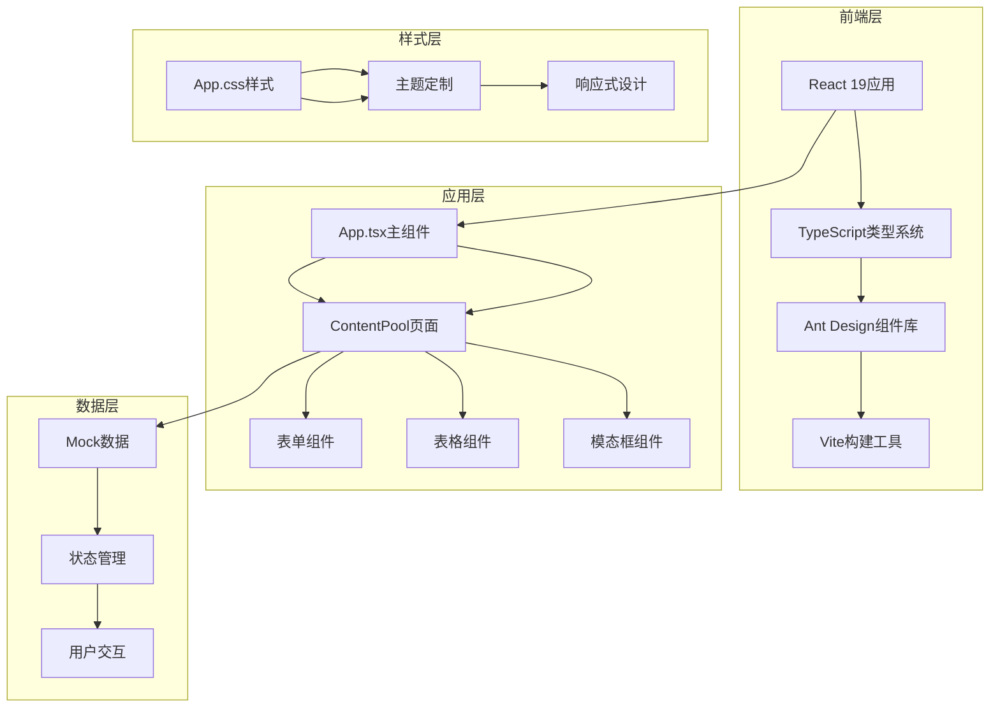
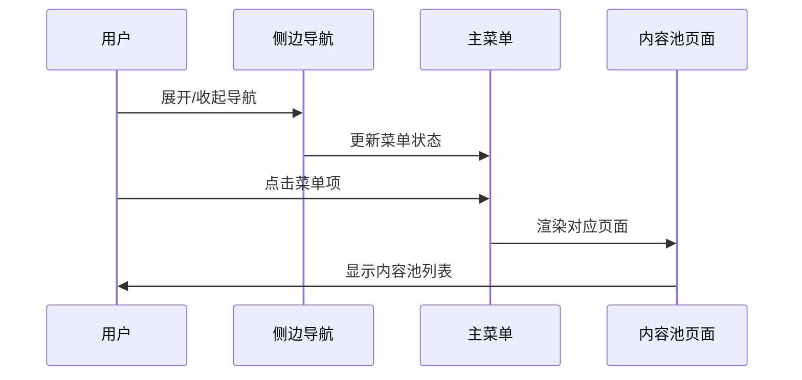
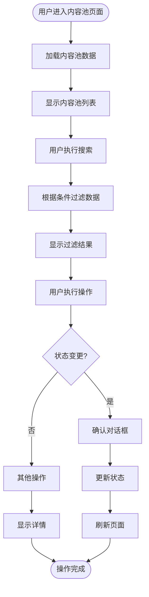

# 项目概述

<cite>
**本文档引用的文件**
- [README.md](file://README.md)
- [package.json](file://package.json)
- [vite.config.ts](file://vite.config.ts)
- [src/App.tsx](file://src/App.tsx)
- [src/main.tsx](file://src/main.tsx)
- [src/pages/ContentPool/index.tsx](file://src/pages/ContentPool/index.tsx)
- [src/App.css](file://src/App.css)
- [index.html](file://index.html)
- [tsconfig.json](file://tsconfig.json)
- [eslint.config.js](file://eslint.config.js)
</cite>

## 目录
1. [项目简介](#项目简介)
2. [项目结构](#项目结构)
3. [核心组件](#核心组件)
4. [架构概览](#架构概览)
5. [详细组件分析](#详细组件分析)
6. [依赖分析](#依赖分析)
7. [性能考虑](#性能考虑)
8. [故障排除指南](#故障排除指南)
9. [结论](#结论)

## 项目简介

Qoder 社区运营管理系统是一个基于现代前端技术栈构建的专业化社区内容池管理平台。该项目旨在为社区运营团队提供一个高效、直观且功能完整的管理界面，专门用于管理社区内容池的各种运营活动。

### 项目定位

Qoder 系统定位于社区内容池管理平台，专注于以下核心业务场景：
- **内容池生命周期管理**：从创建、配置到上线运营的全生命周期管理
- **多维度内容管理**：支持帖子、资讯等多种内容类型的统一管理
- **实时运营监控**：提供内容池状态监控和运营数据可视化
- **批量操作支持**：支持内容池的批量启用、停用、复制等操作

### 技术栈选择理由

本项目采用 React 19 + TypeScript + Vite + Ant Design 的技术组合，这一选择充分考虑了项目需求：

**React 19**：提供最新的 React 特性和性能优化，支持并发特性，提升用户体验
**TypeScript**：确保类型安全，提高代码可维护性和开发效率
**Vite**：提供极速的开发体验和构建性能，支持热模块替换(HMR)
**Ant Design**：成熟的 UI 组件库，提供丰富的运营管理系统所需的基础组件

## 项目结构

项目采用清晰的功能模块化组织结构，主要目录结构如下：



**图表来源**
- [src/App.tsx:1-210](file://src/App.tsx#L1-L210)
- [src/pages/ContentPool/index.tsx:1-417](file://src/pages/ContentPool/index.tsx#L1-L417)

**章节来源**
- [src/App.tsx:1-210](file://src/App.tsx#L1-L210)
- [src/main.tsx:1-11](file://src/main.tsx#L1-L11)
- [package.json:1-34](file://package.json#L1-L34)

## 核心组件

### 应用主框架

应用采用 Ant Design 的 Layout 组件体系构建，包含侧边导航、顶部用户菜单和主要内容区域：



**图表来源**
- [src/App.tsx:123-210](file://src/App.tsx#L123-L210)
- [src/pages/ContentPool/index.tsx:138-417](file://src/pages/ContentPool/index.tsx#L138-L417)

### 内容池管理核心功能

内容池管理是系统的核心功能模块，提供了完整的 CRUD 操作和状态管理：

**数据模型设计**：
- `ContentPoolItem` 接口定义了内容池的基本属性
- 支持多种状态管理：待生效、待初始化、初始化中、生效中
- 提供丰富的统计信息：生效内容量、待审内容量等

**操作功能**：
- 搜索过滤：支持按 ID、名称、分类、状态、内容类型等多维度过滤
- 实时状态切换：支持内容池的启用/停用操作
- 批量管理：支持复制、日志查看、手动触发等操作
- 数据可视化：通过表格展示内容池的详细信息

**章节来源**
- [src/pages/ContentPool/index.tsx:36-136](file://src/pages/ContentPool/index.tsx#L36-L136)
- [src/pages/ContentPool/index.tsx:205-324](file://src/pages/ContentPool/index.tsx#L205-L324)

## 架构概览

系统采用典型的单页应用(SPA)架构，结合现代化的前端工程化工具链：



**图表来源**
- [src/App.tsx:123-210](file://src/App.tsx#L123-L210)
- [src/pages/ContentPool/index.tsx:138-417](file://src/pages/ContentPool/index.tsx#L138-L417)
- [vite.config.ts:1-8](file://vite.config.ts#L1-L8)

### 技术架构决策

**模块化设计**：
- 页面级组件分离，便于维护和扩展
- 功能模块独立，降低耦合度
- 组件复用性强，提高开发效率

**状态管理策略**：
- 使用 React Hooks 进行本地状态管理
- 支持异步操作的状态更新
- 提供用户反馈机制

**开发体验优化**：
- Vite 提供快速的热重载
- TypeScript 提供编译时类型检查
- ESLint 配置确保代码质量

## 详细组件分析

### 导航系统

应用采用 Ant Design 的 Layout 组件构建导航系统，包含侧边菜单和顶部用户菜单：



**图表来源**
- [src/App.tsx:135-206](file://src/App.tsx#L135-L206)
- [src/App.tsx:37-121](file://src/App.tsx#L37-L121)

### 内容池管理流程

内容池管理提供了完整的业务流程支持：



**图表来源**
- [src/pages/ContentPool/index.tsx:143-203](file://src/pages/ContentPool/index.tsx#L143-L203)
- [src/pages/ContentPool/index.tsx:337-411](file://src/pages/ContentPool/index.tsx#L337-L411)

### 用户界面设计

系统采用 Ant Design 的设计规范，提供专业的运营管理系统界面：

**视觉设计特点**：
- 使用品牌色(#eb2f96)作为主要强调色
- 采用卡片式布局，层次分明
- 提供丰富的图标和状态指示器
- 响应式设计，适配不同屏幕尺寸

**交互设计原则**：
- 清晰的操作反馈
- 直观的状态指示
- 便捷的批量操作
- 完善的错误处理

**章节来源**
- [src/App.css:12-84](file://src/App.css#L12-L84)
- [src/App.tsx:129-133](file://src/App.tsx#L129-L133)

## 依赖分析

### 核心依赖关系

项目依赖关系清晰明确，主要依赖包括：

```mermaid
graph LR
subgraph "运行时依赖"
A[react@^19.2.5] --> B[react-dom@^19.2.5]
C[antd@^6.3.7] --> D[@ant-design/icons@^6.2.2]
E[dayjs@^1.11.20] --> F[日期处理]
end
subgraph "开发时依赖"
G[@vitejs/plugin-react@^6.0.1] --> H[Vite插件]
I[typescript@~6.0.2] --> J[TypeScript编译]
K[eslint@^10.2.1] --> L[代码检查]
M[@types/react@^19.2.14] --> N[React类型定义]
end
subgraph "构建工具"
O[Vite] --> P[开发服务器]
O --> Q[生产构建]
R[TypeScript] --> S[类型检查]
T[ESLint] --> U[代码质量]
end
A --> O
C --> O
G --> O
I --> R
K --> T
```

**图表来源**
- [package.json:12-32](file://package.json#L12-L32)

### 开发工具链

**构建工具链**：
- Vite 提供快速的开发体验和构建性能
- TypeScript 确保类型安全和更好的开发体验
- ESLint 配置代码质量标准

**版本兼容性**：
- React 19 与 Ant Design 6 兼容
- TypeScript 6.x 与现代 React 特性配合
- Vite 8.x 提供稳定的构建环境

**章节来源**
- [package.json:1-34](file://package.json#L1-L34)
- [vite.config.ts:1-8](file://vite.config.ts#L1-L8)
- [tsconfig.json:1-8](file://tsconfig.json#L1-L8)

## 性能考虑

### 构建性能优化

**Vite 优势**：
- 基于 ES 模块的快速冷启动
- 热模块替换(HMR)提供即时反馈
- 预构建依赖减少打包体积

**TypeScript 优化**：
- 分离应用和节点配置文件
- 类型检查与构建分离
- 减少编译时间

**代码分割**：
- 按需加载页面组件
- 组件级别的懒加载
- 减少初始包大小

### 运行时性能

**React 19 特性**：
- 并发特性提升用户体验
- 自动批处理优化渲染
- 更好的错误边界处理

**Ant Design 优化**：
- 组件按需加载
- 图标资源优化
- 样式缓存机制

## 故障排除指南

### 常见问题解决

**开发环境问题**：
- 确保 Node.js 版本满足要求
- 检查端口占用情况
- 清理 npm 缓存重新安装依赖

**构建问题**：
- 检查 TypeScript 配置文件
- 验证 Vite 配置正确性
- 确认依赖版本兼容性

**运行时问题**：
- 检查浏览器控制台错误
- 验证网络请求状态
- 确认 API 端点可用性

### 调试技巧

**开发工具使用**：
- 利用 React DevTools 进行组件调试
- 使用浏览器开发者工具分析性能
- 通过控制台输出进行逻辑验证

**日志记录**：
- 在关键函数中添加日志输出
- 使用浏览器控制台进行实时调试
- 利用断点调试复杂逻辑

## 结论

Qoder 社区运营管理系统是一个设计精良、技术先进的社区内容池管理平台。通过采用 React 19 + TypeScript + Vite + Ant Design 的现代化技术栈，系统在保证开发效率的同时，提供了优秀的用户体验和强大的功能特性。

### 项目优势

**技术先进性**：
- 采用最新的 React 19 特性
- TypeScript 提供类型安全保障
- Vite 构建工具带来极致开发体验

**功能完整性**：
- 覆盖社区运营的完整业务流程
- 提供丰富的数据可视化能力
- 支持复杂的批量操作场景

**可维护性**：
- 清晰的模块化架构
- 完善的开发工具链
- 良好的代码组织结构

### 发展前景

该系统为社区运营团队提供了专业化的管理工具，通过持续的功能扩展和技术升级，有望成为社区内容管理领域的标杆解决方案。系统的模块化设计和现代化技术栈为其未来的功能扩展和性能优化奠定了坚实基础。